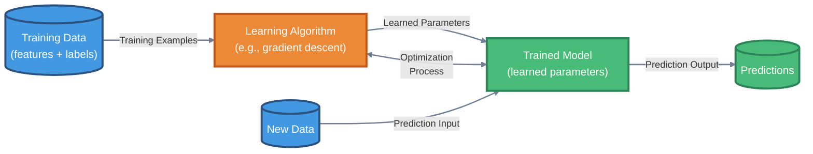
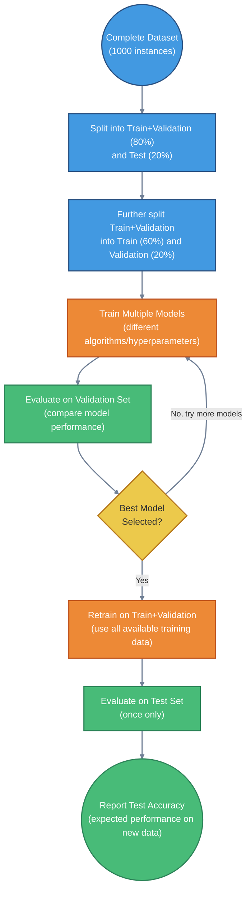

# Introduction to Machine Learning Fundamentals

---
title: Introduction to Machine Learning Fundamentals
description: Core concepts and terminology of machine learning including supervised and unsupervised learning, classification, regression, and data concepts
generated_by: claude skill chapter-content-generator
date: 2025-12-28
version: 0.03
---

## Summary

This foundational chapter introduces the core concepts and terminology of machine learning that will be used throughout the textbook. Students will learn the fundamental paradigms of supervised and unsupervised learning, understand the distinction between classification and regression tasks, and master essential data concepts including training, validation, and test sets. The chapter establishes the vocabulary of features, labels, instances, models, and algorithms that forms the basis for understanding all subsequent machine learning methods. By the end of this chapter, students will have a solid conceptual framework for approaching machine learning problems and will understand how to structure data and evaluate models.

## Concepts Covered

This chapter covers the following 20 concepts from the learning graph:

1. Machine Learning
2. Supervised Learning
3. Unsupervised Learning
4. Classification
5. Regression
6. Training Data
7. Test Data
8. Validation Data
9. Feature
10. Label
11. Instance
12. Feature Vector
13. Model
14. Algorithm
15. Hyperparameter
16. Categorical Features
17. Continuous Features
18. Cross-Validation
19. K-Fold Cross-Validation
20. Feature Map

## Prerequisites

This chapter assumes only the prerequisites listed in the [course description](../../course-description.md): linear algebra, calculus, and programming experience.

---

## What is Machine Learning?

Machine learning is a subfield of artificial intelligence that enables computer systems to learn patterns from data without being explicitly programmed for every scenario. Rather than following rigid, predefined rules, machine learning algorithms identify statistical relationships and build predictive models that generalize to new, unseen examples.

Consider spam email detection as an illustrative example. Traditional rule-based programming might define spam as "emails containing words like 'free money' or 'click here'." Such hard-coded rules fail when spammers adapt their language. Machine learning systems, by contrast, analyze thousands of labeled examples—emails marked as spam or not spam—to automatically discover complex patterns that distinguish spam from legitimate messages. The system learns features like suspicious sender addresses, unusual punctuation patterns, and word combinations that correlate with spam, adapting as spam tactics evolve.

This data-driven paradigm represents a fundamental shift in how we approach computational problem-solving, particularly for tasks where explicit rule specification proves intractable or where patterns must adapt to changing conditions.

### Core Components of Machine Learning Systems

Every machine learning system consists of three essential components that work together to enable learning from data:

- **Data**: The foundation of machine learning, consisting of examples from which the system learns patterns and relationships
- **Model**: A mathematical representation that captures patterns in the data and makes predictions on new inputs
- **Algorithm**: The computational procedure that adjusts the model's parameters based on the training data

#### Machine Learning System Components



## The Two Main Paradigms: Supervised and Unsupervised Learning

Machine learning algorithms fall into two primary categories based on the type of data they work with and the learning objective they pursue.

### Supervised Learning

Supervised learning algorithms learn from labeled examples, where each data point includes both input features and a known output (label). The algorithm's objective is to discover a mapping function that accurately predicts labels for new, unseen inputs.

Think of supervised learning as learning with a teacher who provides correct answers. When learning to identify dog breeds, a supervised algorithm receives thousands of dog images, each labeled with its breed ("Golden Retriever," "Poodle," etc.). The algorithm analyzes these labeled examples to learn visual features that distinguish breeds, such that when shown a new unlabeled dog photo, it can predict the breed accurately.

Supervised learning divides into two subcategories based on the nature of the output variable:

**Classification**: Predicting discrete categorical labels
- Examples: Email classification (spam/not spam), image recognition (dog/cat/bird), disease diagnosis (healthy/infected)
- Output: A finite set of predefined classes

**Regression**: Predicting continuous numerical values
- Examples: House price prediction, temperature forecasting, stock price estimation
- Output: Real-valued numbers on a continuous scale

### Unsupervised Learning

Unsupervised learning algorithms work with unlabeled data, seeking to discover hidden patterns, structures, or relationships without predetermined target outputs. The algorithm explores the data's intrinsic structure, grouping similar examples or identifying underlying patterns.

In unsupervised learning, there is no teacher providing correct answers. Instead, the algorithm autonomously discovers organization within the data. For instance, a clustering algorithm analyzing customer purchase data might identify distinct customer segments (budget shoppers, luxury buyers, bargain hunters) based solely on purchasing patterns, without any pre-labeled categories.

Common unsupervised learning tasks include:

- **Clustering**: Grouping similar data points together (e.g., customer segmentation, document organization)
- **Dimensionality reduction**: Compressing data while preserving important patterns (e.g., visualization, feature extraction)
- **Anomaly detection**: Identifying unusual patterns that don't conform to expected behavior (e.g., fraud detection)

#### Supervised vs Unsupervised Learning Comparison

<div style="display: grid; grid-template-columns: 1fr 1fr; gap: 2rem; margin: 2rem 0;">
  <div style="background: linear-gradient(135deg, #667eea 0%, #764ba2 100%); padding: 1.5rem; border-radius: 8px; color: white;">
    <h4 style="color: white; margin-top: 0;">Supervised Learning</h4>
    <p style="font-weight: bold;">Learning with Labels</p>
    <p><strong>Goal:</strong> Learn mapping X → Y</p>
    <p><strong>Data:</strong> Features (X) + Labels (Y)</p>
    <p><strong>Example:</strong> Images of fruits labeled as "apple", "banana", "orange"</p>
    <p><strong>Process:</strong> Algorithm learns from labeled examples to predict labels for new data</p>
    <p><strong>Common Tasks:</strong></p>
    <ul>
      <li>Classification (discrete labels)</li>
      <li>Regression (continuous values)</li>
      <li>Spam detection</li>
      <li>Price prediction</li>
    </ul>
  </div>
  <div style="background: linear-gradient(135deg, #11998e 0%, #38ef7d 100%); padding: 1.5rem; border-radius: 8px; color: white;">
    <h4 style="color: white; margin-top: 0;">Unsupervised Learning</h4>
    <p style="font-weight: bold;">Finding Hidden Patterns</p>
    <p><strong>Goal:</strong> Discover structure in data</p>
    <p><strong>Data:</strong> Features (X) only, no labels</p>
    <p><strong>Example:</strong> Customer purchase patterns without predefined groups</p>
    <p><strong>Process:</strong> Algorithm finds natural groupings or patterns in the data</p>
    <p><strong>Common Tasks:</strong></p>
    <ul>
      <li>Clustering (group similar items)</li>
      <li>Dimensionality reduction</li>
      <li>Anomaly detection</li>
      <li>Customer segmentation</li>
    </ul>
  </div>
</div>

## Understanding Data in Machine Learning

The quality and structure of data fundamentally determine what a machine learning system can learn. Understanding how to organize and partition data is essential for building effective models.

### Instances, Features, and Labels

Machine learning data consists of individual **instances** (also called examples or samples), each described by a set of **features** (also called attributes or variables). In supervised learning, each instance also has an associated **label** (also called target or output).

Consider a dataset for predicting house prices. Each house represents one instance. Features might include:

- Square footage (continuous numerical feature)
- Number of bedrooms (discrete numerical feature)
- Neighborhood (categorical feature)
- Year built (numerical feature)
- Has garage (binary categorical feature)

The label is the house's sale price (continuous numerical value for regression) or a price category like "affordable/moderate/expensive" (categorical value for classification).

A **feature vector** is the mathematical representation of an instance, organizing all feature values into a structured format (typically a vector or array) that algorithms can process numerically.

```python
import numpy as np
import pandas as pd

# Example: Creating feature vectors for houses
# Each row is an instance, each column is a feature

# House data as a pandas DataFrame
houses = pd.DataFrame({
    'sqft': [1500, 2200, 1800, 2800],
    'bedrooms': [3, 4, 3, 5],
    'neighborhood': ['suburban', 'urban', 'suburban', 'rural'],
    'year_built': [1995, 2010, 2000, 1988],
    'has_garage': [True, True, False, True],
    'price': [250000, 380000, 295000, 420000]  # Label for regression
})

print("House Dataset:")
print(houses)
print("\nFeature vector for first house (as NumPy array):")
# Note: Categorical features need encoding (covered in Chapter 8)
feature_vector = houses.iloc[0, :-1].values  # All columns except price
print(feature_vector)
```

### Categorical vs Continuous Features

Features fall into two fundamental types based on the nature of their values:

**Continuous Features**: Numerical values that can take any value within a range
- Examples: temperature (can be 72.3°F, 72.31°F, 72.315°F, etc.), height, weight, price
- Characteristics: Infinite possible values, meaningful differences between values, can be averaged

**Categorical Features**: Discrete values representing categories or classes
- Examples: color (red/blue/green), country, yes/no responses
- Characteristics: Finite set of possible values, no inherent ordering (for nominal categories), cannot be meaningfully averaged
- Subtypes:
  - Nominal: No natural ordering (colors, countries)
  - Ordinal: Natural ordering exists (education level: high school < bachelor's < master's < PhD)
  - Binary: Exactly two possible values (yes/no, true/false)

Many machine learning algorithms require numerical inputs, so categorical features must be encoded as numbers. Common encoding strategies include one-hot encoding (creating binary features for each category) and label encoding (assigning integer codes). We'll explore these techniques in detail in Chapter 8: Data Preprocessing.

| Feature Type | Examples | Possible Values | Can Compute Mean? |
|--------------|----------|----------------|-------------------|
| Continuous | Temperature, Height, Price | Any value in range | Yes |
| Categorical (Nominal) | Color, Country, Brand | Fixed set of categories | No |
| Categorical (Ordinal) | Rating (poor/fair/good), Education Level | Ordered categories | Sometimes* |
| Categorical (Binary) | True/False, Yes/No | Exactly two values | No |

*Computing means for ordinal categories requires careful interpretation

### Training, Validation, and Test Data

To evaluate machine learning models fairly and avoid overfitting, we split available data into three distinct partitions, each serving a specific purpose in the model development pipeline.

**Training Data**: The portion of data used to fit the model's parameters
- Purpose: The algorithm learns patterns by adjusting parameters to minimize error on this data
- Typical proportion: 60-80% of total data
- The model "sees" this data during learning

**Validation Data**: Data used to tune hyperparameters and make model selection decisions
- Purpose: Evaluate different model configurations to choose the best one
- Typical proportion: 10-20% of total data
- Used iteratively during model development
- Helps prevent overfitting to training data

**Test Data**: Data reserved for final model evaluation
- Purpose: Provide an unbiased estimate of model performance on new data
- Typical proportion: 10-20% of total data
- Used only once, after all model development decisions are finalized
- Simulates how the model will perform on real-world, unseen data

The fundamental principle: **Models should be evaluated on data they have never seen during training**. This separation ensures that performance estimates reflect the model's ability to generalize to new examples rather than merely memorizing the training set.

```python
from sklearn.model_selection import train_test_split

# Example: Splitting data into train, validation, and test sets
# Assuming X contains features and y contains labels

# Generate synthetic example data
np.random.seed(42)
X = np.random.randn(1000, 5)  # 1000 instances, 5 features
y = (X[:, 0] + X[:, 1] > 0).astype(int)  # Binary labels

# First split: separate test set (20% of data)
X_temp, X_test, y_temp, y_test = train_test_split(
    X, y, test_size=0.2, random_state=42
)

# Second split: separate validation set (25% of remaining data = 20% of original)
X_train, X_val, y_train, y_val = train_test_split(
    X_temp, y_temp, test_size=0.25, random_state=42
)

print(f"Training set size: {len(X_train)} ({len(X_train)/len(X)*100:.1f}%)")
print(f"Validation set size: {len(X_val)} ({len(X_val)/len(X)*100:.1f}%)")
print(f"Test set size: {len(X_test)} ({len(X_test)/len(X)*100:.1f}%)")
```

!!! tip "Why Three Splits?"
    - **Training data** teaches the model patterns
    - **Validation data** helps us choose between different models or hyperparameter settings
    - **Test data** gives us an honest assessment of performance

    Without a separate validation set, we risk overfitting our model selection process to the test set, leading to overly optimistic performance estimates.

#### Data Partitioning Workflow



## Models, Algorithms, and Hyperparameters

Understanding the distinction between models, algorithms, and hyperparameters is crucial for navigating machine learning concepts and terminology.

### What is a Model?

A **model** is a mathematical structure that represents the relationship between inputs (features) and outputs (labels or predictions). The model contains **parameters**—numerical values learned from training data that define its specific behavior.

For example, a linear regression model has the form $y = w_1 x_1 + w_2 x_2 + ... + w_n x_n + b$, where:
- $x_1, x_2, ..., x_n$ are input features
- $w_1, w_2, ..., w_n$ are weights (parameters learned from data)
- $b$ is the bias term (another learned parameter)
- $y$ is the predicted output

The parameters $(w_1, w_2, ..., w_n, b)$ are adjusted during training to minimize prediction error on the training data.

### What is an Algorithm?

An **algorithm** is the computational procedure that learns the model's parameters from training data. The algorithm specifies:
- How to initialize parameters
- How to measure prediction error
- How to update parameters to reduce error
- When to stop the learning process

For the linear regression example above, the algorithm might be:
1. Initialize all weights to zero
2. Compute predictions for training examples
3. Calculate mean squared error
4. Update weights using gradient descent
5. Repeat steps 2-4 until error stops decreasing

Different algorithms can learn the same type of model. For instance, linear regression parameters can be learned via gradient descent, normal equations, or stochastic gradient descent—each is a different algorithm producing the same model structure.

### What are Hyperparameters?

**Hyperparameters** are configuration settings that control the learning process but are not learned from data. Unlike model parameters (which the algorithm learns), hyperparameters must be specified before training begins.

Common hyperparameters include:
- **Learning rate**: How large a step the algorithm takes when updating parameters
- **Number of iterations**: How many times to adjust parameters
- **Regularization strength**: How much to penalize model complexity
- **Model architecture choices**: Number of layers in a neural network, maximum depth of a decision tree

Hyperparameters profoundly impact model performance, but finding optimal values requires experimentation. This process—called hyperparameter tuning—typically involves training multiple models with different hyperparameter configurations and selecting the combination that performs best on the validation set.

```python
from sklearn.linear_model import LogisticRegression
from sklearn.model_selection import GridSearchCV

# Example: Hyperparameter tuning using grid search
# Using logistic regression as an example model

# Define hyperparameter grid to search
param_grid = {
    'C': [0.001, 0.01, 0.1, 1, 10, 100],  # Regularization strength
    'penalty': ['l1', 'l2'],  # Regularization type
    'max_iter': [100, 200, 500]  # Maximum training iterations
}

# Create base model
model = LogisticRegression(random_state=42, solver='liblinear')

# Grid search with cross-validation
grid_search = GridSearchCV(
    model,
    param_grid,
    cv=5,  # 5-fold cross-validation
    scoring='accuracy',
    n_jobs=-1
)

# Fit on training data (grid search handles cross-validation internally)
grid_search.fit(X_train, y_train)

print("Best hyperparameters found:")
print(grid_search.best_params_)
print(f"\nBest cross-validation accuracy: {grid_search.best_score_:.3f}")

# Evaluate on test set with best model
test_accuracy = grid_search.score(X_test, y_test)
print(f"Test set accuracy: {test_accuracy:.3f}")
```

The table below summarizes key differences:

| Aspect | Parameters | Hyperparameters |
|--------|-----------|-----------------|
| **Learned from data?** | Yes | No |
| **Set by** | Algorithm during training | User before training |
| **Examples** | Weights in linear regression, neuron connections in neural networks | Learning rate, number of layers, regularization strength |
| **Tuning method** | Optimization algorithm (gradient descent, etc.) | Grid search, random search, manual experimentation |
| **Number** | Often thousands to millions | Typically 5-20 |

## Cross-Validation: Robust Model Evaluation

While splitting data into train, validation, and test sets provides basic evaluation capabilities, **cross-validation** offers a more robust approach that makes efficient use of limited data and provides more reliable performance estimates.

### The Cross-Validation Concept

Cross-validation repeatedly splits data into training and validation sets using different partitions, trains a model on each split, and averages the validation performance across all splits. This process reduces the variance in performance estimates that can arise from a single random data split.

### K-Fold Cross-Validation

The most common cross-validation technique is **K-fold cross-validation**:

1. Divide the dataset into $K$ equal-sized folds (typically $K = 5$ or $K = 10$)
2. For each of the $K$ folds:
   - Use that fold as the validation set
   - Use the remaining $K-1$ folds as the training set
   - Train a model and evaluate it on the validation fold
3. Average the $K$ validation scores to get the final performance estimate

This procedure ensures that every data point is used for validation exactly once and for training $K-1$ times, maximizing the use of available data while still maintaining separation between training and validation.

```python
from sklearn.model_selection import cross_val_score
from sklearn.linear_model import LogisticRegression

# Example: K-fold cross-validation
model = LogisticRegression(random_state=42, max_iter=200)

# Perform 5-fold cross-validation
cv_scores = cross_val_score(
    model,
    X_train,  # Use training data only (hold out test set)
    y_train,
    cv=5,  # Number of folds
    scoring='accuracy'
)

print("Cross-validation scores for each fold:")
for i, score in enumerate(cv_scores, 1):
    print(f"  Fold {i}: {score:.3f}")

print(f"\nMean CV accuracy: {cv_scores.mean():.3f}")
print(f"Standard deviation: {cv_scores.std():.3f}")
```

#### K-Fold Cross-Validation Visualization

<iframe src="../../sims/kfold-cross-validation/main.html" width="100%" height="550px" style="border: 1px solid #ccc; border-radius: 4px;"></iframe>

[View Fullscreen](../../sims/kfold-cross-validation/main.html){: target="_blank" .md-button } | [Documentation](../../sims/kfold-cross-validation/index.md)

This interactive visualization shows how K-fold cross-validation partitions your dataset into K equal folds, using each fold as validation data while training on the remaining folds. Adjust the number of folds and step through each iteration to see how cross-validation ensures every data point is used for both training and validation.

### Why Cross-Validation Matters

Cross-validation provides several key advantages:

- **More reliable estimates**: Averaging across multiple splits reduces the impact of lucky or unlucky single splits
- **Efficient data use**: All data is used for both training and validation (just not simultaneously)
- **Variance estimates**: The standard deviation of cross-validation scores indicates how sensitive the model is to the specific training data
- **Better hyperparameter tuning**: More robust validation scores lead to better hyperparameter selection

!!! warning "Cross-Validation Best Practices"
    - Always use cross-validation on training data only—never on the test set
    - The test set should remain completely untouched until final evaluation
    - For time series data, use time-aware CV methods (e.g., rolling window) to respect temporal ordering
    - When dealing with imbalanced classes, use stratified K-fold CV to maintain class proportions in each fold

## Feature Maps and Representation Learning

A **feature map** is a transformation that converts raw input data into a new representation that better exposes patterns for learning algorithms. Feature maps play a crucial role in deep learning, where neural networks automatically learn hierarchical feature representations from raw data.

In traditional machine learning, humans manually engineer features—selecting and transforming raw measurements into meaningful representations. For image classification, this might involve extracting edges, textures, or color histograms from raw pixels. In contrast, deep neural networks learn feature maps automatically through their hidden layers.

Consider convolutional neural networks (CNNs) for image recognition. Early layers learn low-level features like edges and textures, middle layers combine these into parts (eyes, wheels, windows), and deeper layers recognize complete objects (faces, cars, buildings). Each layer applies a learned feature map that transforms its input into a more abstract, task-relevant representation.

This concept becomes central in Chapter 10 (Convolutional Neural Networks) and Chapter 11 (Transfer Learning), where we explore how pre-trained networks learn rich feature maps that can be reused across different tasks.

```python
# Conceptual example: Manual feature engineering vs learned features
import numpy as np
from sklearn.preprocessing import PolynomialFeatures

# Original features: simple (x, y) coordinates
X_original = np.array([[1, 2], [2, 3], [3, 1], [4, 5]])
print("Original features:")
print(X_original)

# Manual feature engineering: create polynomial features
# This is like creating a feature map: (x, y) → (x, y, x^2, xy, y^2)
poly = PolynomialFeatures(degree=2, include_bias=False)
X_poly = poly.fit_transform(X_original)

print("\nPolynomial feature map (degree 2):")
print("Features: [x, y, x^2, xy, y^2]")
print(X_poly)

# Neural networks learn feature maps automatically
# Each hidden layer can be thought of as a learned feature map
# We'll explore this in depth in Chapters 9-11
```

The power of feature maps lies in their ability to transform data into representations where patterns become more apparent and separable. A good feature representation can make the difference between a model that achieves 60% accuracy and one that achieves 95% accuracy.

## Putting It All Together: A Complete Example

Let's synthesize the concepts covered in this chapter with a complete machine learning workflow using Python and scikit-learn.

```python
import numpy as np
import pandas as pd
from sklearn.datasets import load_iris
from sklearn.model_selection import train_test_split, cross_val_score
from sklearn.preprocessing import StandardScaler
from sklearn.linear_model import LogisticRegression
from sklearn.metrics import accuracy_score, confusion_matrix, classification_report

# Step 1: Load a real dataset (Iris flowers)
# This is a supervised classification problem
iris = load_iris()
X = iris.data  # Features: sepal length, sepal width, petal length, petal width
y = iris.target  # Labels: species (0=setosa, 1=versicolor, 2=virginica)

print("Dataset shape:")
print(f"  Features: {X.shape} (150 instances, 4 continuous features)")
print(f"  Labels: {y.shape} (3 classes)")

# Step 2: Split into train and test sets (80/20 split)
X_train, X_test, y_train, y_test = train_test_split(
    X, y, test_size=0.2, random_state=42, stratify=y  # stratify maintains class balance
)

print(f"\nData split:")
print(f"  Training: {len(X_train)} instances")
print(f"  Test: {len(X_test)} instances")

# Step 3: Preprocess features (standardization)
# Many algorithms work better when features have mean=0 and variance=1
scaler = StandardScaler()
X_train_scaled = scaler.fit_transform(X_train)
X_test_scaled = scaler.transform(X_test)  # Use training statistics

# Step 4: Create and train a model
# Model: Logistic regression (covered in Chapter 4)
# Algorithm: L-BFGS optimization
# Hyperparameters: C=1.0 (regularization), max_iter=200
model = LogisticRegression(C=1.0, max_iter=200, random_state=42)
model.fit(X_train_scaled, y_train)

print("\nModel trained successfully")
print(f"  Model parameters (weights): {model.coef_.shape}")
print(f"  Number of iterations: {model.n_iter_}")

# Step 5: Evaluate using cross-validation on training set
cv_scores = cross_val_score(model, X_train_scaled, y_train, cv=5)
print(f"\nCross-validation scores: {cv_scores}")
print(f"Mean CV accuracy: {cv_scores.mean():.3f} ± {cv_scores.std():.3f}")

# Step 6: Make predictions on test set
y_pred = model.predict(X_test_scaled)
test_accuracy = accuracy_score(y_test, y_pred)

print(f"\nTest set accuracy: {test_accuracy:.3f}")
print("\nConfusion Matrix:")
print(confusion_matrix(y_test, y_pred))

print("\nClassification Report:")
print(classification_report(y_test, y_pred, target_names=iris.target_names))

# Step 7: Demonstrate the model on a new instance
new_flower = np.array([[5.1, 3.5, 1.4, 0.2]])  # Sepal length, sepal width, petal length, petal width
new_flower_scaled = scaler.transform(new_flower)
predicted_class = model.predict(new_flower_scaled)[0]
predicted_proba = model.predict_proba(new_flower_scaled)[0]

print(f"\nPrediction for new flower {new_flower[0]}:")
print(f"  Predicted class: {iris.target_names[predicted_class]}")
print(f"  Class probabilities:")
for i, prob in enumerate(predicted_proba):
    print(f"    {iris.target_names[i]}: {prob:.3f}")
```

This example demonstrates the complete machine learning pipeline:

1. **Load data**: Using a real-world dataset with instances, features, and labels
2. **Split data**: Creating separate train and test sets
3. **Preprocess**: Standardizing continuous features
4. **Train model**: Fitting a logistic regression classifier
5. **Validate**: Using K-fold cross-validation for robust performance estimates
6. **Test**: Evaluating on held-out test data
7. **Deploy**: Making predictions on new instances

These steps form the foundation for all supervised learning tasks you'll encounter throughout this textbook.

## Key Takeaways

This chapter established the fundamental concepts and vocabulary of machine learning:

- **Machine learning** enables systems to learn from data rather than explicit programming, discovering patterns that generalize to new examples

- **Supervised learning** uses labeled examples to learn input-output mappings, divided into **classification** (predicting categories) and **regression** (predicting continuous values)

- **Unsupervised learning** finds patterns in unlabeled data through clustering, dimensionality reduction, and anomaly detection

- **Data organization** is critical: each **instance** is described by **features** (continuous or categorical) and optionally **labels**, represented as **feature vectors**

- **Data partitioning** separates **training data** (for learning), **validation data** (for hyperparameter tuning), and **test data** (for final evaluation)

- **Models** contain learned parameters, **algorithms** specify how to learn those parameters, and **hyperparameters** control the learning process but aren't learned from data

- **Cross-validation**, especially **K-fold CV**, provides robust performance estimates by training and evaluating on multiple data splits

- **Feature maps** transform raw inputs into representations that expose patterns, learned automatically in deep neural networks

With this foundation, you're ready to explore specific machine learning algorithms, beginning with the intuitive K-Nearest Neighbors algorithm in Chapter 2.
