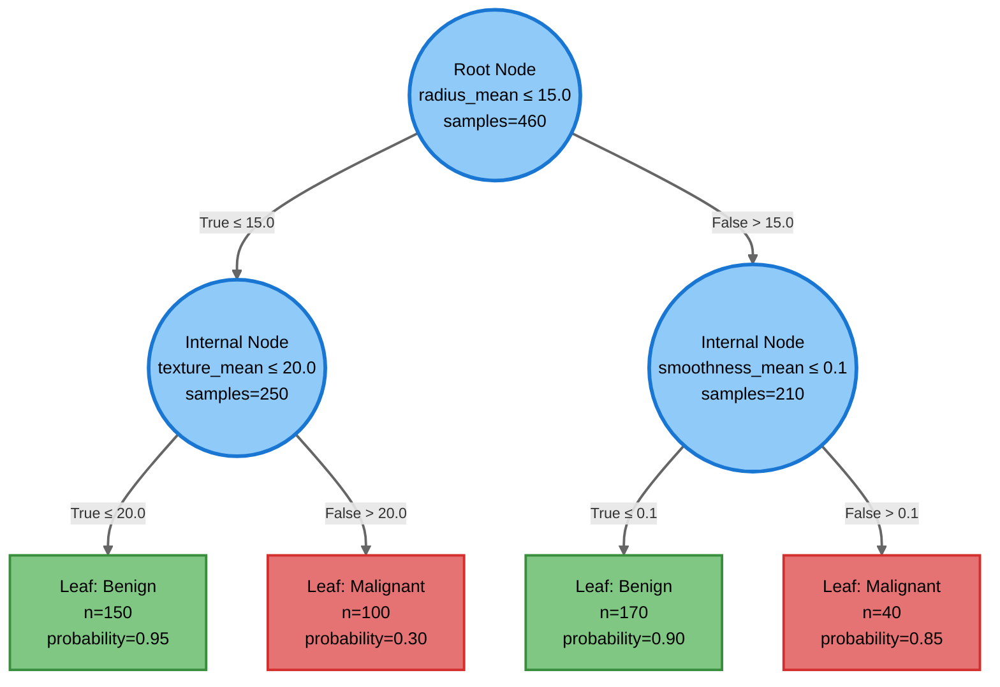

# Decision Trees and Tree-Based Learning

---
title: Decision Trees and Tree-Based Learning
description: Recursive partitioning, splitting criteria (entropy, information gain, Gini impurity), overfitting, underfitting, and tree complexity control
generated_by: claude skill chapter-content-generator
date: 2025-12-28
version: 0.03
---

## Summary

This chapter explores decision trees, one of the most interpretable and widely-used machine learning algorithms. Students will learn how decision trees recursively partition the feature space to make predictions, understand the mathematical foundations of splitting criteria including entropy, information gain, and Gini impurity, and discover how to control tree complexity through pruning and depth limits. The chapter introduces the critical concepts of overfitting and underfitting that apply across all machine learning algorithms, and demonstrates how decision trees handle both categorical and continuous features while creating clear decision boundaries.

## Concepts Covered

This chapter covers the following 14 concepts from the learning graph:

1. Decision Tree
2. Tree Node
3. Leaf Node
4. Splitting Criterion
5. Entropy
6. Information Gain
7. Gini Impurity
8. Pruning
9. Overfitting
10. Underfitting
11. Tree Depth
12. Feature Space Partitioning
13. Loss Function
14. Cross-Entropy Loss

## Prerequisites

This chapter builds on concepts from:

- [Chapter 1: Introduction to Machine Learning Fundamentals](../01-intro-to-ml-fundamentals/index.md)

---

## The Intuition Behind Decision Trees

Imagine you're a doctor diagnosing whether a patient has a disease. You might ask a series of questions: "Is the patient's temperature above 100°F?" If yes, "Does the patient have a cough?" If yes, "Has the cough lasted more than a week?" Based on the answers to these sequential yes/no questions, you arrive at a diagnosis. This is precisely how decision trees work—they make predictions by asking a series of questions about features, following a tree-like structure from root to leaf.

Decision trees are supervised learning algorithms that recursively partition the feature space into regions, each associated with a predicted class (classification) or value (regression). Unlike KNN, which stores all training data, decision trees learn explicit rules during training, creating an interpretable model that humans can understand and validate.

The algorithm's power lies in its simplicity and interpretability. A trained decision tree can be visualized as a flowchart where internal nodes represent feature tests, branches represent outcomes of those tests, and leaf nodes represent final predictions. This transparency makes decision trees particularly valuable in domains requiring explainable AI, such as healthcare, finance, and legal applications.

### A Simple Example: Predicting Tumor Diagnosis

Let's build intuition with a medical example using the Breast Cancer Wisconsin dataset, which contains measurements of cell nuclei from breast masses. The task: predict whether a tumor is malignant (cancerous) or benign (non-cancerous) based on features like radius, texture, and smoothness.

```python
import numpy as np
import pandas as pd
from sklearn.datasets import load_breast_cancer
from sklearn.model_selection import train_test_split
from sklearn.tree import DecisionTreeClassifier
from sklearn.metrics import accuracy_score, confusion_matrix
import matplotlib.pyplot as plt
import seaborn as sns

# Load breast cancer dataset
cancer = load_breast_cancer()
X = cancer.data
y = cancer.target  # 0 = malignant, 1 = benign

# Create DataFrame for exploration
cancer_df = pd.DataFrame(X, columns=cancer.feature_names)
cancer_df['diagnosis'] = pd.Categorical.from_codes(y, ['malignant', 'benign'])

print("Dataset shape:", cancer_df.shape)
print("\nClass distribution:")
print(cancer_df['diagnosis'].value_counts())
print("\nFirst 5 feature columns:")
print(cancer_df.iloc[:, :5].head())
```

This dataset contains 569 tumor samples with 30 features each. A decision tree will learn which features best distinguish malignant from benign tumors.

```python
# Visualize feature relationships
plt.figure(figsize=(12, 10))
selected_features = ['mean radius', 'mean texture', 'mean perimeter',
                     'mean area', 'mean smoothness']
sns.pairplot(cancer_df, vars=selected_features, hue='diagnosis',
             markers=["o", "s"], palette={'malignant': 'red', 'benign': 'blue'})
plt.suptitle("Breast Cancer Features by Diagnosis", y=1.02)
plt.show()
```

Notice how malignant and benign tumors occupy different regions in feature space. Decision trees identify these boundaries by asking questions like "Is mean radius > 15?" to separate classes.

!!! note "Interpretability Advantage"
    Unlike neural networks (black boxes), decision trees produce human-readable rules like: "If radius > 15 AND texture > 20, predict malignant." This transparency is crucial when decisions affect human lives.

## Tree Structure: Nodes, Splits, and Leaves

A decision tree consists of three types of components organized in a hierarchical structure:

**Tree Node (Internal Node)**: A decision point that tests a feature
- Contains a splitting criterion (e.g., "radius_mean ≤ 15.0")
- Has two or more child nodes (binary trees use two)
- Represents a partition of the data based on feature values

**Leaf Node (Terminal Node)**: An endpoint that makes predictions
- Contains no children
- Stores the final prediction (class label or numerical value)
- Represents a region of feature space with homogeneous outcomes

**Tree Depth**: The longest path from root to any leaf
- Depth 0: Only root node (no splits)
- Deeper trees can capture more complex patterns
- Excessive depth leads to overfitting

#### Decision Tree Structure



**Tree Depth**: 2 levels | **Recursive Partitioning**: Each internal node tests a feature and splits data based on a threshold value | **Final Predictions**: Leaf nodes contain class predictions with sample counts

### How Trees Make Predictions

Given a new sample, the tree makes a prediction by:

1. Start at the root node
2. Evaluate the feature test (e.g., "Is radius_mean ≤ 15.0?")
3. Follow the branch corresponding to the test result (True → left, False → right)
4. Repeat steps 2-3 at each internal node until reaching a leaf
5. Return the leaf's prediction (majority class for classification)

This process is deterministic—the same input always produces the same prediction by following the same path through the tree.

## Building Trees: The Recursive Partitioning Algorithm

Decision trees are constructed using a greedy, top-down recursive algorithm:

**Algorithm: Decision Tree Learning**

1. Start with all training data at the root
2. Find the best feature and threshold to split data (maximize information gain or minimize impurity)
3. Create two child nodes and partition data accordingly
4. Recursively repeat steps 2-3 for each child node
5. Stop when:
   - All samples in a node belong to the same class (pure node)
   - Maximum depth is reached
   - Minimum samples threshold is met
   - No split improves the criterion

The key challenge: How do we determine the "best" split? This requires quantifying how well a split separates classes.

```python
# Train a decision tree classifier
X_train, X_test, y_train, y_test = train_test_split(
    X, y, test_size=0.25, random_state=42, stratify=y
)

# Create decision tree with default settings
dt_classifier = DecisionTreeClassifier(random_state=42)
dt_classifier.fit(X_train, y_train)

print("Decision tree trained successfully")
print(f"Tree depth: {dt_classifier.get_depth()}")
print(f"Number of leaves: {dt_classifier.get_n_leaves()}")
print(f"Number of features used: {np.sum(dt_classifier.feature_importances_ > 0)}")

# Make predictions
y_pred = dt_classifier.predict(X_test)
test_accuracy = accuracy_score(y_test, y_pred)
print(f"\nTest accuracy: {test_accuracy:.3f}")

# Confusion matrix
cm = confusion_matrix(y_test, y_pred)
plt.figure(figsize=(8, 6))
sns.heatmap(cm, annot=True, fmt='d', cmap='Blues',
            xticklabels=['Malignant', 'Benign'],
            yticklabels=['Malignant', 'Benign'])
plt.title('Decision Tree Confusion Matrix')
plt.ylabel('True Label')
plt.xlabel('Predicted Label')
plt.show()
```

Even with default settings, decision trees often achieve high accuracy. But what criteria does the algorithm use to choose splits?

## Splitting Criteria: Measuring Impurity

A **splitting criterion** is a mathematical function that quantifies how "pure" or "mixed" a node's class distribution is. The algorithm searches for splits that reduce impurity, creating more homogeneous child nodes.

### Entropy and Information Gain

**Entropy** measures the randomness or disorder in a set of class labels. For a node with class distribution $p_1, p_2, ..., p_k$, entropy is:

$$H(S) = -\sum_{i=1}^{k} p_i \log_2(p_i)$$

where $p_i$ is the proportion of samples in class $i$.

Properties of entropy:
- Minimum entropy = 0 (all samples in one class—perfectly pure)
- Maximum entropy = $\log_2(k)$ (uniform distribution—maximally mixed)
- For binary classification: max entropy = 1 when $p_1 = p_2 = 0.5$

**Information Gain** measures the reduction in entropy achieved by a split:

$$IG(S, A) = H(S) - \sum_{v \in Values(A)} \frac{|S_v|}{|S|} H(S_v)$$

where:
- $S$ = parent node samples
- $A$ = feature being tested
- $S_v$ = subset of samples where feature $A$ has value $v$
- $\frac{|S_v|}{|S|}$ = proportion of samples in subset $v$

The decision tree algorithm selects the split with maximum information gain at each node.

```python
# Example: Calculate entropy for a node
def calculate_entropy(labels):
    """Calculate entropy of a label distribution."""
    _, counts = np.unique(labels, return_counts=True)
    probabilities = counts / len(labels)
    entropy = -np.sum(probabilities * np.log2(probabilities + 1e-10))
    return entropy

# Example node with 50 benign, 50 malignant samples
mixed_node = np.array([0]*50 + [1]*50)
pure_node = np.array([0]*100)

print(f"Entropy of mixed node (50/50): {calculate_entropy(mixed_node):.3f}")
print(f"Entropy of pure node (100/0): {calculate_entropy(pure_node):.3f}")

# After a good split: 10 malignant + 90 benign vs 40 malignant + 10 benign
left_child = np.array([0]*90 + [1]*10)
right_child = np.array([0]*10 + [1]*40)

print(f"\nEntropy of left child: {calculate_entropy(left_child):.3f}")
print(f"Entropy of right child: {calculate_entropy(right_child):.3f}")

# Weighted average entropy after split
weighted_entropy = (100/150 * calculate_entropy(left_child) +
                   50/150 * calculate_entropy(right_child))
info_gain = calculate_entropy(mixed_node) - weighted_entropy
print(f"\nInformation gain from split: {info_gain:.3f}")
```

### Gini Impurity

An alternative to entropy is **Gini impurity**, which measures the probability of misclassifying a randomly chosen element:

$$Gini(S) = 1 - \sum_{i=1}^{k} p_i^2$$

Properties:
- Minimum Gini = 0 (pure node)
- Maximum Gini = $1 - \frac{1}{k}$ for $k$ classes (uniform distribution)
- For binary classification: max Gini = 0.5 when $p_1 = p_2 = 0.5$

Gini impurity is computationally cheaper than entropy (no logarithms) and often produces similar trees. Scikit-learn uses Gini by default.

```python
def calculate_gini(labels):
    """Calculate Gini impurity of a label distribution."""
    _, counts = np.unique(labels, return_counts=True)
    probabilities = counts / len(labels)
    gini = 1 - np.sum(probabilities**2)
    return gini

print(f"Gini of mixed node (50/50): {calculate_gini(mixed_node):.3f}")
print(f"Gini of pure node (100/0): {calculate_gini(pure_node):.3f}")
print(f"Gini of left child: {calculate_gini(left_child):.3f}")
print(f"Gini of right child: {calculate_gini(right_child):.3f}")
```

The comparison:

| Criterion | Formula | Range (binary) | Computation | Common Use |
|-----------|---------|----------------|-------------|------------|
| **Entropy** | $-\sum p_i \log_2(p_i)$ | [0, 1] | Slower (log) | Theoretical analysis, information theory |
| **Gini Impurity** | $1 - \sum p_i^2$ | [0, 0.5] | Faster (squares) | Default in scikit-learn, practical applications |

Both criteria produce similar trees in practice. Entropy tends to favor more balanced splits, while Gini may create slightly more skewed partitions.

#### Entropy and Gini Impurity Interactive Comparison

<iframe src="../../sims/entropy-gini-comparison/main.html" width="100%" height="780px" style="border: 1px solid #ccc; border-radius: 4px;"></iframe>

[View Fullscreen](../../sims/entropy-gini-comparison/main.html){: target="_blank" .md-button } | [Documentation](../../sims/entropy-gini-comparison/index.md)

This interactive visualization compares entropy (blue) and Gini impurity (orange) as class proportions change. Move the slider to see how both measures respond, and click the split buttons to see examples of high and low information gain splits. Both measures peak at 50/50 distribution (maximum uncertainty) and reach zero for pure nodes.

## Overfitting and Underfitting: The Bias-Variance Tradeoff

Decision trees naturally tend toward **overfitting**—learning patterns specific to the training data that don't generalize to new data. This occurs because trees can grow arbitrarily deep, creating complex decision boundaries that perfectly fit training samples but fail on test data.

**Overfitting**: Model is too complex
- Symptoms: Training accuracy near 100%, much lower test accuracy
- Cause: Tree depth too deep, capturing noise and outliers
- Effect: Poor generalization to new data

**Underfitting**: Model is too simple
- Symptoms: Low training and test accuracy
- Cause: Tree depth too shallow, insufficient complexity
- Effect: Cannot capture true patterns in data

```python
# Demonstrate overfitting with unrestricted tree
dt_overfit = DecisionTreeClassifier(random_state=42)  # No depth limit
dt_overfit.fit(X_train, y_train)

train_acc_overfit = accuracy_score(y_train, dt_overfit.predict(X_train))
test_acc_overfit = accuracy_score(y_test, dt_overfit.predict(X_test))

print("Overfitting Example (no depth limit):")
print(f"  Training accuracy: {train_acc_overfit:.3f}")
print(f"  Test accuracy: {test_acc_overfit:.3f}")
print(f"  Tree depth: {dt_overfit.get_depth()}")
print(f"  Number of leaves: {dt_overfit.get_n_leaves()}")

# Demonstrate underfitting with very shallow tree
dt_underfit = DecisionTreeClassifier(max_depth=2, random_state=42)
dt_underfit.fit(X_train, y_train)

train_acc_underfit = accuracy_score(y_train, dt_underfit.predict(X_train))
test_acc_underfit = accuracy_score(y_test, dt_underfit.predict(X_test))

print("\nUnderfitting Example (max_depth=2):")
print(f"  Training accuracy: {train_acc_underfit:.3f}")
print(f"  Test accuracy: {test_acc_underfit:.3f}")
print(f"  Tree depth: {dt_underfit.get_depth()}")
print(f"  Number of leaves: {dt_underfit.get_n_leaves()}")

# Optimal complexity
dt_optimal = DecisionTreeClassifier(max_depth=5, random_state=42)
dt_optimal.fit(X_train, y_train)

train_acc_optimal = accuracy_score(y_train, dt_optimal.predict(X_train))
test_acc_optimal = accuracy_score(y_test, dt_optimal.predict(X_test))

print("\nBalanced Example (max_depth=5):")
print(f"  Training accuracy: {train_acc_optimal:.3f}")
print(f"  Test accuracy: {test_acc_optimal:.3f}")
print(f"  Tree depth: {dt_optimal.get_depth()}")
print(f"  Number of leaves: {dt_optimal.get_n_leaves()}")
```

!!! warning "Perfect Training Accuracy is a Red Flag"
    When a decision tree achieves 100% training accuracy, it's almost certainly overfitting. The tree has memorized specific training examples rather than learning general patterns.

### Controlling Tree Complexity

To prevent overfitting, we constrain tree growth using hyperparameters:

**Tree Depth (`max_depth`)**: Maximum levels from root to leaf
- Small depth → underfitting (too simple)
- Large depth → overfitting (too complex)
- Typical values: 3-10 for interpretability, 10-30 for performance

**Minimum Samples per Split (`min_samples_split`)**: Minimum samples required to split a node
- Higher values → fewer splits → simpler trees
- Prevents splits on small subsets that may be noise

**Minimum Samples per Leaf (`min_samples_leaf`)**: Minimum samples required in a leaf node
- Forces leaves to generalize over multiple examples
- Reduces overfitting to individual outliers

**Pruning**: Remove branches that provide little predictive power
- Pre-pruning: Stop growing tree early (using hyperparameters above)
- Post-pruning: Grow full tree, then remove branches (less common in scikit-learn)

```python
# Find optimal depth using cross-validation
from sklearn.model_selection import cross_val_score

depths = range(1, 20)
train_scores = []
cv_scores = []

for depth in depths:
    dt = DecisionTreeClassifier(max_depth=depth, random_state=42)

    # Training accuracy
    dt.fit(X_train, y_train)
    train_scores.append(accuracy_score(y_train, dt.predict(X_train)))

    # Cross-validation accuracy
    cv_score = cross_val_score(dt, X_train, y_train, cv=5).mean()
    cv_scores.append(cv_score)

# Plot bias-variance tradeoff
plt.figure(figsize=(10, 6))
plt.plot(depths, train_scores, marker='o', label='Training Accuracy', linewidth=2)
plt.plot(depths, cv_scores, marker='s', label='CV Accuracy', linewidth=2)
plt.xlabel('Tree Depth')
plt.ylabel('Accuracy')
plt.title('Bias-Variance Tradeoff: Finding Optimal Tree Depth')
plt.legend()
plt.grid(True, alpha=0.3)
plt.axvline(x=depths[np.argmax(cv_scores)], color='red', linestyle='--',
            label=f'Optimal depth={depths[np.argmax(cv_scores)]}')
plt.legend()
plt.show()

optimal_depth = depths[np.argmax(cv_scores)]
print(f"Optimal tree depth: {optimal_depth}")
print(f"Best CV accuracy: {max(cv_scores):.3f}")
```

This plot reveals the classic bias-variance tradeoff pattern: training accuracy increases monotonically with depth (lower bias), while cross-validation accuracy peaks then declines (variance increases past optimal point).

## Feature Space Partitioning

Decision trees partition the feature space into axis-aligned rectangular regions. Each split creates a boundary perpendicular to one feature axis, dividing the space into two sub-regions.

For a 2D feature space:
- First split: Vertical or horizontal line dividing space
- Second split: Additional line subdividing one half
- Continued splits: Increasingly fine-grained rectangular partition

This geometric interpretation helps understand decision trees' strengths and limitations:

**Strengths:**
- Clear, interpretable boundaries
- Handles non-linear relationships
- No assumptions about data distribution

**Limitations:**
- Cannot learn diagonal boundaries efficiently (requires many splits)
- Struggles with rotated data
- Creates "staircase" boundaries for smooth, curved decision surfaces

```python
# Visualize decision boundaries for 2D data
from sklearn.datasets import make_classification
from matplotlib.colors import ListedColormap

# Create 2D synthetic data
X_2d, y_2d = make_classification(n_samples=300, n_features=2, n_redundant=0,
                                  n_informative=2, n_clusters_per_class=1,
                                  random_state=42)

# Train trees with different depths
fig, axes = plt.subplots(1, 3, figsize=(15, 4))
depths = [2, 4, 10]

cmap_light = ListedColormap(['#FFAAAA', '#AAAAFF'])
cmap_bold = ListedColormap(['#FF0000', '#0000FF'])

for idx, depth in enumerate(depths):
    dt = DecisionTreeClassifier(max_depth=depth, random_state=42)
    dt.fit(X_2d, y_2d)

    # Create mesh for decision boundary
    h = 0.02
    x_min, x_max = X_2d[:, 0].min() - 1, X_2d[:, 0].max() + 1
    y_min, y_max = X_2d[:, 1].min() - 1, X_2d[:, 1].max() + 1
    xx, yy = np.meshgrid(np.arange(x_min, x_max, h),
                         np.arange(y_min, y_max, h))

    # Predict for each point in mesh
    Z = dt.predict(np.c_[xx.ravel(), yy.ravel()])
    Z = Z.reshape(xx.shape)

    # Plot
    axes[idx].contourf(xx, yy, Z, cmap=cmap_light, alpha=0.8)
    axes[idx].scatter(X_2d[:, 0], X_2d[:, 1], c=y_2d, cmap=cmap_bold,
                     edgecolor='black', s=50)
    axes[idx].set_title(f'Decision Tree (depth={depth})')
    axes[idx].set_xlabel('Feature 1')
    axes[idx].set_ylabel('Feature 2')

plt.tight_layout()
plt.show()
```

Notice how deeper trees create more rectangular partitions, capturing finer details but risking overfitting. The axis-aligned nature means diagonal boundaries require multiple splits to approximate.

## Loss Functions and Cross-Entropy Loss

In classification, decision trees minimize a **loss function** that quantifies prediction error. The most common loss for probabilistic classifiers is **cross-entropy loss**, which penalizes confident wrong predictions more than uncertain ones.

For binary classification, cross-entropy loss for a single example is:

$$L(y, \hat{p}) = -y \log(\hat{p}) - (1-y) \log(1-\hat{p})$$

where:
- $y \in \{0, 1\}$ is the true label
- $\hat{p}$ is the predicted probability of class 1

For multi-class classification:

$$L(y, \hat{\mathbf{p}}) = -\sum_{i=1}^{k} y_i \log(\hat{p}_i)$$

where $y_i$ is 1 if the true class is $i$, 0 otherwise (one-hot encoding).

Decision trees don't directly optimize cross-entropy during training (they use Gini or entropy for splits), but cross-entropy provides a principled way to evaluate predicted class probabilities.

```python
from sklearn.metrics import log_loss

# Get probability predictions
y_prob = dt_optimal.predict_proba(X_test)

# Calculate cross-entropy loss
ce_loss = log_loss(y_test, y_prob)
print(f"Cross-entropy loss: {ce_loss:.3f}")

# Compare with accuracy
test_acc = accuracy_score(y_test, dt_optimal.predict(X_test))
print(f"Test accuracy: {test_acc:.3f}")

# Show how confident wrong predictions increase loss
correct_pred = y_prob[y_test == dt_optimal.predict(X_test)]
incorrect_pred = y_prob[y_test != dt_optimal.predict(X_test)]

print(f"\nAverage confidence on correct predictions: {correct_pred.max(axis=1).mean():.3f}")
print(f"Average confidence on incorrect predictions: {incorrect_pred.max(axis=1).mean():.3f}")
```

Cross-entropy penalizes confident mistakes more heavily than uncertain ones, encouraging well-calibrated probability estimates.

## Visualizing Decision Trees

One of decision trees' greatest strengths is interpretability—we can visualize the learned rules and understand how predictions are made.

```python
from sklearn.tree import plot_tree

# Visualize the optimal tree
plt.figure(figsize=(20, 10))
plot_tree(dt_optimal,
          feature_names=cancer.feature_names,
          class_names=['Malignant', 'Benign'],
          filled=True,
          rounded=True,
          fontsize=10)
plt.title("Decision Tree for Breast Cancer Classification (depth=5)")
plt.show()

# Feature importance
feature_importance = pd.DataFrame({
    'feature': cancer.feature_names,
    'importance': dt_optimal.feature_importances_
}).sort_values('importance', ascending=False)

print("\nTop 10 Most Important Features:")
print(feature_importance.head(10))

# Plot feature importance
plt.figure(figsize=(10, 6))
top_features = feature_importance.head(15)
plt.barh(top_features['feature'], top_features['importance'])
plt.xlabel('Feature Importance')
plt.title('Top 15 Feature Importances in Decision Tree')
plt.gca().invert_yaxis()
plt.tight_layout()
plt.show()
```

Feature importance reveals which features the tree relies on most for splits. Features appearing near the root or in many nodes have higher importance.

!!! tip "Reading Tree Visualizations"
    - **Node color intensity**: Darker colors indicate more samples in that class
    - **Sample count**: Number of training examples reaching that node
    - **Value**: Number of samples per class at that node
    - **Gini/Entropy**: Impurity measure at that node
    - **Path from root to leaf**: Decision rule for a specific prediction

## Practical Considerations and Best Practices

Decision trees excel in many scenarios but have important limitations to consider:

**When to Use Decision Trees:**
- Need interpretable models (medical, legal, financial domains)
- Data has mix of categorical and continuous features
- Non-linear relationships exist
- Interactions between features matter
- Robust to outliers (doesn't use distances)

**When to Avoid Decision Trees:**
- Need smooth decision boundaries
- Very high-dimensional data (>100 features)
- Features are highly correlated
- Require stable predictions (trees are sensitive to data changes)

**Best Practices:**

1. **Always set max_depth**: Prevents overfitting, improves interpretability
2. **Use cross-validation**: Find optimal hyperparameters systematically
3. **Check feature importance**: Validate that important features make domain sense
4. **Compare training vs test accuracy**: Monitor for overfitting
5. **Consider ensemble methods**: Random forests (next section) often outperform single trees

```python
# Example: Proper hyperparameter tuning with grid search
from sklearn.model_selection import GridSearchCV

param_grid = {
    'max_depth': [3, 5, 7, 10, None],
    'min_samples_split': [2, 5, 10],
    'min_samples_leaf': [1, 2, 4],
    'criterion': ['gini', 'entropy']
}

grid_search = GridSearchCV(
    DecisionTreeClassifier(random_state=42),
    param_grid,
    cv=5,
    scoring='accuracy',
    n_jobs=-1
)

grid_search.fit(X_train, y_train)

print("Best hyperparameters:")
print(grid_search.best_params_)
print(f"\nBest CV accuracy: {grid_search.best_score_:.3f}")
print(f"Test accuracy: {grid_search.score(X_test, y_test):.3f}")
```

## Random Forests: Ensemble of Trees

A single decision tree's predictions can be unstable—small changes in training data may produce very different trees. **Random forests** address this by training multiple trees on random subsets of data and averaging their predictions.

Random forest algorithm:
1. Create many bootstrap samples (random sampling with replacement)
2. Train a decision tree on each bootstrap sample
3. For each tree, consider only random subset of features at each split
4. Predict by majority vote (classification) or averaging (regression)

This ensemble approach reduces variance while maintaining low bias, often outperforming single trees.

```python
from sklearn.ensemble import RandomForestClassifier

# Train random forest
rf_classifier = RandomForestClassifier(n_estimators=100, max_depth=10,
                                       random_state=42, n_jobs=-1)
rf_classifier.fit(X_train, y_train)

# Evaluate
rf_train_acc = accuracy_score(y_train, rf_classifier.predict(X_train))
rf_test_acc = accuracy_score(y_test, rf_classifier.predict(X_test))

print("Random Forest Performance:")
print(f"  Training accuracy: {rf_train_acc:.3f}")
print(f"  Test accuracy: {rf_test_acc:.3f}")

# Compare with single tree
print("\nSingle Decision Tree Performance:")
print(f"  Training accuracy: {train_acc_optimal:.3f}")
print(f"  Test accuracy: {test_acc_optimal:.3f}")

print(f"\nImprovement from ensemble: {(rf_test_acc - test_acc_optimal)*100:.1f}%")
```

Random forests typically improve test accuracy by 2-5% while reducing overfitting. The tradeoff: loss of interpretability (100 trees are harder to understand than 1).

## Key Takeaways

This chapter explored decision trees, an interpretable and versatile machine learning algorithm:

- **Decision trees** recursively partition feature space using a hierarchy of feature tests, making predictions at leaf nodes

- **Tree structure** consists of internal nodes (feature tests), branches (outcomes), and leaf nodes (predictions), organized by depth

- **Splitting criteria** like entropy and Gini impurity quantify node purity; trees choose splits that maximize information gain or minimize impurity

- **Overfitting** occurs when trees grow too deep, memorizing training data; **underfitting** occurs when trees are too shallow to capture patterns

- **Tree depth control** via max_depth, min_samples_split, and pruning prevents overfitting while maintaining predictive power

- **Feature space partitioning** creates axis-aligned rectangular regions; interpretable but cannot efficiently learn diagonal boundaries

- **Cross-entropy loss** measures prediction quality for probabilistic classification, penalizing confident wrong predictions

- **Random forests** combine multiple trees trained on random data subsets, reducing variance and improving generalization

Decision trees provide a strong foundation for understanding more sophisticated algorithms, including ensemble methods and gradient boosting covered in advanced courses. Their interpretability makes them invaluable when stakeholders need to understand and trust model decisions.

In the next chapter, we'll explore logistic regression, which takes a different approach to classification using probabilistic modeling and linear decision boundaries.
