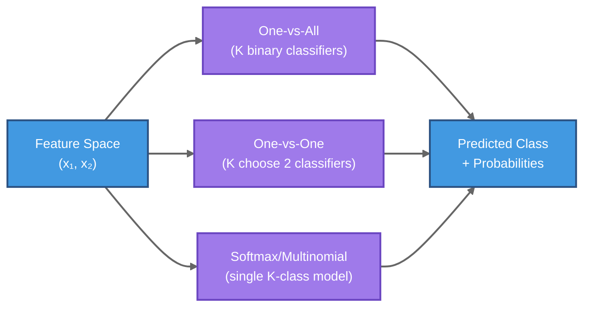

# Logistic Regression and Classification

## Summary

This chapter introduces logistic regression, a fundamental algorithm for classification that uses probabilistic modeling to predict class membership. Students will learn how the sigmoid function transforms linear combinations of features into probabilities, understand the log-loss (cross-entropy) objective function, and explore maximum likelihood estimation. The chapter extends beyond binary classification to cover multiclass problems through one-vs-all and one-vs-one strategies, and introduces the softmax function for directly modeling multiple classes. By mastering logistic regression, students will understand the bridge between linear models and probabilistic classification.

## Concepts Covered

This chapter covers the following 10 concepts from the learning graph:

1. Logistic Regression
2. Sigmoid Function
3. Sigmoid Activation
4. Log-Loss
5. Binary Classification
6. Multiclass Classification
7. Maximum Likelihood
8. One-vs-All
9. One-vs-One
10. Softmax Function

## Prerequisites

This chapter builds on concepts from:

- [Chapter 1: Introduction to Machine Learning Fundamentals](../01-intro-to-ml-fundamentals/index.md)
- [Chapter 3: Decision Trees and Tree-Based Learning](../03-decision-trees/index.md)

---

## From Regression to Classification

Linear regression, with its familiar form $y = mx + b$, excels at predicting continuous numerical values. When you need to predict whether a penguin is male or female, whether an email is spam or not spam, or which species of iris flower you're observing, however, linear regression encounters fundamental limitations. Classification requires predicting discrete categories rather than continuous values, and this calls for a different approach.

### The Problem with Linear Regression for Classification

Consider a binary classification task where we want to predict penguin sex (male or female) based on physical measurements. If we encode the classes as 0 and 1 and apply standard linear regression, we face several conceptual difficulties:

```python
import numpy as np
import pandas as pd
import matplotlib.pyplot as plt
from sklearn.linear_model import LinearRegression

# Load penguin data
penguins = pd.read_csv('https://raw.githubusercontent.com/sziccardi/MLCamp2025_DataRepository/main/penguins.csv')

# Convert categorical variables to numerical format
penguins2 = pd.get_dummies(penguins, drop_first=True, dtype='int')

# Prepare features and target
predictors = penguins2.columns[0:-1]
X = penguins2[predictors].values
Y = penguins2["sex_male"].values.reshape(-1, 1)

# Fit linear regression model
linear_regressor = LinearRegression()
linear_regressor.fit(X, Y)
Y_pred = linear_regressor.predict(X)

# Visualize the problem
plt.figure(figsize=(12, 6))
plt.scatter(Y_pred, Y, alpha=0.5)
plt.xlabel("Predicted")
plt.ylabel("Actual")
plt.title("Linear Regression for Binary Classification")
plt.show()
```

The predictions from linear regression are not constrained to the interval [0, 1]. The model might predict values like 1.3 or -0.2, which are meaningless as probabilities or class labels. While we could threshold predictions at 0.5 to assign classes, the unconstrained output range makes it difficult to interpret predictions probabilistically.

What we need is a transformation that takes any real-valued linear combination of features and maps it to a value between 0 and 1—something we can interpret as a probability.

## The Sigmoid Function

The **sigmoid function** (also called the **logistic function**) provides exactly this transformation. Mathematically, it's defined as:

$$\sigma(z) = \frac{1}{1 + e^{-z}}$$

where $z$ can be any real number. The sigmoid function has several remarkable properties that make it ideal for classification:

1. **Range**: The output is always between 0 and 1, regardless of the input value
2. **Monotonicity**: As $z$ increases, $\sigma(z)$ increases smoothly
3. **Interpretability**: The output can be interpreted as a probability
4. **Differentiability**: The function is smooth and differentiable everywhere

Let's visualize the sigmoid function to understand its behavior:

```python
# Plot the sigmoid function
xvals = np.linspace(-6, 6, 200)
f = lambda x: 1 / (1 + np.exp(-x))

plt.figure(figsize=(12, 6))
plt.plot(xvals, f(xvals), linewidth=2)
plt.axhline(0, color="red", linestyle="--", alpha=0.7)
plt.axhline(1, color="red", linestyle="--", alpha=0.7)
plt.axhline(0.5, color="green", linestyle="--", alpha=0.7)
plt.axvline(0, color="gray", linestyle="--", alpha=0.5)
plt.xlabel("z", fontsize=12)
plt.ylabel("σ(z)", fontsize=12)
plt.title("The Sigmoid Function", fontsize=14)
plt.grid(True, alpha=0.3)
plt.show()
```

Notice how the sigmoid function smoothly transitions from 0 to 1, with the steepest change occurring around $z = 0$. When $z = 0$, the sigmoid outputs exactly 0.5. As $z$ approaches positive infinity, the output approaches 1, and as $z$ approaches negative infinity, the output approaches 0.

### Sigmoid as an Activation Function

In the context of machine learning and neural networks, the sigmoid is often referred to as an **activation function**. When used as a **sigmoid activation**, it transforms the weighted sum of inputs into a probability-like output. This concept becomes particularly important in neural networks, where sigmoid units were historically used as the primary nonlinear transformation.

The sigmoid function can also be written in the equivalent form:

$$\sigma(z) = \frac{e^z}{1 + e^z}$$

This alternative formulation highlights the exponential relationship and is particularly useful when deriving the softmax function for multiclass problems.

## Binary Classification with Logistic Regression

**Logistic regression** applies the sigmoid transformation to a linear combination of features, creating a probabilistic binary classifier. The model has the form:

$$z = \beta_0 + \beta_1 x_1 + \beta_2 x_2 + \cdots + \beta_k x_k$$

$$P(y = 1 | \mathbf{x}) = \sigma(z) = \frac{1}{1 + e^{-z}}$$

where $\mathbf{x} = (x_1, x_2, \ldots, x_k)$ represents the feature vector, $\boldsymbol{\beta} = (\beta_0, \beta_1, \ldots, \beta_k)$ are the model parameters, and $P(y = 1 | \mathbf{x})$ is the probability that the instance belongs to class 1 given its features.

The model outputs a probability between 0 and 1. For **binary classification**, we typically apply a decision threshold (usually 0.5) to convert this probability into a class prediction:

$$\hat{y} = \begin{cases} 1 & \text{if } P(y = 1 | \mathbf{x}) \geq 0.5 \\ 0 & \text{otherwise} \end{cases}$$

Let's apply logistic regression to the penguin sex classification problem:

```python
from sklearn.linear_model import LogisticRegression

# Fit logistic regression model
logistic_regressor = LogisticRegression(max_iter=10000)
logistic_regressor.fit(X, Y.ravel())

# Get probability predictions
Y_pred_prob = logistic_regressor.predict_proba(X)

# Display first 10 predictions
print("First 10 probability predictions:")
print(Y_pred_prob[0:10, :])
```

The `predict_proba` method returns a two-column array. The first column contains $P(y = 0 | \mathbf{x})$ (probability of female), and the second column contains $P(y = 1 | \mathbf{x})$ (probability of male). Note that these probabilities sum to 1 for each instance.

We can visualize how the logistic regression predictions differ from linear regression:

```python
plt.figure(figsize=(12, 6))
plt.scatter(Y_pred_prob[:, 1], Y, alpha=0.5)
plt.xlabel("Predicted Probability (Male)")
plt.ylabel("Actual Label")
plt.title("Logistic Regression Predictions")
plt.grid(True, alpha=0.3)
plt.show()
```

Unlike linear regression, logistic regression constrains all predictions to the [0, 1] interval, making them interpretable as probabilities.

### Making Class Predictions

The `predict` method applies the default 0.5 threshold to generate class predictions:

```python
# Get class predictions
Y_pred = logistic_regressor.predict(X)

# Evaluate using confusion matrix
from sklearn.metrics import confusion_matrix

cm = confusion_matrix(Y, Y_pred)
print("Confusion Matrix:")
print(cm)

# Show as percentages
cm_normalized = confusion_matrix(Y, Y_pred, normalize='all')
print("\nConfusion Matrix (Normalized):")
print(cm_normalized)
```

The confusion matrix shows that the model correctly classifies most penguins, with a small number of false positives and false negatives. The normalized version expresses these counts as proportions of the total dataset.

!!! tip "Interpreting the Confusion Matrix"
    For binary classification, the confusion matrix has the form:

    |              | Predicted 0 | Predicted 1 |
    |--------------|-------------|-------------|
    | **Actual 0** | True Neg    | False Pos   |
    | **Actual 1** | False Neg   | True Pos    |

    The diagonal elements represent correct predictions, while off-diagonal elements represent errors.

## Maximum Likelihood Estimation and Log-Loss

How does logistic regression determine the optimal parameters $\boldsymbol{\beta}$? Unlike linear regression, which minimizes squared error, logistic regression uses **maximum likelihood estimation** (MLE).

### The Likelihood Principle

Given a dataset with $n$ instances, where each instance $i$ has features $\mathbf{x}_i$ and true label $y_i \in \{0, 1\}$, the likelihood of the data under our model is:

$$L(\boldsymbol{\beta}) = \prod_{i=1}^{n} P(y_i | \mathbf{x}_i; \boldsymbol{\beta})$$

For each instance, this probability is:

$$P(y_i | \mathbf{x}_i; \boldsymbol{\beta}) = \begin{cases} \sigma(z_i) & \text{if } y_i = 1 \\ 1 - \sigma(z_i) & \text{if } y_i = 0 \end{cases}$$

This can be written compactly as:

$$P(y_i | \mathbf{x}_i; \boldsymbol{\beta}) = \sigma(z_i)^{y_i} (1 - \sigma(z_i))^{1-y_i}$$

### From Likelihood to Log-Loss

Taking the logarithm of the likelihood (which is monotonic and thus preserves the location of the maximum) gives us the log-likelihood:

$$\log L(\boldsymbol{\beta}) = \sum_{i=1}^{n} \left[ y_i \log \sigma(z_i) + (1-y_i) \log(1-\sigma(z_i)) \right]$$

Machine learning practitioners typically work with loss functions (which we minimize) rather than likelihood functions (which we maximize). The **log-loss** (also called **binary cross-entropy**) is the negative average log-likelihood:

$$\text{Log-Loss} = -\frac{1}{n} \sum_{i=1}^{n} \left[ y_i \log \hat{p}_i + (1-y_i) \log(1-\hat{p}_i) \right]$$

where $\hat{p}_i = \sigma(z_i)$ is the predicted probability for instance $i$.

### Interpreting Log-Loss

Log-loss penalizes confident wrong predictions heavily. If the true label is 1 and the model predicts a probability near 0, the term $\log \hat{p}_i$ approaches negative infinity, resulting in a very large loss. Conversely, correct predictions with high confidence yield low loss values.

Consider these examples:

- True label = 1, predicted probability = 0.9: Loss = $-\log(0.9) \approx 0.105$ (small penalty)
- True label = 1, predicted probability = 0.5: Loss = $-\log(0.5) \approx 0.693$ (moderate penalty)
- True label = 1, predicted probability = 0.1: Loss = $-\log(0.1) \approx 2.303$ (large penalty)

Scikit-learn's `LogisticRegression` uses optimization algorithms (like L-BFGS or stochastic gradient descent) to find the parameters $\boldsymbol{\beta}$ that minimize the log-loss, optionally with regularization terms added to prevent overfitting.

!!! note "Regularization in Logistic Regression"
    The `C` parameter in scikit-learn's `LogisticRegression` controls regularization strength. Smaller values of `C` specify stronger regularization. The default is `C=1.0`.

## Multiclass Classification Strategies

Many real-world problems involve predicting one of several classes rather than just two. **Multiclass classification** requires extending binary methods to handle multiple categories. There are several standard approaches for adapting binary classifiers to multiclass problems.

### One-vs-All (One-vs-Rest)

The **one-vs-all** (OvA) strategy, also called one-vs-rest, trains $K$ separate binary classifiers for a $K$-class problem. For each class $k$:

1. Create a binary classification task where class $k$ is the positive class and all other classes are grouped as the negative class
2. Train a binary classifier on this transformed dataset
3. The classifier learns to distinguish "class $k$" from "not class $k$"

During prediction, all $K$ classifiers generate scores for a new instance. The class with the highest score (or highest predicted probability) is selected as the final prediction.

**Advantages:**
- Simple to implement and understand
- Requires training only $K$ classifiers
- Works with any binary classifier

**Disadvantages:**
- Class imbalance (one positive class vs. many negative classes combined)
- Classifiers are not directly comparable (trained on different datasets)

### One-vs-One

The **one-vs-one** (OvO) strategy trains a binary classifier for every pair of classes. For $K$ classes, this requires training $\binom{K}{2} = \frac{K(K-1)}{2}$ classifiers.

For each pair of classes $(i, j)$:

1. Create a binary dataset containing only instances from classes $i$ and $j$
2. Train a binary classifier to distinguish class $i$ from class $j$

During prediction, each of the $\binom{K}{2}$ classifiers votes for one class. The class that receives the most votes is selected as the final prediction.

**Advantages:**
- Each classifier trains on a balanced, smaller dataset
- Can be more accurate for some problems
- Parallelizable (classifiers are independent)

**Disadvantages:**
- Requires $O(K^2)$ classifiers, which can be expensive for large $K$
- Voting can be ambiguous (ties, no clear majority)

!!! warning "Computational Considerations"
    For 10 classes, one-vs-one requires 45 classifiers. For 100 classes, it requires 4,950 classifiers. The computational cost can become prohibitive for problems with many classes.

### Direct Multiclass Logistic Regression: The Softmax Function

Rather than training multiple binary classifiers, we can directly extend logistic regression to handle multiple classes using the **softmax function**. For $K$ classes, we learn $K$ separate linear models:

$$z_k = \beta_{k,0} + \beta_{k,1} x_1 + \beta_{k,2} x_2 + \cdots + \beta_{k,p} x_p$$

for $k = 1, 2, \ldots, K$. The softmax function then converts these scores into probabilities:

$$P(y = k | \mathbf{x}) = \frac{e^{z_k}}{\sum_{j=1}^{K} e^{z_j}}$$

The softmax ensures that:

1. All probabilities are positive
2. All probabilities sum to 1: $\sum_{k=1}^{K} P(y = k | \mathbf{x}) = 1$
3. The class with the highest score $z_k$ gets the highest probability

Notice that softmax is a generalization of the sigmoid function. For $K = 2$ classes, softmax reduces to the binary sigmoid formulation.

### Implementing Multiclass Logistic Regression

Let's apply multinomial logistic regression to the classic Iris dataset, which has three classes (setosa, versicolor, virginica):

```python
# Load Iris dataset
iris_df = pd.read_csv('https://raw.githubusercontent.com/sziccardi/MLCamp2025_DataRepository/main/iris.csv')

# Convert species names to numerical labels
labels, unique = pd.factorize(iris_df['species'])

# Prepare features and target
X = iris_df.iloc[:, 1:5].values  # Use sepal and petal measurements
y = labels

# Train multinomial logistic regression
mc_lr = LogisticRegression(multi_class='multinomial', solver='lbfgs', max_iter=1000)
mc_lr.fit(X, y)

# Get probability predictions for first 5 instances
probs = mc_lr.predict_proba(X)[0:5, :]
print("Probability predictions (first 5 instances):")
print(probs)
```

The `predict_proba` output now has three columns, one for each class. Each row sums to 1, representing a complete probability distribution over the three species.

```python
# Generate class predictions
preds = mc_lr.predict(X)

# Evaluate with confusion matrix
cm = confusion_matrix(y, preds)
print("\nConfusion Matrix:")
print(cm)
```

For the Iris dataset, logistic regression typically achieves near-perfect classification, as evidenced by a diagonal confusion matrix with few or no off-diagonal errors.

!!! tip "Choosing Multiclass Strategies"
    - **Use softmax (multinomial)** when you want calibrated probabilities and direct multiclass modeling
    - **Use one-vs-all** for faster training with many classes and simpler implementation
    - **Use one-vs-one** when you have moderate numbers of classes and want high accuracy

## Logistic Regression in Practice

### Preprocessing and Feature Engineering

While logistic regression doesn't require features to be normally distributed (unlike linear discriminant analysis), standardizing features often improves convergence and numerical stability:

```python
from sklearn.preprocessing import StandardScaler
from sklearn.model_selection import train_test_split

# Split data
X_train, X_test, y_train, y_test = train_test_split(X, y, test_size=0.2,
                                                      random_state=42, stratify=y)

# Standardize features
scaler = StandardScaler()
X_train_scaled = scaler.fit_transform(X_train)
X_test_scaled = scaler.transform(X_test)

# Train on scaled data
lr = LogisticRegression(max_iter=1000)
lr.fit(X_train_scaled, y_train)

# Evaluate
train_score = lr.score(X_train_scaled, y_train)
test_score = lr.score(X_test_scaled, y_test)

print(f"Training accuracy: {train_score:.3f}")
print(f"Test accuracy: {test_score:.3f}")
```

### Interpreting Coefficients

The coefficients $\boldsymbol{\beta}$ in logistic regression indicate how each feature influences the log-odds of the positive class:

$$\log \frac{P(y=1|\mathbf{x})}{P(y=0|\mathbf{x})} = \beta_0 + \beta_1 x_1 + \cdots + \beta_k x_k$$

A positive coefficient $\beta_j$ means that increasing feature $x_j$ increases the log-odds (and thus the probability) of class 1. The magnitude indicates the strength of the effect.

```python
# Display coefficients for binary logistic regression
feature_names = iris_df.columns[1:5]
coefficients = lr.coef_[0]

for name, coef in zip(feature_names, coefficients):
    print(f"{name}: {coef:.3f}")
```

### Regularization and Model Complexity

The `C` parameter controls the inverse of regularization strength:

- **Large C** (e.g., 100): Weak regularization, model fits training data closely (risk of overfitting)
- **Small C** (e.g., 0.01): Strong regularization, model is simpler and more robust (risk of underfitting)

You can tune `C` using cross-validation:

```python
from sklearn.model_selection import cross_val_score

# Test different C values
C_values = [0.001, 0.01, 0.1, 1.0, 10.0, 100.0]

for C in C_values:
    lr = LogisticRegression(C=C, max_iter=1000)
    scores = cross_val_score(lr, X_train_scaled, y_train, cv=5)
    print(f"C={C:6.3f}: CV accuracy = {scores.mean():.3f} (+/- {scores.std():.3f})")
```

### When to Use Logistic Regression

**Strengths:**
- Fast to train and predict
- Provides calibrated probability estimates
- Interpretable coefficients
- Works well with linearly separable classes
- Effective with regularization for high-dimensional data

**Limitations:**
- Assumes linear decision boundaries
- May underfit complex, nonlinear relationships
- Sensitive to outliers in features (though less so than linear regression)
- Requires relatively more data for high-dimensional problems

## Interactive Visualization: Sigmoid Function Explorer

This interactive visualization shows how the sigmoid function $\sigma(z) = \frac{1}{1+e^{-z}}$ transforms a linear function $z = mx + b$ into probabilities. Adjust the slope to control prediction confidence (steeper = more confident) and the intercept to shift the decision boundary.

<iframe src="../../sims/sigmoid-explorer/main.html" width="100%" height="680px" frameborder="0"></iframe>

## Interactive Visualization: Multiclass Decision Boundaries



**Multiclass Strategies**: (1) **One-vs-All**: Train K binary classifiers, pick class with highest confidence; (2) **One-vs-One**: Train K(K-1)/2 pairwise classifiers, use voting; (3) **Softmax**: Direct multinomial model with exp normalization ensuring probabilities sum to 1.

## Summary

Logistic regression bridges the gap between linear regression and classification by applying the sigmoid transformation to produce probability estimates. The sigmoid function constrains outputs to [0, 1], enabling probabilistic interpretation and principled decision-making. Through maximum likelihood estimation and log-loss minimization, logistic regression learns decision boundaries that separate classes effectively.

For multiclass problems, we have several strategies: one-vs-all trains $K$ binary classifiers, one-vs-one trains $\binom{K}{2}$ pairwise classifiers, and the softmax function enables direct multinomial modeling. Each approach has trade-offs in computational cost, accuracy, and interpretability.

The concepts introduced in this chapter—sigmoid activation, log-loss, and softmax—form the foundation for understanding neural networks, where these functions appear as building blocks in more complex architectures. Logistic regression remains a valuable tool for its simplicity, interpretability, and effectiveness on linearly separable problems.

## Key Takeaways

1. The **sigmoid function** maps any real number to the interval [0, 1], enabling probabilistic interpretation
2. **Logistic regression** applies sigmoid transformation to a linear combination of features for binary classification
3. **Log-loss** (binary cross-entropy) measures the quality of probability predictions and is minimized during training
4. **Maximum likelihood estimation** provides the theoretical foundation for learning logistic regression parameters
5. **One-vs-all** and **one-vs-one** are strategies for extending binary classifiers to multiclass problems
6. The **softmax function** generalizes sigmoid to multiple classes, producing a probability distribution over $K$ classes
7. Regularization (controlled by parameter `C`) balances model complexity and generalization
8. Logistic regression works best for linearly separable problems but can be extended with polynomial features or combined with other methods

## Further Reading

- Hastie, T., Tibshirani, R., & Friedman, J. (2009). *The Elements of Statistical Learning* (Chapter 4: Linear Methods for Classification)
- Bishop, C. M. (2006). *Pattern Recognition and Machine Learning* (Chapter 4: Linear Models for Classification)
- Murphy, K. P. (2012). *Machine Learning: A Probabilistic Perspective* (Chapter 8: Logistic Regression)
- Scikit-learn documentation: [Logistic Regression](https://scikit-learn.org/stable/modules/linear_model.html#logistic-regression)

## Exercises

1. **Sigmoid Properties**: Prove that the sigmoid function $\sigma(z) = \frac{1}{1+e^{-z}}$ has the derivative $\sigma'(z) = \sigma(z)(1-\sigma(z))$. Why is this property useful for gradient-based optimization?

2. **Log-Loss Calculation**: Given three predictions: (true=1, predicted=0.8), (true=0, predicted=0.3), (true=1, predicted=0.6), calculate the average log-loss. Which prediction contributes most to the loss?

3. **Multiclass Comparison**: Implement logistic regression on a dataset with 5 classes using both one-vs-all and softmax strategies. Compare training time, prediction time, and accuracy. Under what conditions might one approach be preferable?

4. **Feature Scaling Impact**: Train logistic regression on the Iris dataset with and without feature standardization. Compare convergence speed and final accuracy. Explain the differences.

5. **Regularization Tuning**: Use grid search with cross-validation to find the optimal `C` parameter for logistic regression on a high-dimensional dataset. Plot the relationship between `C` and cross-validation score.

6. **Coefficient Interpretation**: Train a logistic regression model and interpret the sign and magnitude of each coefficient. Create a visualization showing feature importance based on coefficient values.
