# Support Vector Machines

## Summary

This chapter provides comprehensive coverage of Support Vector Machines (SVMs), powerful algorithms for both linear and nonlinear classification. Students will learn how SVMs find optimal decision boundaries by maximizing the margin between classes, understand the role of support vectors in defining these boundaries, and explore the difference between hard-margin and soft-margin formulations. The chapter introduces the kernel trick, a mathematical technique that enables SVMs to learn complex nonlinear decision boundaries by implicitly mapping data to higher-dimensional spaces. Students will explore various kernel functions (linear, polynomial, RBF/Gaussian) and understand the duality between primal and dual formulations.

## Concepts Covered

This chapter covers the following 16 concepts from the learning graph:

1. Support Vector Machine
2. Hyperplane
3. Margin
4. Support Vectors
5. Margin Maximization
6. Hard Margin SVM
7. Soft Margin SVM
8. Slack Variables
9. Kernel Trick
10. Linear Kernel
11. Polynomial Kernel
12. Radial Basis Function
13. Gaussian Kernel
14. Dual Formulation
15. Primal Formulation
16. Kernel Size

## Prerequisites

This chapter builds on concepts from:

- [Chapter 1: Introduction to Machine Learning Fundamentals](../01-intro-to-ml-fundamentals/index.md)
- [Chapter 4: Logistic Regression and Classification](../04-logistic-regression/index.md)

---

## The Quest for the Best Decision Boundary

Classification algorithms must draw decision boundaries that separate classes in feature space. Logistic regression finds boundaries using probabilistic reasoning, decision trees partition space with axis-aligned splits, and k-nearest neighbors use local voting regions. But how do we define the "best" boundary?

**Support Vector Machines** (SVMs) provide an elegant answer: the best decision boundary is the one that maximizes the margin—the distance to the nearest training examples from each class. This principle of **margin maximization** leads to classifiers that generalize well and have strong theoretical guarantees.

Consider a simple two-class problem where data points are linearly separable. Infinitely many lines (or hyperplanes in higher dimensions) can separate the classes perfectly. SVMs choose the unique hyperplane that lies exactly in the middle of the gap between the two classes, maximizing the minimum distance to any training point.

### Linear Separability and Hyperplanes

A **hyperplane** in $d$-dimensional space is a $(d-1)$-dimensional flat subspace defined by:

$$\mathbf{w}^T \mathbf{x} + b = 0$$

where:

- $\mathbf{w}$ is the **weight vector** (normal to the hyperplane)
- $b$ is the **bias** term (controls hyperplane position)
- $\mathbf{x}$ is a point in feature space

For 2D data, a hyperplane is a line. For 3D data, it's a plane. In higher dimensions, we still call it a hyperplane.

The hyperplane divides space into two half-spaces:

- **Positive side**: $\mathbf{w}^T \mathbf{x} + b > 0$
- **Negative side**: $\mathbf{w}^T \mathbf{x} + b < 0$

We assign class labels based on which side a point falls:

$$\hat{y} = \begin{cases} +1 & \text{if } \mathbf{w}^T \mathbf{x} + b \geq 0 \\ -1 & \text{if } \mathbf{w}^T \mathbf{x} + b < 0 \end{cases}$$

### The Margin

The **margin** is the perpendicular distance from the decision boundary to the nearest data point from either class. For a hyperplane defined by $\mathbf{w}$ and $b$, the distance from a point $\mathbf{x}_i$ to the hyperplane is:

$$\text{distance} = \frac{|{\mathbf{w}^T \mathbf{x}_i + b}|}{\|\mathbf{w}\|}$$

The margin width is twice this minimum distance:

$$\text{margin} = \frac{2}{\|\mathbf{w}\|}$$

SVMs seek the hyperplane that maximizes this margin. Geometrically, this means finding the "widest street" that separates the two classes.

### Support Vectors

**Support vectors** are the training points that lie exactly on the margin boundaries—the data points closest to the decision boundary. These critical points define the optimal hyperplane. Remarkably, the SVM solution depends only on support vectors; all other training points could be removed without changing the decision boundary.

This sparsity property makes SVMs computationally efficient and resistant to outliers far from the boundary. Only points near the decision boundary influence the final classifier.

## Hard Margin SVM

The **hard margin SVM** assumes the data is perfectly linearly separable and enforces that all training points be on the correct side of the margin. The optimization problem is:

$$\min_{\mathbf{w}, b} \frac{1}{2} \|\mathbf{w}\|^2$$

subject to:

$$y_i(\mathbf{w}^T \mathbf{x}_i + b) \geq 1 \quad \text{for all } i = 1, \ldots, n$$

The constraints ensure that:

- Points with $y_i = +1$ satisfy $\mathbf{w}^T \mathbf{x}_i + b \geq 1$ (above the upper margin boundary)
- Points with $y_i = -1$ satisfy $\mathbf{w}^T \mathbf{x}_i + b \leq -1$ (below the lower margin boundary)

Minimizing $\frac{1}{2}\|\mathbf{w}\|^2$ is equivalent to maximizing the margin $\frac{2}{\|\mathbf{w}\|}$.

### Limitations of Hard Margin SVM

Hard margin SVMs have serious limitations:

1. **Requires perfect linear separability**: If even one point cannot be correctly classified with a linear boundary, no solution exists
2. **Sensitive to outliers**: A single mislabeled or anomalous point can drastically change the optimal hyperplane
3. **No flexibility**: Cannot handle noisy data or overlapping class distributions

Real-world datasets are rarely perfectly separable, necessitating a more flexible formulation.

## Soft Margin SVM

**Soft margin SVMs** relax the hard constraint by introducing **slack variables** $\xi_i \geq 0$ that allow some points to violate the margin or even be misclassified:

$$\min_{\mathbf{w}, b, \boldsymbol{\xi}} \frac{1}{2} \|\mathbf{w}\|^2 + C \sum_{i=1}^{n} \xi_i$$

subject to:

$$y_i(\mathbf{w}^T \mathbf{x}_i + b) \geq 1 - \xi_i \quad \text{and} \quad \xi_i \geq 0 \quad \text{for all } i$$

The slack variable $\xi_i$ represents the degree of margin violation for point $i$:

- $\xi_i = 0$: Point is on or outside the correct margin boundary (no violation)
- $0 < \xi_i < 1$: Point is inside the margin but correctly classified
- $\xi_i \geq 1$: Point is misclassified

The parameter $C > 0$ controls the trade-off between margin width and margin violations:

- **Large $C$**: Heavily penalize violations, prioritize correct classification (risk overfitting)
- **Small $C$**: Tolerate violations, prioritize large margin (risk underfitting)

This formulation balances two competing objectives: maximize the margin (first term) while minimizing classification errors and margin violations (second term).

!!! note "Regularization Connection"
    The soft margin SVM objective is analogous to regularized models from Chapter 5. The $\frac{1}{2}\|\mathbf{w}\|^2$ term is an L2 penalty encouraging simpler models, while $C$ controls regularization strength (smaller $C$ = stronger regularization).

## SVM in Practice: Bank Loan Classification

Let's apply SVMs to a real-world problem: predicting whether a bank loan application will be approved based on applicant information.

### Loading and Exploring the Data

```python
import pandas as pd
import numpy as np
import matplotlib.pyplot as plt
import seaborn as sns
from sklearn import svm
from sklearn.model_selection import train_test_split
from sklearn.metrics import confusion_matrix, accuracy_score

# Load bank loan dataset
loan_df = pd.read_csv('https://raw.githubusercontent.com/sziccardi/MLCamp2025_DataRepository/main/credit.csv')

# Display first few rows
print(loan_df.head())

# Check for missing values
print("\nMissing values:")
print(loan_df.isnull().sum())

# Class distribution
print("\nLoan approval distribution:")
print(loan_df['Loan_Status'].value_counts())
```

The dataset contains both categorical features (Gender, Married, Education) and quantitative features (ApplicantIncome, LoanAmount, Credit_History). For this example, we'll focus on quantitative features.

The data shows class imbalance: 422 loans approved (Y) versus 192 rejected (N). This imbalance can affect classifier performance and should be considered during evaluation.

### Data Preprocessing

```python
# Drop rows with missing values
new_loan_df = loan_df.dropna()

print(f"Dataset size after removing missing values: {len(new_loan_df)} rows")

# Select quantitative features
features = ['ApplicantIncome', 'CoapplicantIncome', 'LoanAmount',
            'Loan_Amount_Term', 'Credit_History']

X = new_loan_df[features]
y = new_loan_df['Loan_Status']

# Split into training and test sets
X_train, X_test, y_train, y_test = train_test_split(X, y, test_size=0.25, random_state=42)

print(f"Training set: {len(X_train)} samples")
print(f"Test set: {len(X_test)} samples")
```

After removing missing values, we have 480 loan records with complete data. We split this into 75% training (360 samples) and 25% testing (120 samples).

### Training a Linear SVM

```python
# Train SVM with linear kernel
svc = svm.SVC(kernel='linear')
svc.fit(X_train, y_train)

# Make predictions on test set
y_pred = svc.predict(X_test)

# Evaluate performance
cm = confusion_matrix(y_test, y_pred)
accuracy = accuracy_score(y_test, y_pred)

print("Confusion Matrix:")
print(cm)
print(f"\nAccuracy: {accuracy:.3f}")
```

The linear SVM achieves approximately 78% accuracy on the test set. The confusion matrix reveals the model's performance:

```
[[12, 26],
 [ 0, 82]]
```

This shows:
- True Negatives: 12 (correctly rejected)
- False Positives: 26 (incorrectly approved)
- False Negatives: 0 (incorrectly rejected)
- True Positives: 82 (correctly approved)

The model tends to approve loans more readily, which aligns with the class imbalance in the training data.

### Tuning the Regularization Parameter

The `C` parameter in scikit-learn controls the soft margin trade-off:

```python
# Test different C values
C_values = [0.01, 0.1, 1.0, 10.0, 100.0]
results = []

for C in C_values:
    svc = svm.SVC(kernel='linear', C=C)
    svc.fit(X_train, y_train)

    train_acc = svc.score(X_train, y_train)
    test_acc = svc.score(X_test, y_test)
    n_support = svc.n_support_

    results.append({
        'C': C,
        'Train_Acc': train_acc,
        'Test_Acc': test_acc,
        'Support_Vectors': sum(n_support)
    })

# Display results
results_df = pd.DataFrame(results)
print(results_df)

# Plot accuracy vs C
plt.figure(figsize=(10, 6))
plt.plot(results_df['C'], results_df['Train_Acc'], 'b-o', label='Training')
plt.plot(results_df['C'], results_df['Test_Acc'], 'r-s', label='Test')
plt.xscale('log')
plt.xlabel('C (Regularization Parameter)', fontsize=12)
plt.ylabel('Accuracy', fontsize=12)
plt.title('SVM Performance vs Regularization Strength', fontsize=14)
plt.legend()
plt.grid(True, alpha=0.3)
plt.show()
```

The number of support vectors typically decreases as $C$ increases (fewer violations tolerated), while training accuracy increases. The optimal $C$ balances these to maximize test performance.

## The Kernel Trick

Real-world data often cannot be separated by a linear boundary. Consider data arranged in concentric circles or XOR patterns—no straight line can classify these correctly. The **kernel trick** is SVM's elegant solution to this problem.

### The Core Idea

Instead of finding a nonlinear boundary in the original feature space, the kernel trick:

1. **Implicitly maps** data to a higher-dimensional space where it becomes linearly separable
2. **Computes only inner products** in this high-dimensional space, avoiding explicit transformation
3. **Uses kernel functions** $K(\mathbf{x}_i, \mathbf{x}_j)$ that represent inner products in the transformed space

Remarkably, we never need to compute the actual transformation $\phi(\mathbf{x})$—the kernel function computes $\phi(\mathbf{x}_i)^T \phi(\mathbf{x}_j)$ directly.

### Example: Polynomial Transformation

Consider 2D data $(x_1, x_2)$ that needs a quadratic boundary. We could explicitly transform:

$$\phi(x_1, x_2) = (x_1^2, \sqrt{2}x_1 x_2, x_2^2, \sqrt{2}x_1, \sqrt{2}x_2, 1)$$

This maps 2D data to 6D space. The inner product in this space is:

$$\phi(\mathbf{x})^T \phi(\mathbf{z}) = (x_1 z_1 + x_2 z_2 + 1)^2$$

The **polynomial kernel** computes this directly without constructing the 6D vectors:

$$K(\mathbf{x}, \mathbf{z}) = (\mathbf{x}^T \mathbf{z} + 1)^2$$

For higher dimensions and higher degrees, explicit transformation becomes computationally infeasible, but the kernel trick remains efficient.

### Common Kernel Functions

SVMs support various kernel functions, each suitable for different data patterns:

**1. Linear Kernel**

$$K(\mathbf{x}, \mathbf{z}) = \mathbf{x}^T \mathbf{z}$$

The **linear kernel** is equivalent to the standard inner product—no transformation. Use when data is linearly separable or nearly so.

**2. Polynomial Kernel**

$$K(\mathbf{x}, \mathbf{z}) = (\gamma \mathbf{x}^T \mathbf{z} + r)^d$$

The **polynomial kernel** creates polynomial decision boundaries of degree $d$. Parameters:
- $d$: degree (controls complexity)
- $\gamma$: scaling factor
- $r$: independent term (allows shifting)

Degree 2 creates parabolic boundaries, degree 3 creates cubic boundaries, etc.

**3. Radial Basis Function (RBF) / Gaussian Kernel**

$$K(\mathbf{x}, \mathbf{z}) = \exp\left(-\gamma \|\mathbf{x} - \mathbf{z}\|^2\right)$$

The **RBF kernel** (also called **Gaussian kernel**) is the most popular nonlinear kernel. It creates smooth, flexible decision boundaries and implicitly maps to infinite-dimensional space.

The parameter $\gamma$ (called **kernel size** or bandwidth) controls the influence of individual training points:
- **Large $\gamma$**: Each point influences only nearby regions (high complexity, risk of overfitting)
- **Small $\gamma$**: Each point influences broader regions (lower complexity, smoother boundaries)

**4. Sigmoid Kernel**

$$K(\mathbf{x}, \mathbf{z}) = \tanh(\gamma \mathbf{x}^T \mathbf{z} + r)$$

The sigmoid kernel resembles neural network activation functions. Less commonly used than polynomial or RBF kernels.

### Applying Different Kernels

Let's test different kernels on the loan dataset:

```python
# Define kernels to test
kernels = {
    'linear': svm.SVC(kernel='linear'),
    'poly': svm.SVC(kernel='poly', degree=3),
    'rbf': svm.SVC(kernel='rbf'),
    'sigmoid': svm.SVC(kernel='sigmoid')
}

# Train and evaluate each kernel
for name, model in kernels.items():
    model.fit(X_train, y_train)

    train_acc = model.score(X_train, y_train)
    test_acc = model.score(X_test, y_test)

    print(f"{name.capitalize()} Kernel:")
    print(f"  Training Accuracy: {train_acc:.3f}")
    print(f"  Test Accuracy: {test_acc:.3f}")
    print()
```

For this particular dataset, the linear kernel performs best (78% test accuracy), while nonlinear kernels achieve lower accuracy (68-69%). This suggests the loan approval decision boundary is approximately linear in the feature space, and nonlinear kernels may be overfitting the training data.

!!! warning "Kernel Selection"
    More complex kernels don't always improve performance. Start with a linear kernel as a baseline. Use nonlinear kernels when:
    - Data has clear nonlinear patterns
    - Linear models underperform significantly
    - Domain knowledge suggests nonlinear relationships

    Always validate kernel choice using cross-validation on held-out data.

### Tuning RBF Kernel Parameters

The RBF kernel has two key hyperparameters to tune: $C$ (regularization) and $\gamma$ (kernel bandwidth):

```python
from sklearn.model_selection import GridSearchCV

# Define parameter grid
param_grid = {
    'C': [0.1, 1, 10, 100],
    'gamma': [0.001, 0.01, 0.1, 1]
}

# Grid search with cross-validation
grid_search = GridSearchCV(svm.SVC(kernel='rbf'), param_grid, cv=5, scoring='accuracy')
grid_search.fit(X_train, y_train)

print("Best parameters:", grid_search.best_params_)
print("Best cross-validation score:", grid_search.best_score_)

# Evaluate on test set
best_model = grid_search.best_estimator_
test_acc = best_model.score(X_test, y_test)
print(f"Test accuracy with best parameters: {test_acc:.3f}")
```

Grid search explores combinations of $C$ and $\gamma$ to find optimal values that maximize cross-validation performance.

## Primal and Dual Formulations

SVMs can be formulated in two mathematically equivalent ways: the **primal formulation** and the **dual formulation**.

### Primal Formulation

The primal formulation directly optimizes over the weights $\mathbf{w}$ and bias $b$:

$$\min_{\mathbf{w}, b, \boldsymbol{\xi}} \frac{1}{2} \|\mathbf{w}\|^2 + C \sum_{i=1}^{n} \xi_i$$

subject to: $y_i(\mathbf{w}^T \mathbf{x}_i + b) \geq 1 - \xi_i$ and $\xi_i \geq 0$

This formulation has $d + 1 + n$ variables ($d$ weights, 1 bias, $n$ slack variables) and $2n$ constraints.

### Dual Formulation

Through Lagrangian duality, the problem can be rewritten to optimize over dual variables $\boldsymbol{\alpha} = (\alpha_1, \ldots, \alpha_n)$:

$$\max_{\boldsymbol{\alpha}} \sum_{i=1}^{n} \alpha_i - \frac{1}{2} \sum_{i=1}^{n} \sum_{j=1}^{n} \alpha_i \alpha_j y_i y_j \mathbf{x}_i^T \mathbf{x}_j$$

subject to: $0 \leq \alpha_i \leq C$ and $\sum_{i=1}^{n} \alpha_i y_i = 0$

The dual formulation has $n$ variables and $2n + 1$ constraints. Key properties:

1. **Depends only on inner products** $\mathbf{x}_i^T \mathbf{x}_j$: This is where the kernel trick applies!
2. **Support vectors** have $\alpha_i > 0$; all other points have $\alpha_i = 0$
3. **Decision function** becomes: $f(\mathbf{x}) = \sum_{i=1}^{n} \alpha_i y_i K(\mathbf{x}_i, \mathbf{x}) + b$

### Why Use the Dual?

The dual formulation enables:

1. **Kernel trick**: Replace $\mathbf{x}_i^T \mathbf{x}_j$ with $K(\mathbf{x}_i, \mathbf{x}_j)$ for nonlinear boundaries
2. **Sparsity**: Most $\alpha_i = 0$, only support vectors matter
3. **High-dimensional efficiency**: When $n < d$, dual has fewer variables than primal

Most SVM software (including scikit-learn) solves the dual formulation using specialized optimization algorithms like Sequential Minimal Optimization (SMO).

## Interactive Visualization: Maximum Margin Classification

<iframe src="../../sims/svm-margin-maximization/main.html" width="100%" height="582" frameborder="0"></iframe>

## Interactive Visualization: Kernel Trick Demonstration

#### Kernel Trick Transformation

```mermaid
graph TD
    Original["Original Space (2D)<br/>Non-linearly separable<br/>🔴🔵 mixed"]
    Kernel["Kernel Function<br/>φ(x): ℝ² → ℝⁿ"]
    Transform["Transformed Space<br/>(High-dimensional)<br/>Linearly separable"]
    Linear["Linear SVM<br/>in high-dim space"]
    Nonlinear["Nonlinear boundary<br/>in original space"]

    Original --> Kernel
    Kernel --> Transform
    Transform --> Linear
    Linear -->|Project back| Nonlinear

    classDef spaceNode fill:#e3f2fd,stroke:#2196F3,stroke-width:2px,color:#000,font-size:14px
    classDef kernelNode fill:#f3e5f5,stroke:#9c27b0,stroke-width:2px,color:#000,font-size:14px
    classDef resultNode fill:#e8f5e9,stroke:#4caf50,stroke-width:2px,color:#000,font-size:14px

    class Original,Transform spaceNode
    class Kernel kernelNode
    class Linear,Nonlinear resultNode

    linkStyle default stroke:#666,stroke-width:2px,font-size:12px
```



**Common Kernels:**

| Kernel | Formula | Use Case |
|--------|---------|----------|
| **Linear** | K(x, x') = x · x' | Already linearly separable |
| **Polynomial** | K(x, x') = (x · x' + c)^d | Curved boundaries, degree d |
| **RBF (Gaussian)** | K(x, x') = exp(-γ\\|x - x'\\|²) | Complex, smooth boundaries |
| **Sigmoid** | K(x, x') = tanh(αx · x' + c) | Neural network-like |

**Key Insight**: The kernel trick computes inner products in high-dimensional space **without explicitly transforming the data**, making it computationally efficient.

## Practical Considerations

### Feature Scaling

SVMs are sensitive to feature scales. The margin depends on distances in feature space, so features with larger scales dominate the optimization:

```python
from sklearn.preprocessing import StandardScaler

# Always scale features before training SVM
scaler = StandardScaler()
X_train_scaled = scaler.fit_transform(X_train)
X_test_scaled = scaler.transform(X_test)

# Train SVM on scaled data
svc = svm.SVC(kernel='rbf', C=1.0, gamma='scale')
svc.fit(X_train_scaled, y_train)

print("Test accuracy with scaling:", svc.score(X_test_scaled, y_test))
```

Without scaling, features like "ApplicantIncome" (range: 150-81,000) would dominate features like "Credit_History" (range: 0-1).

### Computational Complexity

Training SVMs requires solving a quadratic programming problem:

- **Linear SVM**: $O(nd)$ to $O(n^2 d)$ depending on optimization method
- **Kernel SVM**: $O(n^2 d)$ to $O(n^3)$

where $n$ is the number of samples and $d$ is the number of features.

For large datasets ($n > 10,000$), consider:
- **LinearSVC**: Optimized for linear kernels, scales better than `SVC(kernel='linear')`
- **Stochastic methods**: Approximate solutions with faster training
- **Subset selection**: Train on representative subsets for very large datasets

### When to Use SVMs

**Strengths:**

- Effective in high-dimensional spaces (works well even when $d > n$)
- Memory efficient (only stores support vectors)
- Versatile (different kernels for different data patterns)
- Strong theoretical foundations (margin maximization, VC theory)
- Works well with clear margins between classes

**Limitations:**

- Requires careful feature scaling
- Sensitive to hyperparameter choices ($C$, $\gamma$)
- Does not directly provide probability estimates (requires calibration)
- Computationally expensive for large datasets
- Less interpretable than decision trees or linear models
- Choosing the right kernel requires domain knowledge and experimentation

**Use SVMs when:**

- You have a moderate-sized dataset ($n < 10,000$)
- The problem is binary or multiclass classification
- Features are continuous and can be meaningfully scaled
- You need strong generalization performance
- High-dimensional data or need for nonlinear boundaries

**Avoid SVMs when:**

- Working with very large datasets (consider linear models or neural networks)
- Features are predominantly categorical without natural ordering
- Interpretability is paramount (use decision trees or linear models)
- You need well-calibrated probability estimates (use logistic regression)

## Multiclass Classification with SVMs

SVMs are inherently binary classifiers, but they can handle multiclass problems using two strategies:

**One-vs-One (OvO):**
Train $\binom{K}{2}$ binary classifiers for each pair of classes. Prediction uses voting.

**One-vs-Rest (OvR):**
Train $K$ binary classifiers, each separating one class from all others. Prediction selects the class with highest confidence.

Scikit-learn's `SVC` uses One-vs-One by default for multiclass problems:

```python
from sklearn.datasets import load_iris

# Load iris dataset (3 classes)
iris = load_iris()
X, y = iris.data, iris.target

# Split and scale
X_train, X_test, y_train, y_test = train_test_split(X, y, test_size=0.3, random_state=42)
scaler = StandardScaler()
X_train_scaled = scaler.fit_transform(X_train)
X_test_scaled = scaler.transform(X_test)

# Train multiclass SVM
svc_multi = svm.SVC(kernel='rbf', C=1.0, gamma='scale')
svc_multi.fit(X_train_scaled, y_train)

print("Test accuracy:", svc_multi.score(X_test_scaled, y_test))
print("Number of support vectors per class:", svc_multi.n_support_)
```

## Summary

Support Vector Machines provide a principled approach to classification through margin maximization. By finding the decision boundary that lies furthest from both classes, SVMs achieve strong generalization performance with theoretical guarantees.

The **hard margin SVM** requires perfect linear separability and is sensitive to outliers. The **soft margin SVM** introduces slack variables to tolerate violations, controlled by the regularization parameter $C$. This formulation balances margin width against classification errors.

The **kernel trick** extends SVMs to handle nonlinear boundaries by implicitly mapping data to higher-dimensional spaces. Common kernels include the linear kernel (no transformation), polynomial kernel (polynomial boundaries), and RBF/Gaussian kernel (smooth, flexible boundaries). The choice of kernel and its parameters ($\gamma$ for RBF, degree for polynomial) critically affects performance.

SVMs can be formulated in **primal** (optimizing weights directly) or **dual** (optimizing Lagrange multipliers) form. The dual formulation enables the kernel trick and reveals that only **support vectors**—points on or inside the margin boundaries—determine the decision boundary.

While SVMs excel with moderate-sized datasets and high-dimensional features, they require careful preprocessing (feature scaling), hyperparameter tuning ($C$, kernel parameters), and can be computationally expensive for large datasets.

## Key Takeaways

1. **SVMs maximize the margin** between classes, finding the decision boundary furthest from training points
2. **Hyperplanes** are $(d-1)$-dimensional surfaces that divide $d$-dimensional space
3. **Support vectors** are the critical training points on the margin boundaries that define the optimal hyperplane
4. **Hard margin SVMs** require perfect separability; **soft margin SVMs** use slack variables to tolerate violations
5. The **regularization parameter $C$** controls the margin-violation trade-off
6. The **kernel trick** enables nonlinear boundaries by implicitly mapping to higher dimensions
7. **Linear kernel** uses no transformation; **polynomial kernel** creates polynomial boundaries; **RBF kernel** creates smooth, flexible boundaries
8. The **gamma parameter** ($\gamma$) controls kernel size/bandwidth in RBF and polynomial kernels
9. **Dual formulation** enables the kernel trick and reveals sparsity (only support vectors matter)
10. SVMs require feature scaling and careful hyperparameter tuning for optimal performance

## Further Reading

- Cortes, C., & Vapnik, V. (1995). "Support-vector networks." *Machine Learning*, 20(3), 273-297.
- Cristianini, N., & Shawe-Taylor, J. (2000). *An Introduction to Support Vector Machines*. Cambridge University Press.
- Hastie, T., Tibshirani, R., & Friedman, J. (2009). *The Elements of Statistical Learning* (Chapter 12: Support Vector Machines)
- Schölkopf, B., & Smola, A. J. (2002). *Learning with Kernels*. MIT Press.
- Scikit-learn documentation: [Support Vector Machines](https://scikit-learn.org/stable/modules/svm.html)

## Exercises

1. **Margin Geometry**: Prove that the margin width for a hyperplane defined by $\mathbf{w}$ and $b$ is $\frac{2}{\|\mathbf{w}\|}$. Show mathematically why minimizing $\|\mathbf{w}\|^2$ maximizes the margin.

2. **Support Vector Identification**: Train an SVM on a 2D dataset and plot the decision boundary, margins, and support vectors. Verify that removing non-support vectors and retraining produces the same decision boundary.

3. **Kernel Comparison**: Generate three synthetic datasets: (a) linearly separable, (b) concentric circles, (c) XOR pattern. Train SVMs with linear, polynomial, and RBF kernels on each. Which kernel works best for each dataset and why?

4. **Hyperparameter Tuning**: Use grid search with cross-validation to find optimal $(C, \gamma)$ values for an RBF SVM on the iris dataset. Visualize the grid search results as a heatmap showing accuracy for each parameter combination.

5. **Primal vs Dual**: Implement a simple 2D linear SVM solver in both primal and dual formulations. Compare the solutions and verify they produce the same decision boundary. Time the implementations for different dataset sizes.

6. **Kernel Implementation**: Implement a custom kernel function (e.g., a string kernel for text data) and use it with scikit-learn's `SVC` class. Test on a text classification problem.
