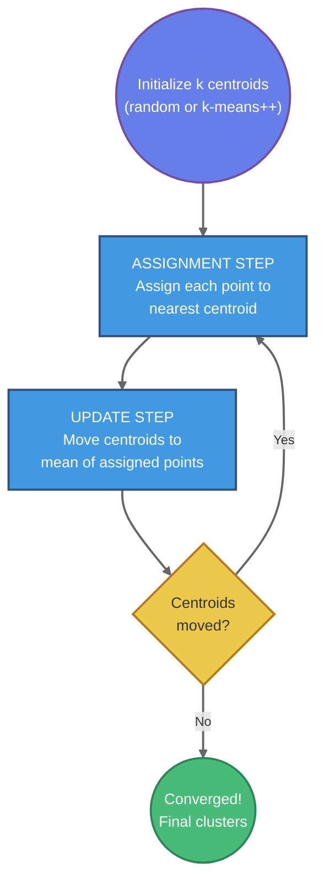

# K-Means Clustering and Unsupervised Learning

## Summary

This chapter explores k-means clustering, the most popular unsupervised learning algorithm for discovering natural groupings in unlabeled data. Students will learn the iterative algorithm that alternates between assigning points to clusters and updating cluster centroids, understand the importance of initialization strategies (random initialization vs. k-means++), and explore methods for selecting the optimal number of clusters using the elbow method and silhouette scores. The chapter covers convergence criteria, within-cluster variance, and inertia as measures of clustering quality, providing students with practical skills for exploratory data analysis and pattern discovery.

## Concepts Covered

This chapter covers the following 12 concepts from the learning graph:

1. K-Means Clustering
2. Centroid
3. Cluster Assignment
4. Cluster Update
5. K-Means Initialization
6. Random Initialization
7. K-Means++ Initialization
8. Elbow Method
9. Silhouette Score
10. Within-Cluster Variance
11. Convergence Criteria
12. Inertia

## Prerequisites

This chapter builds on concepts from:

- [Chapter 1: Introduction to Machine Learning Fundamentals](../01-intro-to-ml-fundamentals/index.md)

---

## Introduction to Unsupervised Learning

In supervised learning, we train models to predict known labels or values—classification for discrete categories, regression for continuous outputs. Every training example includes both features and a target label that guides the learning process. But what happens when we have data without labels? What can we learn from unlabeled data alone?

**Unsupervised learning** addresses this question by discovering hidden patterns and structure in data without explicit target values. Instead of learning to predict labels, unsupervised algorithms identify natural groupings, detect anomalies, reduce dimensionality, or find associations within the data itself.

**Clustering** is a fundamental unsupervised learning task: partitioning data into groups (clusters) such that examples within each group are more similar to each other than to examples in other groups. Clustering has numerous applications:

- **Customer segmentation**: Grouping customers by purchasing behavior for targeted marketing
- **Document organization**: Clustering news articles by topic for automatic categorization
- **Image compression**: Reducing colors by clustering similar pixels
- **Anomaly detection**: Identifying unusual patterns that don't fit any cluster
- **Data exploration**: Understanding structure in complex datasets before modeling
- **Gene expression analysis**: Finding groups of genes with similar behavior

Unlike classification, where class boundaries are learned from labeled examples, clustering must discover these boundaries from the data distribution alone.

## K-Means Clustering: The Algorithm

**K-means clustering** is the most widely used clustering algorithm due to its simplicity, efficiency, and effectiveness. Given a dataset and a desired number of clusters $k$, k-means partitions the data into $k$ groups by iteratively refining cluster assignments.

### The Core Idea

K-means represents each cluster by its **centroid**—the geometric center (mean) of all points assigned to that cluster. The algorithm alternates between two steps:

1. **Cluster Assignment**: Assign each data point to the cluster with the nearest centroid
2. **Cluster Update**: Recompute each centroid as the mean of all points assigned to that cluster

These steps repeat until cluster assignments stabilize (convergence).

### Mathematical Formulation

Given a dataset $\{\mathbf{x}_1, \mathbf{x}_2, \ldots, \mathbf{x}_n\}$ where each $\mathbf{x}_i \in \mathbb{R}^d$, k-means seeks to minimize the **within-cluster variance** (also called **inertia**):

$$J = \sum_{i=1}^{n} \|\mathbf{x}_i - \boldsymbol{\mu}_{c_i}\|^2$$

where:

- $c_i$ is the cluster assignment for point $i$
- $\boldsymbol{\mu}_{c_i}$ is the centroid of the cluster containing point $i$
- $\|\mathbf{x}_i - \boldsymbol{\mu}_{c_i}\|^2$ is the squared Euclidean distance from point $i$ to its assigned centroid

This objective function measures how tightly grouped the clusters are. Smaller values indicate more compact, well-separated clusters.

### The K-Means Algorithm

**Input:**
- Dataset $\mathcal{D} = \{\mathbf{x}_1, \ldots, \mathbf{x}_n\}$
- Number of clusters $k$

**Output:**
- Cluster assignments $c_1, \ldots, c_n$
- Cluster centroids $\boldsymbol{\mu}_1, \ldots, \boldsymbol{\mu}_k$

**Algorithm:**

1. **Initialize** $k$ centroids $\boldsymbol{\mu}_1, \ldots, \boldsymbol{\mu}_k$ (see initialization strategies below)

2. **Repeat** until convergence:

   a. **Cluster Assignment Step:**

   For each data point $\mathbf{x}_i$:
   $$c_i \leftarrow \arg\min_{j \in \{1,\ldots,k\}} \|\mathbf{x}_i - \boldsymbol{\mu}_j\|^2$$

   (Assign $\mathbf{x}_i$ to the nearest centroid)

   b. **Cluster Update Step:**

   For each cluster $j$:
   $$\boldsymbol{\mu}_j \leftarrow \frac{1}{|C_j|} \sum_{\mathbf{x}_i \in C_j} \mathbf{x}_i$$

   where $C_j = \{\mathbf{x}_i : c_i = j\}$ is the set of points assigned to cluster $j$

   (Recompute centroids as the mean of assigned points)

3. **Check convergence:** Stop if assignments don't change or maximum iterations reached

### Convergence Criteria

K-means converges when one of the following **convergence criteria** is met:

1. **No reassignments**: Cluster assignments don't change between iterations
2. **Centroid stability**: Centroids move less than a threshold distance
3. **Objective improvement**: Change in inertia is below a threshold
4. **Maximum iterations**: A predefined iteration limit is reached

The algorithm is guaranteed to converge to a local minimum of the objective function (though not necessarily the global minimum). In practice, k-means typically converges within 10-50 iterations for most datasets.

## K-Means on the Iris Dataset

Let's apply k-means to the classic Iris dataset to discover natural groupings in flower measurements:

```python
import pandas as pd
import numpy as np
import matplotlib.pyplot as plt
import seaborn as sns
from sklearn.cluster import KMeans

# Load iris dataset
iris_df = pd.read_csv('https://raw.githubusercontent.com/sziccardi/MLCamp2025_DataRepository/main/iris.csv')

# Extract features (no labels for unsupervised learning!)
features = ["sepal_length", "sepal_width", "petal_length", "petal_width"]
X = iris_df[features].values

print("Dataset shape:", X.shape)
print("\nFeature statistics:")
print(iris_df[features].describe())
```

Unlike supervised learning, we use only the feature columns—no species labels. The goal is to discover groupings based solely on the flower measurements.

### Visualizing the Data

Before clustering, let's explore the data distribution:

```python
# Create pairplot to visualize feature relationships
cluster_df = iris_df[features]

plt.figure()
sns.pairplot(cluster_df, vars=features)
plt.suptitle("Iris Dataset: Feature Relationships (Unlabeled)", y=1.01)
plt.show()
```

The pairplot reveals structure in the data—some features show clear separation between groups, while others overlap. This visual exploration helps us hypothesize how many natural clusters might exist.

### Clustering with k=2

Let's start with 2 clusters:

```python
# Fit k-means with k=2
kmeans_2 = KMeans(n_clusters=2, random_state=42)
kmeans_2.fit(X)

# Examine cluster centers (centroids)
print("Cluster centroids:")
print(kmeans_2.cluster_centers_)

# Examine cluster assignments
print("\nCluster labels for first 10 points:")
print(kmeans_2.labels_[:10])

# Count points in each cluster
unique, counts = np.unique(kmeans_2.labels_, return_counts=True)
print("\nCluster sizes:")
for cluster, count in zip(unique, counts):
    print(f"  Cluster {cluster}: {count} points")
```

The centroids are 4-dimensional vectors (one value per feature) representing the center of each cluster. The labels array assigns each of the 150 data points to cluster 0 or 1.

### Visualizing Clusters

```python
# Add cluster labels to dataframe
cluster_df_2 = iris_df[features].copy()
cluster_df_2['Cluster'] = kmeans_2.labels_

# Create pairplot colored by cluster
plt.figure()
sns.pairplot(cluster_df_2, vars=features, hue="Cluster", palette="Set1")
plt.suptitle("K-Means Clustering with k=2", y=1.01)
plt.show()
```

The colored pairplot shows how k-means has partitioned the data. We can see clear separation in some feature combinations (e.g., petal length vs. petal width) and more overlap in others (sepal measurements).

### Clustering with k=3

Since the iris dataset actually contains three species, let's try k=3:

```python
# Fit k-means with k=3
kmeans_3 = KMeans(n_clusters=3, random_state=42)
kmeans_3.fit(X)

print("Cluster centroids (k=3):")
print(kmeans_3.cluster_centers_)

# Visualize clusters
cluster_df_3 = iris_df[features].copy()
cluster_df_3['Cluster'] = kmeans_3.labels_

plt.figure()
sns.pairplot(cluster_df_3, vars=features, hue="Cluster", palette="Set2")
plt.suptitle("K-Means Clustering with k=3", y=1.01)
plt.show()
```

With three clusters, the separation looks more refined. But how well does unsupervised k-means recover the true species structure?

### Comparing Clusters to True Labels

Although we didn't use species labels during clustering, we can compare the discovered clusters to the ground truth:

```python
# Create crosstab comparing clusters to actual species
actual_species = iris_df['species']
cluster_labels = kmeans_3.labels_

comparison = pd.crosstab(actual_species, cluster_labels,
                         rownames=['Species'], colnames=['Cluster'])
print("Cluster vs Species comparison:")
print(comparison)
```

The crosstab reveals how well k-means discovered the natural species groupings. Typically, one cluster perfectly captures setosa (which is well-separated), while versicolor and virginica show some mixing (they overlap more in feature space).

!!! note "Cluster Labels are Arbitrary"
    K-means assigns cluster numbers arbitrarily (0, 1, 2, etc.). There's no inherent ordering or meaning to these numbers. The algorithm might assign setosa to cluster 1 in one run and cluster 0 in another.

## Initialization Strategies

K-means' final solution depends heavily on the initial centroid positions. Poor initialization can lead to suboptimal clusters or slow convergence. Two main strategies address this:

### Random Initialization

**Random initialization** selects $k$ data points uniformly at random from the dataset as initial centroids:

1. Choose $k$ points $\{\mathbf{x}_{i_1}, \ldots, \mathbf{x}_{i_k}\}$ randomly from the data
2. Set $\boldsymbol{\mu}_j = \mathbf{x}_{i_j}$ for $j = 1, \ldots, k$

**Advantages:**
- Simple to implement
- Fast (no computation required)

**Disadvantages:**
- Sensitive to outliers (might choose outlier as initial centroid)
- May lead to poor local minima
- Results vary across runs
- Can converge slowly if initial centroids are all close together

Because of random initialization's variability, it's common to run k-means multiple times with different random seeds and choose the run with lowest inertia.

### K-Means++ Initialization

**K-means++** improves upon random initialization by spreading initial centroids far apart, leading to better and more consistent results:

**Algorithm:**

1. Choose the first centroid $\boldsymbol{\mu}_1$ uniformly at random from data points

2. For each remaining centroid $j = 2, \ldots, k$:

   a. For each data point $\mathbf{x}_i$, compute $D(\mathbf{x}_i)$ = distance to nearest already-chosen centroid

   b. Choose next centroid $\boldsymbol{\mu}_j$ from data points with probability proportional to $D(\mathbf{x}_i)^2$

   (Points far from existing centroids are more likely to be chosen)

3. Proceed with standard k-means using these initial centroids

**Advantages:**
- Provably better initialization (theoretically and empirically)
- More consistent results across runs
- Often converges faster
- Reduces need for multiple random restarts

**Disadvantages:**
- Slightly more complex to implement
- Requires $O(nk)$ computation for initialization (vs. $O(k)$ for random)

Scikit-learn uses k-means++ by default (`init='k-means++'`).

### Comparing Initialization Methods

```python
# Compare random vs k-means++ initialization
results = []

for init_method in ['random', 'k-means++']:
    for trial in range(10):
        kmeans = KMeans(n_clusters=3, init=init_method, n_init=1, random_state=trial)
        kmeans.fit(X)
        results.append({
            'Method': init_method,
            'Trial': trial,
            'Inertia': kmeans.inertia_,
            'Iterations': kmeans.n_iter_
        })

results_df = pd.DataFrame(results)

# Compare statistics
print(results_df.groupby('Method')[['Inertia', 'Iterations']].describe())

# Plot distributions
fig, axes = plt.subplots(1, 2, figsize=(12, 5))

results_df.boxplot(column='Inertia', by='Method', ax=axes[0])
axes[0].set_title('Inertia by Initialization Method')
axes[0].set_xlabel('Initialization Method')

results_df.boxplot(column='Iterations', by='Method', ax=axes[1])
axes[1].set_title('Iterations to Convergence')
axes[1].set_xlabel('Initialization Method')

plt.tight_layout()
plt.show()
```

K-means++ typically produces lower inertia values and more consistent results across trials.

## Choosing the Number of Clusters

A fundamental challenge in k-means is selecting the appropriate value of $k$. Too few clusters oversimplify the data structure; too many create artificial divisions. Two popular methods help choose $k$:

### The Elbow Method

The **elbow method** plots inertia (within-cluster sum of squares) as a function of $k$ and looks for an "elbow"—a point where adding more clusters yields diminishing returns.

**Procedure:**

1. Run k-means for a range of $k$ values (e.g., $k = 1, 2, \ldots, 10$)
2. Compute inertia for each $k$
3. Plot inertia vs. $k$
4. Identify the "elbow" where the curve bends sharply

**Interpretation:**

- Inertia always decreases as $k$ increases (more clusters = tighter fit)
- The elbow represents the $k$ value beyond which additional clusters provide marginal improvement
- Choose $k$ at the elbow for good trade-off between simplicity and fit quality

```python
# Compute inertia for different k values
k_values = range(1, 11)
inertias = []

for k in k_values:
    kmeans = KMeans(n_clusters=k, random_state=42)
    kmeans.fit(X)
    inertias.append(kmeans.inertia_)

# Plot elbow curve
plt.figure(figsize=(10, 6))
plt.plot(k_values, inertias, 'bo-', linewidth=2, markersize=8)
plt.xlabel('Number of Clusters (k)', fontsize=12)
plt.ylabel('Inertia (Within-Cluster Sum of Squares)', fontsize=12)
plt.title('Elbow Method for Optimal k', fontsize=14)
plt.grid(True, alpha=0.3)
plt.xticks(k_values)
plt.show()
```

For the Iris dataset, the elbow typically appears around $k = 3$, suggesting three natural clusters (matching the three species).

!!! warning "Elbow Ambiguity"
    The elbow isn't always clear or unique. Some datasets show gradual curves without obvious elbows, making visual interpretation subjective. In such cases, combine the elbow method with other criteria like silhouette scores.

### Silhouette Score

The **silhouette score** measures how well-separated clusters are by comparing within-cluster distances to nearest-cluster distances for each point.

**For a single point $i$:**

1. Compute $a(i)$ = average distance to other points in the same cluster (cohesion)
2. Compute $b(i)$ = average distance to points in the nearest other cluster (separation)
3. Calculate silhouette coefficient:

$$s(i) = \frac{b(i) - a(i)}{\max(a(i), b(i))}$$

**Interpretation:**

- $s(i) \approx 1$: Point is well-clustered (far from other clusters, close to own cluster)
- $s(i) \approx 0$: Point is on the border between clusters
- $s(i) < 0$: Point might be assigned to the wrong cluster

**Overall silhouette score** = average $s(i)$ across all points

**Procedure:**

1. Run k-means for a range of $k$ values
2. Compute average silhouette score for each $k$
3. Choose $k$ with highest silhouette score

```python
from sklearn.metrics import silhouette_score, silhouette_samples

# Compute silhouette scores for different k
k_values = range(2, 11)  # Silhouette requires k >= 2
silhouette_scores = []

for k in k_values:
    kmeans = KMeans(n_clusters=k, random_state=42)
    labels = kmeans.fit_predict(X)
    score = silhouette_score(X, labels)
    silhouette_scores.append(score)

# Plot silhouette scores
plt.figure(figsize=(10, 6))
plt.plot(k_values, silhouette_scores, 'go-', linewidth=2, markersize=8)
plt.xlabel('Number of Clusters (k)', fontsize=12)
plt.ylabel('Average Silhouette Score', fontsize=12)
plt.title('Silhouette Analysis for Optimal k', fontsize=14)
plt.grid(True, alpha=0.3)
plt.xticks(k_values)
plt.axhline(y=0, color='r', linestyle='--', alpha=0.5)
plt.show()

print("Silhouette scores by k:")
for k, score in zip(k_values, silhouette_scores):
    print(f"  k={k}: {score:.3f}")
```

Higher silhouette scores indicate better-defined, well-separated clusters.

### Silhouette Plots

A **silhouette plot** visualizes the silhouette coefficient for each point, organized by cluster:

```python
from matplotlib import cm

# Create silhouette plot for k=3
k = 3
kmeans = KMeans(n_clusters=k, random_state=42)
labels = kmeans.fit_predict(X)
silhouette_vals = silhouette_samples(X, labels)

fig, ax = plt.subplots(figsize=(10, 6))

y_lower = 10
for i in range(k):
    # Get silhouette values for cluster i
    cluster_silhouette_vals = silhouette_vals[labels == i]
    cluster_silhouette_vals.sort()

    size_cluster_i = cluster_silhouette_vals.shape[0]
    y_upper = y_lower + size_cluster_i

    color = cm.nipy_spectral(float(i) / k)
    ax.fill_betweenx(np.arange(y_lower, y_upper),
                     0, cluster_silhouette_vals,
                     facecolor=color, edgecolor=color, alpha=0.7)

    # Label cluster
    ax.text(-0.05, y_lower + 0.5 * size_cluster_i, str(i))

    y_lower = y_upper + 10

ax.set_xlabel('Silhouette Coefficient', fontsize=12)
ax.set_ylabel('Cluster', fontsize=12)
ax.set_title(f'Silhouette Plot for k={k}', fontsize=14)

# Add average silhouette score line
avg_score = silhouette_score(X, labels)
ax.axvline(x=avg_score, color="red", linestyle="--", label=f'Average: {avg_score:.3f}')
ax.legend()

plt.show()
```

In a good silhouette plot:
- All clusters have widths extending well past the average line
- Clusters have similar widths (balanced sizes)
- Few or no negative values (misassigned points)

## Within-Cluster Variance and Inertia

**Within-cluster variance** quantifies the compactness of clusters by measuring how spread out points are around their centroids.

For cluster $j$, the within-cluster variance is:

$$\text{Var}_j = \frac{1}{|C_j|} \sum_{\mathbf{x}_i \in C_j} \|\mathbf{x}_i - \boldsymbol{\mu}_j\|^2$$

**Inertia** (also called **within-cluster sum of squares** or WCSS) is the sum of squared distances across all clusters:

$$\text{Inertia} = \sum_{j=1}^{k} \sum_{\mathbf{x}_i \in C_j} \|\mathbf{x}_i - \boldsymbol{\mu}_j\|^2$$

This is exactly the objective function that k-means minimizes.

### Accessing Inertia in Scikit-Learn

```python
# Fit k-means
kmeans = KMeans(n_clusters=3, random_state=42)
kmeans.fit(X)

# Access inertia
print(f"Inertia: {kmeans.inertia_:.2f}")

# Manually compute to verify
manual_inertia = 0
for i in range(len(X)):
    cluster_idx = kmeans.labels_[i]
    centroid = kmeans.cluster_centers_[cluster_idx]
    distance_sq = np.sum((X[i] - centroid) ** 2)
    manual_inertia += distance_sq

print(f"Manually computed inertia: {manual_inertia:.2f}")
```

Lower inertia indicates tighter, more cohesive clusters. However, inertia alone shouldn't determine the number of clusters—it always decreases with increasing $k$, reaching zero when $k = n$ (each point is its own cluster).

## Interactive Visualization: K-Means Algorithm Steps

#### K-Means Iteration Visualization



**Algorithm Steps:**
1. **Initialize**: Place k centroids randomly (or using k-means++)
2. **Assign**: Each point joins the cluster of its nearest centroid
3. **Update**: Move each centroid to the mean position of all points in its cluster
4. **Repeat**: Steps 2-3 until centroids stop moving (convergence)

**Key Insight**: K-means minimizes within-cluster variance (inertia) through iterative refinement.

## Interactive Visualization: Elbow Method and Silhouette Analysis

#### Cluster Evaluation Metrics

**Determining Optimal k:**

| Metric | Formula | Interpretation |  Optimal k |
|--------|---------|----------------|------------|
| **Inertia (SSE)** | Σ \\|x - μ\\|² | Within-cluster sum of squares | Elbow point where decrease slows |
| **Silhouette Score** | (b - a) / max(a, b) | How similar point is to own cluster vs others | Maximum value (range: -1 to 1) |
| **Davies-Bouldin Index** | Avg similarity of each cluster with most similar one | Lower is better | Minimum value |
| **Calinski-Harabasz** | Between-cluster / within-cluster variance ratio | Higher is better | Maximum value |

**Elbow Method:**
- Plot inertia vs k
- Look for "elbow" where adding clusters provides diminishing returns
- Trade-off between fit and complexity
  - k value selector (slider or buttons for k = 2 to 10)
  - Dataset dropdown (Iris, synthetic blobs, custom upload)
  - Number of features slider (for synthetic data)
  - Cluster separation slider (for synthetic data)
  - Reset button

- **Metrics Display:**
  - Current k value
  - Inertia for current k
  - Average silhouette score
  - Number of iterations to convergence
  - Cluster size distribution (histogram)

**Interactions:**

- Click on elbow curve to set k and update visualization
- Click on silhouette plot to set k
- Hover over any plot to see detailed tooltips
- Synchronized highlighting: hover over a cluster in visualization highlights corresponding bar in silhouette plot
- Toggle between 2D views (first two features, PCA, t-SNE)
- Generate new synthetic data with adjustable parameters
- Export metrics as CSV

**Default Parameters:**

- Dataset: Iris (4 features, 150 samples)
- k range: 2-10
- Initialization: k-means++
- Display: All three panels visible

**Implementation:** p5.js for all visualizations. Implement k-means and PCA in JavaScript for real-time computation. Use Chart.js or custom p5.js plotting for line and bar charts. Compute silhouette scores efficiently using vectorized distance calculations. Include smooth transitions when changing k. Responsive three-panel layout adapting to window size.

**Canvas:** Three panels, each ~400px × 300px (responsive, stacked on mobile)
</details>

## Limitations and Considerations

While k-means is powerful and widely used, it has important limitations:

### 1. Requires Specifying k

You must choose the number of clusters in advance. For exploratory analysis where cluster count is unknown, this creates a chicken-and-egg problem requiring iterative experimentation.

### 2. Assumes Spherical Clusters

K-means uses Euclidean distance, implicitly assuming clusters are roughly spherical and equally sized. It struggles with:
- Elongated or irregular cluster shapes
- Clusters of very different sizes
- Nested or hierarchical structures

### 3. Sensitive to Outliers

Since centroids are means, a few extreme outliers can pull centroids far from the true cluster center, distorting cluster boundaries.

### 4. Local Optima

K-means is not guaranteed to find the global minimum. Different initializations can produce different solutions. Always run multiple times or use k-means++ initialization.

### 5. Scale Sensitivity

Features with larger scales dominate distance calculations. Always standardize features before clustering:

```python
from sklearn.preprocessing import StandardScaler

# Standardize features
scaler = StandardScaler()
X_scaled = scaler.fit_transform(X)

# Cluster on scaled data
kmeans = KMeans(n_clusters=3, random_state=42)
kmeans.fit(X_scaled)
```

### 6. Only Works with Numerical Data

K-means requires computing distances and means, which aren't well-defined for categorical variables. Use specialized algorithms (k-modes, k-prototypes) for categorical or mixed data.

## Practical Applications

### Customer Segmentation

```python
# Example: Segment customers by purchasing behavior
# Features: total_spent, num_purchases, avg_purchase_value, days_since_last_purchase

customer_data = pd.read_csv('customer_data.csv')
features = ['total_spent', 'num_purchases', 'avg_purchase_value', 'days_since_last_purchase']

# Standardize
scaler = StandardScaler()
X_scaled = scaler.fit_transform(customer_data[features])

# Find optimal k using elbow method
inertias = []
for k in range(2, 11):
    kmeans = KMeans(n_clusters=k, random_state=42)
    kmeans.fit(X_scaled)
    inertias.append(kmeans.inertia_)

# Choose k=4 based on elbow
kmeans_final = KMeans(n_clusters=4, random_state=42)
customer_data['Segment'] = kmeans_final.fit_predict(X_scaled)

# Analyze segments
print(customer_data.groupby('Segment')[features].mean())
```

This reveals customer groups like "high-value frequent buyers," "occasional big spenders," "regular small purchasers," and "inactive accounts."

### Image Compression

K-means can reduce the number of colors in an image:

```python
from sklearn.cluster import KMeans
import matplotlib.pyplot as plt
from PIL import Image

# Load image and reshape to (num_pixels, 3) for RGB
img = np.array(Image.open('photo.jpg'))
h, w, d = img.shape
img_flat = img.reshape(-1, 3)

# Cluster colors into k representative colors
k = 16  # Reduce to 16 colors
kmeans = KMeans(n_clusters=k, random_state=42)
kmeans.fit(img_flat)

# Replace each pixel with its cluster centroid
compressed = kmeans.cluster_centers_[kmeans.labels_]
compressed_img = compressed.reshape(h, w, d).astype('uint8')

# Display original vs compressed
fig, axes = plt.subplots(1, 2, figsize=(12, 6))
axes[0].imshow(img)
axes[0].set_title('Original')
axes[0].axis('off')

axes[1].imshow(compressed_img)
axes[1].set_title(f'Compressed ({k} colors)')
axes[1].axis('off')

plt.show()
```

## Summary

K-means clustering discovers natural groupings in unlabeled data through an iterative refinement process. By alternating between assigning points to the nearest centroid and recomputing centroids as cluster means, the algorithm minimizes within-cluster variance.

The **cluster assignment** step assigns each point to its nearest centroid, while the **cluster update** step recomputes each centroid as the mean of its assigned points. This process continues until **convergence criteria** are met—typically when assignments stabilize or centroids move minimally.

**Initialization** critically affects k-means performance. **K-means++** initialization spreads initial centroids apart, leading to better and more consistent results than **random initialization**. Running k-means multiple times with different initializations helps avoid poor local minima.

Choosing the number of clusters $k$ requires evaluation metrics. The **elbow method** identifies $k$ where adding more clusters yields diminishing returns in **inertia** (within-cluster sum of squares). **Silhouette scores** measure cluster separation quality, with higher scores indicating well-defined clusters.

While k-means is efficient and effective for many tasks, it assumes spherical clusters of similar sizes, requires specifying $k$ in advance, and is sensitive to outliers and feature scales. Despite these limitations, k-means remains the most widely used clustering algorithm for exploratory data analysis, customer segmentation, image compression, and pattern discovery.

## Key Takeaways

1. **K-means clustering** partitions unlabeled data into $k$ groups by iteratively refining cluster assignments
2. **Centroids** represent cluster centers as the geometric mean of assigned points
3. **Cluster assignment** assigns each point to the nearest centroid
4. **Cluster update** recomputes centroids as the mean of assigned points
5. **K-means++ initialization** spreads initial centroids to improve convergence
6. **Random initialization** can lead to suboptimal solutions; multiple runs recommended
7. The **elbow method** identifies optimal $k$ by finding diminishing returns in inertia reduction
8. **Silhouette scores** measure cluster quality by comparing within-cluster cohesion to between-cluster separation
9. **Within-cluster variance** and **inertia** quantify cluster compactness
10. **Convergence criteria** stop iteration when assignments stabilize or maximum iterations are reached
11. Always standardize features before k-means clustering
12. K-means assumes spherical clusters and is sensitive to initialization and outliers

## Further Reading

- MacQueen, J. (1967). "Some methods for classification and analysis of multivariate observations." *Proceedings of the Fifth Berkeley Symposium on Mathematical Statistics and Probability*, 1, 281-297.
- Arthur, D., & Vassilvitskii, S. (2007). "k-means++: The advantages of careful seeding." *Proceedings of the Eighteenth Annual ACM-SIAM Symposium on Discrete Algorithms*, 1027-1035.
- Hastie, T., Tibshirani, R., & Friedman, J. (2009). *The Elements of Statistical Learning* (Chapter 14: Unsupervised Learning)
- Scikit-learn documentation: [Clustering](https://scikit-learn.org/stable/modules/clustering.html)

## Exercises

1. **Algorithm Trace**: Manually execute k-means on a small 2D dataset (10 points) for 3 iterations with k=2. Show cluster assignments and centroid positions at each step.

2. **Initialization Impact**: Generate a dataset with 4 well-separated Gaussian blobs. Run k-means 20 times with random initialization and 20 times with k-means++. Compare the distribution of final inertia values and number of iterations.

3. **Elbow Ambiguity**: Create a dataset where the elbow method gives an ambiguous result (no clear elbow). Use silhouette scores to determine the optimal k. Explain why the methods disagree.

4. **Feature Scaling**: Generate a dataset with features on vastly different scales (e.g., one feature ranges 0-1, another 0-10000). Cluster with and without standardization. Visualize and explain the differences.

5. **Non-Spherical Clusters**: Create a dataset with concentric circles or moons (scikit-learn provides `make_circles` and `make_moons`). Apply k-means and observe its limitations. Research and apply an alternative clustering algorithm (DBSCAN or spectral clustering) that handles non-spherical shapes.

6. **Image Segmentation**: Load a color image and use k-means to segment it into regions. Experiment with different k values and visualize the resulting segmentations. Compute silhouette scores to find optimal segmentation.
