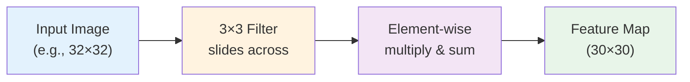
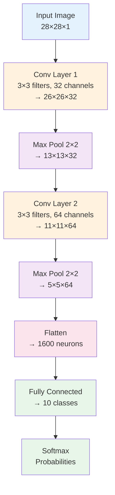

# Convolutional Neural Networks for Computer Vision

## Summary

This chapter explores Convolutional Neural Networks (CNNs), specialized architectures designed for processing grid-like data such as images. Students will learn how convolution operations preserve spatial structure by applying filters across input images, understand the role of hyperparameters like kernel size, stride, and padding (valid vs. same), and explore pooling layers (max pooling, average pooling) that provide translation invariance and reduce computational complexity. The chapter covers fundamental CNN properties including local connectivity, weight sharing, and the formation of spatial hierarchies through feature maps and receptive fields. Students will study famous CNN architectures including LeNet, AlexNet, VGG, ResNet, and Inception, understanding how architectural innovations have driven progress in computer vision tasks.

## Concepts Covered

This chapter covers the following 22 concepts from the learning graph:

1. Convolutional Neural Network
2. Convolution Operation
3. Filter
4. Stride
5. Padding
6. Valid Padding
7. Same Padding
8. Receptive Field
9. Max Pooling
10. Average Pooling
11. Spatial Hierarchies
12. Translation Invariance
13. Local Connectivity
14. Weight Sharing
15. CNN Architecture
16. LeNet
17. AlexNet
18. VGG
19. ResNet
20. Inception
21. ImageNet
22. Data Augmentation

## Prerequisites

This chapter builds on concepts from:

- [Chapter 1: Introduction to Machine Learning Fundamentals](../01-intro-to-ml-fundamentals/index.md)
- [Chapter 8: Data Preprocessing and Feature Engineering](../08-data-preprocessing/index.md)
- [Chapter 9: Neural Networks Fundamentals](../09-neural-networks/index.md)

---

## Why Convolutional Neural Networks?

Standard fully connected neural networks struggle with image data. Consider a modest 224×224 color image—it contains 224 × 224 × 3 = 150,528 pixels. A fully connected hidden layer with 1,000 neurons would require over 150 million weights just for the first layer! This creates three critical problems:

1. **Computational burden**: Millions of parameters are expensive to store and compute
2. **Overfitting**: Too many parameters relative to training data
3. **Loss of spatial structure**: Flattening an image into a vector discards spatial relationships between nearby pixels

**Convolutional Neural Networks** (CNNs) solve these problems through three key principles:

- **Local connectivity**: Each neuron connects only to a small local region
- **Weight sharing**: The same weights (filters) apply across the entire image
- **Spatial hierarchies**: Layers progressively build from simple to complex features

These principles dramatically reduce parameters while preserving and exploiting spatial structure, making CNNs the dominant architecture for computer vision.

## The Convolution Operation

The **convolution operation** is the fundamental building block of CNNs. Instead of learning separate weights for every pixel, convolution applies a small **filter** (also called a kernel) that slides across the input image.

### Mathematical Definition

For a 2D image $I$ and filter $K$ of size $k \times k$, the convolution operation is:

$$(I * K)[i,j] = \sum_{m=0}^{k-1} \sum_{n=0}^{k-1} I[i+m, j+n] \cdot K[m,n]$$

This computes a weighted sum of a local $k \times k$ neighborhood centered at position $(i,j)$.

### How Convolution Works

Consider a 5×5 input image and a 3×3 filter:

**Input image** ($5 \times 5$):
```
1  2  0  1  3
0  1  2  1  0
1  0  1  2  1
2  1  0  1  2
1  0  2  1  0
```

**Filter** ($3 \times 3$) - Edge detector:
```
-1  -1  -1
 0   0   0
 1   1   1
```

To compute the output at position (1,1):
1. Place filter over input region [0:3, 0:3]
2. Multiply element-wise: $(-1)(1) + (-1)(2) + (-1)(0) + (0)(0) + (0)(1) + (0)(2) + (1)(1) + (1)(0) + (1)(1)$
3. Sum the products: $-1 - 2 + 0 + 0 + 0 + 0 + 1 + 0 + 1 = -1$

Sliding the filter across produces a $(5-3+1) \times (5-3+1) = 3 \times 3$ output called a **feature map** or activation map.

### Filters Detect Features

Different filters detect different features:

- **Vertical edge detector**:
  ```
  -1  0  1
  -1  0  1
  -1  0  1
  ```

- **Horizontal edge detector**:
  ```
  -1  -1  -1
   0   0   0
   1   1   1
  ```

- **Blur (smoothing)**:
  ```
  1/9  1/9  1/9
  1/9  1/9  1/9
  1/9  1/9  1/9
  ```

In CNNs, filter values are **learned** during training rather than hand-designed, allowing the network to discover optimal features for the task.

## Stride

**Stride** controls how far the filter moves at each step. A stride of 1 moves the filter one pixel at a time; stride of 2 skips every other position.

**Effect on output size:**

For input size $n \times n$, filter size $k \times k$, and stride $s$:

$$\text{Output size} = \left\lfloor \frac{n - k}{s} + 1 \right\rfloor \times \left\lfloor \frac{n - k}{s} + 1 \right\rfloor$$

**Example:**
- Input: $7 \times 7$, Filter: $3 \times 3$, Stride: 1 → Output: $5 \times 5$
- Input: $7 \times 7$, Filter: $3 \times 3$, Stride: 2 → Output: $3 \times 3$

Larger strides reduce computational cost and output dimensions but may lose fine-grained spatial information.

## Padding

Without padding, convolution shrinks the image—a $5 \times 5$ image convolved with a $3 \times 3$ filter produces a $3 \times 3$ output. After many layers, the image shrinks to unusable sizes.

**Padding** adds border pixels around the input to control output dimensions.

### Valid Padding

**Valid padding** (no padding) applies the filter only where it fits completely within the input:

$$\text{Output size} = \left\lfloor \frac{n - k}{s} + 1 \right\rfloor$$

This shrinks the spatial dimensions with each layer.

### Same Padding

**Same padding** adds enough zeros around the border so that (with stride 1) the output has the same spatial dimensions as the input.

For filter size $k$ and stride 1, we need padding $p$:

$$p = \frac{k-1}{2}$$

For example, a $3 \times 3$ filter needs padding of 1 on all sides; a $5 \times 5$ filter needs padding of 2.

**Example with padding 1:**

Input ($5 \times 5$) becomes padded input ($7 \times 7$):
```
0  0  0  0  0  0  0
0  1  2  0  1  3  0
0  0  1  2  1  0  0
0  1  0  1  2  1  0
0  2  1  0  1  2  0
0  1  0  2  1  0  0
0  0  0  0  0  0  0
```

Convolving with $3 \times 3$ filter produces $5 \times 5$ output—same as input size.

**Why padding matters:**
- Preserves spatial dimensions through many layers
- Allows information from edge pixels to be used
- Prevents border information from being lost

## Receptive Field

The **receptive field** of a neuron is the region of the input image that affects that neuron's activation. In deeper layers, neurons have larger receptive fields, capturing more global context.

**Example:**
- Layer 1 neuron with $3 \times 3$ filter has $3 \times 3$ receptive field
- Layer 2 neuron receiving from $3 \times 3$ region of layer 1, each with $3 \times 3$ receptive field, has $5 \times 5$ receptive field in input
- Layer 3: $7 \times 7$ receptive field

Deep CNNs build large receptive fields through stacking, enabling neurons in final layers to integrate information from the entire image while maintaining computational efficiency.

## Pooling Layers

**Pooling layers** downsample feature maps, reducing spatial dimensions while retaining important information. Pooling provides two critical benefits:

1. **Translation invariance**: Small shifts in input don't change output
2. **Computational efficiency**: Reduces dimensions for downstream layers

### Max Pooling

**Max pooling** takes the maximum value in each local region. For $2 \times 2$ max pooling with stride 2:

**Input feature map** ($4 \times 4$):
```
1  3  2  4
5  6  7  8
3  2  1  0
1  2  3  4
```

**Output** ($2 \times 2$):
```
6  8
3  4
```

Each $2 \times 2$ region is replaced by its maximum value.

**Properties:**
- Most common pooling operation
- Preserves strongest activations (detected features)
- Makes representations invariant to small translations
- Typically uses $2 \times 2$ windows with stride 2 (halves spatial dimensions)

### Average Pooling

**Average pooling** takes the mean of each local region:

**Input** (same $4 \times 4$):
```
1  3  2  4
5  6  7  8
3  2  1  0
1  2  3  4
```

**Output** ($2 \times 2$):
```
3.75  5.25
2.00  2.00
```

Average pooling is less commonly used than max pooling in convolutional layers but sometimes appears in final layers before classification.

### Translation Invariance

**Translation invariance** means that small spatial shifts in the input don't significantly change the output. Pooling achieves this by discarding precise spatial positions.

For example, if an edge detector activates at position (10, 15) in one image and (10, 16) in a slightly shifted version, $2 \times 2$ max pooling groups both into the same output, making the representation robust to small translations.

This is crucial for computer vision: a cat is still a cat whether it's in the top-left or top-right of the image.

## CNN Architecture Components

### Local Connectivity

In **local connectivity**, each neuron connects only to a small spatial region of the previous layer. A neuron in a convolutional layer with a $3 \times 3$ filter receives input from a $3 \times 3$ patch, not the entire input.

**Comparison:**
- Fully connected layer: $n^2$ input pixels, $m$ neurons → $m \times n^2$ weights
- Convolutional layer: $k \times k$ filter, $m$ filters → $m \times k^2$ weights

For $n=224$, $k=3$, $m=64$:
- Fully connected: $64 \times 224^2 \approx 3.2$ million weights
- Convolutional: $64 \times 3^2 = 576$ weights

Local connectivity dramatically reduces parameters while preserving spatial structure.

### Weight Sharing

In **weight sharing**, the same filter (same weights) slides across the entire input. All neurons in a feature map share identical weights.

**Benefits:**
- **Parameter efficiency**: One $3 \times 3$ filter has 9 weights, but processes entire image
- **Translation equivariance**: Same pattern detected anywhere in the image
- **Inductive bias**: Assumes useful features can appear anywhere (appropriate for images)

A convolutional layer with 64 filters of size $3 \times 3$ has only $64 \times 3 \times 3 = 576$ weights, regardless of input size.

### Spatial Hierarchies

CNNs learn **spatial hierarchies** of features: early layers detect simple patterns (edges, textures), middle layers combine these into parts (eyes, wheels), and deep layers recognize objects (faces, cars).

**Typical hierarchy:**
- **Layer 1**: Edges, colors, simple patterns
- **Layer 2-3**: Corners, textures, simple shapes
- **Layer 4-5**: Object parts (eyes, noses, wheels, windows)
- **Layer 6+**: Complete objects, scenes

This hierarchical organization mirrors the visual cortex in biological vision systems.

## Building a CNN in PyTorch

Let's implement a CNN for MNIST digit classification:

```python
import torch
import torch.nn as nn
import torch.nn.functional as F
import torch.optim as optim
from torchvision import datasets, transforms
from torch.optim.lr_scheduler import StepLR


class Net(nn.Module):
    def __init__(self):
        super(Net, self).__init__()
        # First convolutional layer: 1 input channel (grayscale), 32 output channels, 3x3 filter
        self.conv1 = nn.Conv2d(1, 32, 3, 1)
        # Second convolutional layer: 32 input channels, 64 output channels, 3x3 filter
        self.conv2 = nn.Conv2d(32, 64, 3, 1)
        # Fully connected layers
        self.fc1 = nn.Linear(64*5*5, 512)
        self.fc2 = nn.Linear(512, 10)
        # Dropout for regularization
        self.dropout = nn.Dropout(p=0.5)

    def forward(self, x):
        # Input: 28x28 images
        x = self.conv1(x)       # After conv1: 26x26 (28-3+1)
        x = F.relu(x)           # ReLU activation
        x = F.max_pool2d(x, 2)  # After pooling: 13x13 (26/2)

        x = self.conv2(x)       # After conv2: 11x11 (13-3+1)
        x = F.relu(x)           # ReLU activation
        x = F.max_pool2d(x, 2)  # After pooling: 5x5 (11/2)

        x = torch.flatten(x, 1) # Flatten to vector: 64*5*5 = 1600
        x = self.fc1(x)         # Fully connected: 1600 → 512
        x = self.dropout(x)     # Dropout regularization
        x = F.relu(x)           # ReLU activation
        x = self.fc2(x)         # Output layer: 512 → 10 classes
        output = F.log_softmax(x, dim=1)  # Log probabilities
        return output
```

**Architecture breakdown:**
- Input: 28×28 grayscale images
- Conv1: 32 filters (3×3) → 26×26×32
- Max pool: 2×2 → 13×13×32
- Conv2: 64 filters (3×3) → 11×11×64
- Max pool: 2×2 → 5×5×64
- Flatten → 1600-dimensional vector
- FC1: 1600 → 512
- Dropout (0.5)
- FC2: 512 → 10 (digit classes)

### Training the CNN

```python
def train(model, device, train_loader, optimizer, epoch):
    model.train()
    for batch_idx, (data, target) in enumerate(train_loader):
        data, target = data.to(device), target.to(device)
        optimizer.zero_grad()           # Zero gradients
        output = model(data)            # Forward pass
        loss = F.nll_loss(output, target)  # Compute loss
        loss.backward()                 # Backpropagation
        optimizer.step()                # Update weights

        if batch_idx % 100 == 0:
            print(f'Epoch: {epoch} [{batch_idx * len(data)}/{len(train_loader.dataset)}] '
                  f'Loss: {loss.item():.6f}')


def test(model, device, test_loader):
    model.eval()
    test_loss = 0
    correct = 0
    with torch.no_grad():
        for data, target in test_loader:
            data, target = data.to(device), target.to(device)
            output = model(data)
            test_loss += F.nll_loss(output, target, reduction='sum').item()
            pred = output.argmax(dim=1, keepdim=True)
            correct += pred.eq(target.view_as(pred)).sum().item()

    test_loss /= len(test_loader.dataset)
    accuracy = 100. * correct / len(test_loader.dataset)
    print(f'\nTest: Average loss: {test_loss:.4f}, '
          f'Accuracy: {correct}/{len(test_loader.dataset)} ({accuracy:.0f}%)\n')


# Training setup
device = torch.device("cuda" if torch.cuda.is_available() else "cpu")
model = Net().to(device)
optimizer = optim.Adadelta(model.parameters(), lr=1.0)
scheduler = StepLR(optimizer, step_size=1, gamma=0.7)

# Load MNIST dataset
transform = transforms.Compose([transforms.ToTensor()])
train_dataset = datasets.MNIST('./data', train=True, download=True, transform=transform)
test_dataset = datasets.MNIST('./data', train=False, transform=transform)

train_loader = torch.utils.data.DataLoader(train_dataset, batch_size=64, shuffle=True)
test_loader = torch.utils.data.DataLoader(test_dataset, batch_size=1000, shuffle=False)

# Train for 14 epochs
for epoch in range(1, 15):
    train(model, device, train_loader, optimizer, epoch)
    test(model, device, test_loader)
    scheduler.step()

# Save trained model
torch.save(model.state_dict(), "mnist_cnn.pth")
```

This achieves ~99% accuracy on MNIST after 14 epochs, demonstrating CNN effectiveness for image classification.

## Famous CNN Architectures

### LeNet-5 (1998)

**LeNet**, developed by Yann LeCun, was the first successful CNN architecture, originally designed for handwritten digit recognition (used by banks to read checks).

**Architecture:**
- Input: 32×32 grayscale images
- Conv1: 6 filters (5×5) + tanh → 28×28×6
- AvgPool: 2×2 → 14×14×6
- Conv2: 16 filters (5×5) + tanh → 10×10×16
- AvgPool: 2×2 → 5×5×16
- FC: 5×5×16 → 120 → 84 → 10

**Innovations:**
- First practical demonstration of CNNs
- Established conv-pool-conv-pool-FC pattern
- Proved that gradient-based learning works for deep networks

### AlexNet (2012)

**AlexNet**, by Alex Krizhevsky, achieved breakthrough performance on ImageNet, sparking the deep learning revolution.

**Architecture:**
- Input: 227×227 RGB images
- 5 convolutional layers (with ReLU)
- 3 max pooling layers
- 3 fully connected layers
- 60 million parameters

**Key innovations:**
- **ReLU activation**: Replaced tanh/sigmoid, enabling faster training
- **Dropout**: Reduced overfitting in fully connected layers
- **Data augmentation**: Random crops, flips, color jittering
- **GPU training**: Parallelized across 2 GPUs
- **Local Response Normalization** (LRN): Competitive normalization (later replaced by batch norm)

**Impact:**
- Won ImageNet 2012 with 15.3% error (vs. 26.2% for second place)
- Demonstrated deep networks could outperform hand-crafted features
- Catalyzed the modern deep learning era

### VGG (2014)

**VGG** (Visual Geometry Group, Oxford) showed that network depth is critical, using very small (3×3) filters throughout.

**Architecture (VGG-16):**
- 13 convolutional layers (all 3×3 filters)
- 5 max pooling layers (2×2)
- 3 fully connected layers
- 138 million parameters

**Design principles:**
- **Small filters**: Only 3×3 convolutions throughout
- **Deep networks**: 16-19 layers (hence VGG-16, VGG-19)
- **Simple architecture**: Repetitive structure easy to understand and modify

**Advantages:**
- Smaller filters reduce parameters while maintaining receptive field
- Deeper networks learn more complex representations
- Homogeneous architecture simplifies design

**Limitation:**
- Very large number of parameters (memory intensive)

### ResNet (2015)

**ResNet** (Residual Networks) introduced skip connections, enabling training of extremely deep networks (50-152 layers).

**Core innovation: Residual blocks**

Instead of learning $H(x)$ directly, learn residual $F(x) = H(x) - x$:

$$H(x) = F(x) + x$$

The skip connection adds the input $x$ to the output, creating a shortcut path.

**Architecture (ResNet-50):**
- 50 layers organized into residual blocks
- Each block: Conv-BatchNorm-ReLU-Conv-BatchNorm + Skip Connection
- Deeper variants: ResNet-101, ResNet-152

**Why skip connections work:**
- **Gradient flow**: Gradients flow directly through skip connections, alleviating vanishing gradients
- **Easier optimization**: Learning residuals $F(x)$ easier than learning full transformation $H(x)$
- **Identity mapping**: If optimal transformation is close to identity, network can learn $F(x) \approx 0$

**Impact:**
- Enabled training of 100+ layer networks
- Won ImageNet 2015 with 3.6% error (surpassing human-level 5%)
- Skip connections now ubiquitous in deep architectures

### Inception (GoogLeNet, 2014)

**Inception** introduced multi-scale feature extraction through parallel conv paths with different filter sizes.

**Inception module:**
- Parallel paths: 1×1 conv, 3×3 conv, 5×5 conv, 3×3 max pool
- Concatenate outputs along channel dimension
- 1×1 convolutions reduce dimensionality before expensive operations

**Benefits:**
- **Multi-scale features**: Captures patterns at different scales simultaneously
- **Computational efficiency**: 1×1 "bottleneck" convolutions reduce computation
- **Sparse connections**: More efficient than fully dense layers

**Architecture (GoogLeNet/Inception-v1):**
- 22 layers with 9 inception modules
- Only 5 million parameters (vs. 60M for AlexNet)
- Auxiliary classifiers during training to combat vanishing gradients

Later versions (Inception-v2, v3, v4, Inception-ResNet) incorporated batch normalization, factorized convolutions, and residual connections.

## ImageNet and the Evolution of Computer Vision

**ImageNet** is a massive image dataset containing 14 million images across 20,000+ categories. The ImageNet Large Scale Visual Recognition Challenge (ILSVRC) drove much of CNN architecture development.

**Annual progress:**
- 2010: Traditional methods ~28% error
- 2012: AlexNet 15.3% (first deep CNN)
- 2013: ZFNet 11.7%
- 2014: VGG 7.3%, GoogLeNet 6.7%
- 2015: ResNet 3.6% (surpassed human ~5%)
- 2017+: <3% error with advanced architectures

ImageNet established deep CNNs as the dominant approach for computer vision, with pretrained ImageNet models becoming standard starting points for transfer learning on other vision tasks.

## Data Augmentation

**Data augmentation** artificially expands the training set by applying transformations that preserve labels. This is crucial for training deep CNNs, which require massive amounts of data.

### Common Image Augmentations

**Geometric transformations:**
- **Random crops**: Extract random patches from images
- **Horizontal flips**: Mirror images left-right (not vertical for natural images)
- **Rotations**: Small random rotations (±15°)
- **Scaling**: Zoom in/out
- **Shearing**: Slant transformations

**Color transformations:**
- **Brightness/contrast**: Adjust intensity
- **Color jittering**: Randomly perturb RGB channels
- **Hue/saturation**: Shift colors

**Advanced augmentations:**
- **Cutout**: Randomly mask square regions
- **Mixup**: Blend two images and their labels
- **AutoAugment**: Learn optimal augmentation policies

### Implementation Example

```python
from torchvision import transforms

# Training augmentation pipeline
train_transform = transforms.Compose([
    transforms.RandomCrop(32, padding=4),        # Random crop with padding
    transforms.RandomHorizontalFlip(p=0.5),      # 50% chance of horizontal flip
    transforms.ColorJitter(brightness=0.2,        # Color perturbations
                           contrast=0.2,
                           saturation=0.2),
    transforms.ToTensor(),                        # Convert to tensor
    transforms.Normalize((0.5, 0.5, 0.5),        # Normalize to [-1, 1]
                         (0.5, 0.5, 0.5))
])

# Test augmentation (no randomness)
test_transform = transforms.Compose([
    transforms.ToTensor(),
    transforms.Normalize((0.5, 0.5, 0.5), (0.5, 0.5, 0.5))
])
```

Data augmentation acts as strong regularization, often improving generalization more than architectural changes or hyperparameter tuning.

## Interactive Visualization: Convolution Operation

Understanding how convolution filters process images:



**Key Concepts:**
- **Filter (Kernel)**: Small matrix (e.g., 3×3) that slides across input
- **Stride**: Step size (stride=1 moves one pixel at a time)
- **Padding**: Zeros added around borders to control output size
- **Output Size**: $(n - k + 2p)/s + 1$ where n=input, k=kernel, p=padding, s=stride

**Common Filters:**
- Edge Detection: `[[-1,-1,-1], [-1,8,-1], [-1,-1,-1]]`
- Blur: `[[1,1,1], [1,1,1], [1,1,1]] / 9`
- Sharpen: `[[0,-1,0], [-1,5,-1], [0,-1,0]]`

## Interactive Visualization: CNN Architecture

CNN layers progressively transform images into abstract feature representations:



**Spatial Hierarchy:**
- **Early layers** (Conv1): Detect edges, textures, simple patterns
- **Middle layers** (Conv2): Recognize parts, combinations of features
- **Deep layers** (FC): Identify complete objects, high-level concepts

**Key Observations:**
- Spatial dimensions decrease (28×28 → 5×5) through pooling
- Channel depth increases (1 → 32 → 64) capturing more features
- Receptive field grows - deep neurons "see" larger input regions
- Parameters concentrated in fully connected layers

## Summary

Convolutional Neural Networks revolutionized computer vision through three key principles: local connectivity (neurons connect to small regions), weight sharing (same filter across entire image), and spatial hierarchies (simple to complex features).

The convolution operation applies filters that slide across images with configurable stride and padding. Filters are learned during training, automatically discovering optimal feature detectors. Max pooling downsamples feature maps, providing translation invariance and computational efficiency.

CNNs build spatial hierarchies: early layers detect edges and textures, middle layers recognize parts, and deep layers identify complete objects. Receptive fields grow with depth, allowing deep neurons to integrate global context while maintaining computational efficiency.

Landmark architectures drove progress: LeNet demonstrated feasibility, AlexNet sparked the deep learning revolution with ReLU and dropout, VGG showed that depth matters, ResNet enabled 100+ layer networks through skip connections, and Inception introduced multi-scale feature extraction.

ImageNet competition accelerated development, with accuracy improving from 28% (2010) to below human-level 5% (2015). Data augmentation artificially expands training data through label-preserving transformations, acting as powerful regularization for deep CNNs.

## Key Takeaways

1. **Convolution operation** applies filters that slide across images, detecting features through learned weights
2. **Local connectivity** connects neurons only to small spatial regions, reducing parameters dramatically
3. **Weight sharing** uses same filter across entire image, enabling translation equivariance
4. **Stride** controls filter movement; larger stride reduces output dimensions
5. **Same padding** preserves spatial dimensions; **valid padding** shrinks them
6. **Receptive field** grows with depth, allowing deep neurons to see entire image
7. **Max pooling** provides translation invariance and reduces spatial dimensions by factor
8. **Spatial hierarchies** emerge: edges → parts → objects across layers
9. **ResNet skip connections** enable training very deep networks by alleviating vanishing gradients
10. **Data augmentation** expands training data through transformations, reducing overfitting
11. CNNs achieve human-level performance on ImageNet through architectural innovation
12. Transfer learning with pretrained CNNs enables strong performance on limited data

## Further Reading

- LeCun, Y., Bottou, L., Bengio, Y., & Haffner, P. (1998). "Gradient-based learning applied to document recognition." *Proceedings of the IEEE*, 86(11), 2278-2324.
- Krizhevsky, A., Sutskever, I., & Hinton, G. (2012). "ImageNet classification with deep convolutional neural networks." *NeurIPS*, 1097-1105.
- Simonyan, K., & Zisserman, A. (2014). "Very deep convolutional networks for large-scale image recognition." *ICLR*.
- He, K., Zhang, X., Ren, S., & Sun, J. (2016). "Deep residual learning for image recognition." *CVPR*, 770-778.
- Szegedy, C., et al. (2015). "Going deeper with convolutions." *CVPR*, 1-9.
- Goodfellow, I., Bengio, Y., & Courville, A. (2016). *Deep Learning* (Chapter 9: Convolutional Networks)

## Exercises

1. **Manual Convolution**: Compute a 3×3 convolution with stride 1, valid padding on a 5×5 image using a vertical edge detection filter. Show all intermediate steps.

2. **Receptive Field Calculation**: For a network with three 3×3 conv layers (stride 1, same padding) followed by 2×2 max pooling (stride 2), calculate the receptive field size of a neuron in layer 3.

3. **Output Size Formula**: Derive the output size formula for convolution given input size $n$, filter size $k$, stride $s$, and padding $p$.

4. **Architecture Design**: Design a CNN for 32×32 RGB images with 10 classes. Specify all layer types, dimensions, and number of parameters. Aim for <1 million parameters.

5. **Filter Visualization**: Train a CNN on MNIST and visualize the learned filters in the first convolutional layer. What patterns do they detect?

6. **Pooling Comparison**: Implement max pooling and average pooling. Compare their effects on feature map invariance and information preservation using test images.

7. **Data Augmentation Impact**: Train two identical CNNs on CIFAR-10: one with data augmentation, one without. Compare final test accuracy and training curves. What is the effect of each augmentation type?