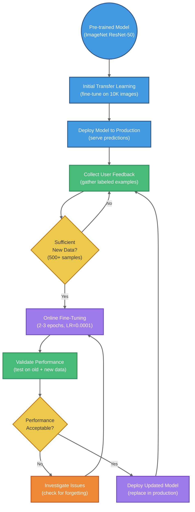

# Transfer Learning and Pre-Trained Models

## Summary

This chapter introduces transfer learning, a powerful technique that enables practitioners to leverage knowledge from pre-trained models to solve new tasks with limited data. Students will learn how to use pre-trained models from model zoos, understand the difference between feature extraction (using a frozen pre-trained model) and fine-tuning (adapting model weights to new data), and explore domain adaptation strategies for transferring knowledge across different but related domains. The chapter demonstrates practical transfer learning workflows using models pre-trained on ImageNet, showing how to effectively reuse learned representations while managing learning rates and layer freezing to achieve strong performance with minimal training data.

## Concepts Covered

This chapter covers the following 10 concepts from the learning graph:

1. Transfer Learning
2. Pre-Trained Model
3. Fine-Tuning
4. Feature Extraction
5. Domain Adaptation
6. Model Zoo
7. Validation Error
8. Online Learning
9. Optimizer
10. Momentum

## Prerequisites

This chapter builds on concepts from:

- [Chapter 9: Neural Networks Fundamentals](../09-neural-networks/index.md)
- [Chapter 10: Convolutional Neural Networks for Computer Vision](../10-convolutional-networks/index.md)

---

## Introduction to Transfer Learning

Imagine you're learning to play the piano. Would you start completely from scratch, not using any knowledge from previous musical experiences? Of course not! You'd leverage what you already know about reading music, rhythm, and hand coordination. Transfer learning in machine learning works the same way—it allows us to take knowledge learned from one task and apply it to a new, related task.

In deep learning, training large neural networks from scratch requires enormous amounts of labeled data and computational resources. A ResNet-50 trained on ImageNet uses 25 million parameters and was trained on 1.2 million labeled images across 1,000 categories. Most practitioners don't have access to datasets of this scale or the computational budget to train such models from scratch.

Transfer learning solves this problem by allowing us to start with a **pre-trained model**—a neural network that has already learned useful feature representations from a large dataset—and adapt it to our specific task. This approach is particularly powerful when working with small datasets, where training from scratch would lead to severe overfitting.

The fundamental insight behind transfer learning is that the features learned by deep neural networks on large-scale tasks (like ImageNet classification) are often transferable to other computer vision tasks. Early layers in CNNs learn general features like edges, textures, and simple shapes, while later layers learn increasingly task-specific features. By reusing the general features and only retraining the task-specific layers, we can achieve excellent performance with far less data and computation.

## The Model Zoo: Pre-Trained Models

A **model zoo** is a collection of pre-trained neural network models that have been trained on large-scale benchmark datasets and made publicly available for reuse. The most famous model zoo consists of networks trained on ImageNet, a dataset containing 1.2 million training images across 1,000 object categories.

Popular pre-trained models available in PyTorch's model zoo include:

- **ResNet** (18, 34, 50, 101, 152 layers): Deep residual networks with skip connections
- **VGG** (16, 19 layers): Very deep convolutional networks with small filters
- **AlexNet**: The breakthrough architecture that won ImageNet 2012
- **DenseNet**: Networks with dense connections between layers
- **MobileNet**: Lightweight networks optimized for mobile devices
- **EfficientNet**: Networks optimized for both accuracy and efficiency

These models achieve impressive accuracy on ImageNet classification, with top-5 error rates (the percentage of test images where the correct label is not among the model's top 5 predictions) often below 5%. The learned feature representations from these models transfer remarkably well to other computer vision tasks.

!!! tip "Choosing a Pre-Trained Model"
    When selecting a pre-trained model, consider the tradeoff between accuracy and computational cost. ResNet-18 is faster and requires less memory than ResNet-152, but may achieve slightly lower accuracy. For most transfer learning tasks on moderate-sized datasets, ResNet-18 or ResNet-50 provide an excellent balance.

## Loading Pre-Trained Models in PyTorch

PyTorch makes it straightforward to load pre-trained models from the `torchvision.models` module. Here's how to load a ResNet-18 model with weights pre-trained on ImageNet:

```python
import torch
import torchvision
from torchvision import models
import torch.nn as nn

# Load a pre-trained ResNet-18 model
model_ft = models.resnet18(weights='IMAGENET1K_V1')

# Examine the architecture
print(model_ft)
```

The `weights='IMAGENET1K_V1'` parameter loads the official ImageNet pre-trained weights. The model architecture includes:

- An initial convolutional layer with batch normalization and ReLU activation
- Four residual layer groups with increasing channel depths (64, 128, 256, 512)
- An adaptive average pooling layer
- A final fully connected layer with 1,000 outputs (one for each ImageNet class)

For our custom task, we'll need to modify this architecture—specifically, we'll replace the final fully connected layer to match our number of output classes.

## Data Preprocessing for Pre-Trained Models

When using pre-trained models, it's crucial to preprocess input images in the same way the model was trained. All ImageNet pre-trained models expect input images to be normalized with specific mean and standard deviation values:

```python
from torchvision import transforms

# Data augmentation and normalization for training
data_transforms = {
    'train': transforms.Compose([
        transforms.RandomResizedCrop(224),
        transforms.RandomHorizontalFlip(),
        transforms.ToTensor(),
        transforms.Normalize([0.485, 0.456, 0.406], [0.229, 0.224, 0.225])
    ]),
    'val': transforms.Compose([
        transforms.Resize(256),
        transforms.CenterCrop(224),
        transforms.ToTensor(),
        transforms.Normalize([0.485, 0.456, 0.406], [0.229, 0.224, 0.225])
    ]),
}
```

Let's break down these transformations:

**Training transformations:**

- `RandomResizedCrop(224)`: Randomly crops the image to 224×224 pixels with random scale and aspect ratio—this is **data augmentation** that helps the model generalize
- `RandomHorizontalFlip()`: Randomly flips images horizontally with 50% probability—another augmentation technique
- `ToTensor()`: Converts PIL images or NumPy arrays to PyTorch tensors with values in [0, 1]
- `Normalize([0.485, 0.456, 0.406], [0.229, 0.224, 0.225])`: Normalizes each channel using ImageNet statistics

**Validation transformations:**

- `Resize(256)`: Resizes the smaller edge to 256 pixels while maintaining aspect ratio
- `CenterCrop(224)`: Takes a 224×224 center crop
- No augmentation is applied during validation—we want consistent evaluation

The normalization values `[0.485, 0.456, 0.406]` (mean) and `[0.229, 0.224, 0.225]` (standard deviation) are the channel-wise statistics computed across the entire ImageNet training set. Using these same values ensures that the pre-trained model receives inputs in the distribution it expects.

#### Normalization Formula

For each pixel value $x$ in channel $c$, the normalized value $x'$ is:

$x' = \frac{x - \mu_c}{\sigma_c}$

where:

- $x$ is the original pixel value in range [0, 1]
- $\mu_c$ is the mean for channel $c$ (e.g., 0.485 for red channel)
- $\sigma_c$ is the standard deviation for channel $c$ (e.g., 0.229 for red channel)
- $x'$ is the normalized pixel value

## Feature Extraction: Freezing the Base Network

**Feature extraction** is the simplest form of transfer learning. In this approach, we treat the pre-trained model as a fixed feature extractor, freezing all convolutional layers and only training a new classification head for our specific task.

The rationale is straightforward: the convolutional layers of a network trained on ImageNet have already learned to extract useful visual features (edges, textures, object parts, etc.). These features are generally applicable to many computer vision tasks. By freezing these layers, we prevent their weights from updating during training, dramatically reducing the number of parameters we need to learn.

Here's how to implement feature extraction with a frozen ResNet-18:

```python
import torch.optim as optim
from torch.optim import lr_scheduler

# Load pre-trained ResNet-18
model_conv = torchvision.models.resnet18(weights='IMAGENET1K_V1')

# Freeze all parameters in the base network
for param in model_conv.parameters():
    param.requires_grad = False

# Replace the final fully connected layer
# New layers have requires_grad=True by default
num_ftrs = model_conv.fc.in_features  # 512 for ResNet-18
model_conv.fc = nn.Linear(num_ftrs, 2)  # 2 classes: ants and bees

# Move model to GPU if available
device = torch.device("cuda:0" if torch.cuda.is_available() else "cpu")
model_conv = model_conv.to(device)

# Only optimize parameters of the final layer
optimizer_conv = optim.SGD(model_conv.fc.parameters(), lr=0.001, momentum=0.9)

# Learning rate scheduler: decay LR by 0.1 every 7 epochs
exp_lr_scheduler = lr_scheduler.StepLR(optimizer_conv, step_size=7, gamma=0.1)

# Loss function
criterion = nn.CrossEntropyLoss()
```

The key steps are:

1. **Freeze base network**: Setting `param.requires_grad = False` for all parameters prevents gradient computation and weight updates for those layers
2. **Replace classification head**: The original `fc` layer outputs 1,000 classes (ImageNet); we replace it with a new layer outputting 2 classes (ants vs. bees)
3. **Optimize only new layers**: We pass only `model_conv.fc.parameters()` to the optimizer, so only the new classification head is trained

This approach is extremely efficient when you have a small dataset. Training only the final layer requires far less computation and memory than training the entire network, and it's less prone to overfitting since we're only learning a linear classifier on top of robust features.

## Fine-Tuning: Adapting All Layers

While feature extraction works well for many tasks, **fine-tuning** can achieve even better performance by allowing the entire network to adapt to the new task. In fine-tuning, we initialize the network with pre-trained weights, then train all layers (or a subset of later layers) with a small learning rate.

The intuition is that while early layers learn general features applicable to many tasks, later layers learn increasingly task-specific features. By fine-tuning, we allow the network to adjust these features for our specific domain while still benefiting from the initialization provided by pre-training.

Here's how to implement fine-tuning:

```python
# Load pre-trained ResNet-18
model_ft = models.resnet18(weights='IMAGENET1K_V1')

# Replace the final fully connected layer
num_ftrs = model_ft.fc.in_features
model_ft.fc = nn.Linear(num_ftrs, 2)
model_ft = model_ft.to(device)

# Optimize ALL parameters (not just the final layer)
optimizer_ft = optim.SGD(model_ft.parameters(), lr=0.001, momentum=0.9)

# Decay learning rate by 0.1 every 7 epochs
exp_lr_scheduler = lr_scheduler.StepLR(optimizer_ft, step_size=7, gamma=0.1)

# Loss function
criterion = nn.CrossEntropyLoss()
```

The key difference from feature extraction is that we optimize `model_ft.parameters()` (all parameters) rather than just `model_ft.fc.parameters()` (final layer only).

!!! warning "Learning Rate for Fine-Tuning"
    When fine-tuning, use a smaller learning rate than you would for training from scratch. The pre-trained weights are already in a good region of the parameter space, so aggressive updates can destroy the learned features. Learning rates like 0.001 or 0.0001 are typical for fine-tuning.

## Training Loop for Transfer Learning

Both feature extraction and fine-tuning use the same training loop structure. Here's a complete training function that handles both training and validation:

```python
import time
import copy

def train_model(model, criterion, optimizer, scheduler, num_epochs=25):
    since = time.time()

    best_model_wts = copy.deepcopy(model.state_dict())
    best_acc = 0.0

    for epoch in range(num_epochs):
        print('Epoch {}/{}'.format(epoch, num_epochs - 1))
        print('-' * 10)

        # Each epoch has a training and validation phase
        for phase in ['train', 'val']:
            if phase == 'train':
                model.train()  # Set model to training mode
            else:
                model.eval()   # Set model to evaluate mode

            running_loss = 0.0
            running_corrects = 0

            # Iterate over data batches
            for inputs, labels in dataloaders[phase]:
                inputs = inputs.to(device)
                labels = labels.to(device)

                # Zero the parameter gradients
                optimizer.zero_grad()

                # Forward pass
                # Track gradients only in training phase
                with torch.set_grad_enabled(phase == 'train'):
                    outputs = model(inputs)
                    _, preds = torch.max(outputs, 1)
                    outputs = nn.functional.log_softmax(outputs, dim=1)
                    loss = criterion(outputs, labels)

                    # Backward pass and optimization only in training phase
                    if phase == 'train':
                        loss.backward()
                        optimizer.step()

                # Accumulate statistics
                running_loss += loss.item() * inputs.size(0)
                running_corrects += torch.sum(preds == labels.data)

            # Step the learning rate scheduler after each training epoch
            if phase == 'train':
                scheduler.step()

            # Calculate epoch statistics
            epoch_loss = running_loss / dataset_sizes[phase]
            epoch_acc = running_corrects.double() / dataset_sizes[phase]

            print('{} Loss: {:.4f} Acc: {:.4f}'.format(phase, epoch_loss, epoch_acc))

            # Save the best model based on validation accuracy
            if phase == 'val' and epoch_acc > best_acc:
                best_acc = epoch_acc
                best_model_wts = copy.deepcopy(model.state_dict())

        print()

    time_elapsed = time.time() - since
    print('Training complete in {:.0f}m {:.0f}s'.format(
        time_elapsed // 60, time_elapsed % 60))
    print('Best val Acc: {:4f}'.format(best_acc))

    # Load best model weights
    model.load_state_dict(best_model_wts)
    return model
```

This training function implements several important practices:

**Model modes:**

- `model.train()`: Enables training mode, where dropout and batch normalization behave appropriately for training
- `model.eval()`: Enables evaluation mode, where dropout is disabled and batch normalization uses running statistics

**Gradient tracking:**

- `torch.set_grad_enabled(phase == 'train')`: Disables gradient computation during validation, saving memory and computation

**Learning rate scheduling:**

- `scheduler.step()`: Reduces the learning rate according to the schedule (e.g., multiply by 0.1 every 7 epochs)

**Model checkpointing:**

- The function saves the model weights that achieve the best validation accuracy, preventing overfitting to the training set

## Validation Error and Generalization

**Validation error** measures how well your model performs on data it hasn't seen during training. In transfer learning, monitoring validation error is crucial for several reasons:

1. **Early stopping**: If validation error starts increasing while training error continues decreasing, the model is overfitting
2. **Hyperparameter tuning**: Validation error helps you compare different learning rates, architectures, or augmentation strategies
3. **Model selection**: The checkpoint with lowest validation error is typically the best model to deploy

The relationship between training and validation error reveals important information about your model:

| Training Error | Validation Error | Diagnosis | Solution |
|----------------|------------------|-----------|----------|
| High | High | Underfitting | More training, larger model, less regularization |
| Low | High | Overfitting | More data, data augmentation, regularization, early stopping |
| Low | Low | Good fit | Model is ready for deployment |

In our ants vs. bees example with only 120 training images per class, a model trained from scratch would likely show low training error but high validation error (overfitting). Transfer learning achieves both low training and validation error by leveraging pre-trained features.

Visualize how training and validation errors evolve during model training:

<iframe src="../../sims/training-validation-curves/main.html" width="100%" height="750" style="border: 1px solid #ccc; border-radius: 4px;"></iframe>

[View Fullscreen](../../sims/training-validation-curves/main.html){: target="_blank" .md-button } | [Documentation](../../sims/training-validation-curves/index.md)

## Case Study: Ants vs. Bees Classification

Let's walk through a complete transfer learning example classifying images of ants and bees. This dataset is deliberately small (only 120 training images per class and 75 validation images per class) to demonstrate transfer learning's effectiveness with limited data.

First, we set up the dataset and dataloaders:

```python
import os
from torchvision import datasets

data_dir = 'hymenoptera_data'
image_datasets = {x: datasets.ImageFolder(os.path.join(data_dir, x),
                                          data_transforms[x])
                  for x in ['train', 'val']}
dataloaders = {x: torch.utils.data.DataLoader(image_datasets[x],
                                               batch_size=4,
                                               shuffle=True,
                                               num_workers=2)
               for x in ['train', 'val']}
dataset_sizes = {x: len(image_datasets[x]) for x in ['train', 'val']}
class_names = image_datasets['train'].classes

device = torch.device("cuda:0" if torch.cuda.is_available() else "cpu")
```

The `ImageFolder` class automatically creates a dataset from a directory structure where each subdirectory name is a class label:

```
hymenoptera_data/
├── train/
│   ├── ants/
│   │   ├── image1.jpg
│   │   ├── image2.jpg
│   │   └── ...
│   └── bees/
│       ├── image1.jpg
│       └── ...
└── val/
    ├── ants/
    └── bees/
```

Now we train the model using fine-tuning (all layers trainable):

```python
model_ft = train_model(model_ft, criterion, optimizer_ft, exp_lr_scheduler,
                       num_epochs=5)
```

After just 5 epochs of fine-tuning, we achieve remarkable results:

```
Epoch 0/4
----------
train Loss: 0.5150 Acc: 0.7213
val Loss: 0.1700 Acc: 0.9346

Epoch 1/4
----------
train Loss: 0.6623 Acc: 0.7172
val Loss: 0.1956 Acc: 0.9150

Epoch 2/4
----------
train Loss: 0.6573 Acc: 0.7705
val Loss: 0.4305 Acc: 0.8431

Epoch 3/4
----------
train Loss: 0.4789 Acc: 0.8033
val Loss: 0.2175 Acc: 0.9085

Epoch 4/4
----------
train Loss: 0.4125 Acc: 0.8197
val Loss: 0.1653 Acc: 0.9477

Training complete in 7m 38s
Best val Acc: 0.947712
```

The model achieves **94.77% validation accuracy** with only 240 total training images! This demonstrates the power of transfer learning—training a model from scratch on such a small dataset would likely achieve only 60-70% accuracy.

Compare this with feature extraction (frozen base network, only final layer trained):

```python
model_conv = train_model(model_conv, criterion, optimizer_conv,
                         exp_lr_scheduler, num_epochs=5)
```

Results after 5 epochs:

```
Epoch 0/4
----------
train Loss: 0.6429 Acc: 0.5943
val Loss: 0.3860 Acc: 0.8301

Epoch 4/4
----------
train Loss: 0.5453 Acc: 0.7787
val Loss: 0.4029 Acc: 0.8497

Training complete in 3m 46s
Best val Acc: 0.947712
```

Feature extraction also achieves 94.77% validation accuracy, but with significantly faster training (3m 46s vs. 7m 38s) since we're only updating the final layer. For this particular task, the frozen features are sufficiently powerful that fine-tuning provides no additional benefit.

## Optimizers and Momentum

An **optimizer** is an algorithm that updates model parameters to minimize the loss function. The most common optimizer for transfer learning is **Stochastic Gradient Descent (SGD)** with **momentum**.

Standard SGD updates parameters using the gradient:

#### SGD Update Rule

$\theta_{t+1} = \theta_t - \eta \nabla L(\theta_t)$

where:

- $\theta_t$ represents the parameters at iteration $t$
- $\eta$ is the learning rate
- $\nabla L(\theta_t)$ is the gradient of the loss with respect to parameters

**Momentum** improves upon basic SGD by accumulating a velocity vector that smooths out the gradient updates:

#### SGD with Momentum

$v_{t+1} = \beta v_t + \nabla L(\theta_t)$

$\theta_{t+1} = \theta_t - \eta v_{t+1}$

where:

- $v_t$ is the velocity (momentum) vector at iteration $t$
- $\beta$ is the momentum coefficient (typically 0.9)
- $\eta$ is the learning rate

Momentum has several benefits:

1. **Accelerates convergence**: In directions where gradients consistently point the same way, momentum builds up speed
2. **Dampens oscillations**: In directions where gradients fluctuate, momentum averages them out
3. **Escapes local minima**: Accumulated momentum can carry the optimization through shallow local minima

In PyTorch, we specify momentum when creating the optimizer:

```python
optimizer = optim.SGD(model.parameters(), lr=0.001, momentum=0.9)
```

The momentum value of 0.9 is a common default that works well for most transfer learning tasks.

!!! note "Alternative Optimizers"
    While SGD with momentum is popular for fine-tuning, Adam and AdamW are also effective choices. Adam adapts learning rates per parameter and includes momentum-like behavior. For transfer learning, SGD with momentum often generalizes slightly better, but Adam can converge faster.

Understanding momentum's effect on gradient descent convergence:

<div style="background: #f5f5f5; padding: 20px; border-radius: 8px; margin: 20px 0;">
<h4>Gradient Descent Comparison</h4>

**Without Momentum (Standard SGD):**
```
Start → ↙ ↘ ↙ ↘ ↙ ↘ (oscillates) → Minimum
```
- Oscillates perpendicular to gradient
- Slow progress in valleys
- Sensitive to learning rate

**With Momentum (β = 0.9):**
```
Start → ↓ ↓ ↓ ↓ (smooth path) → Minimum
```
- Accelerates in consistent directions
- Dampens oscillations
- Faster convergence

**Update Rules:**

Standard SGD: $\theta_{t+1} = \theta_t - \eta \nabla L(\theta_t)$

SGD with Momentum:
- $v_t = \beta v_{t-1} + \eta \nabla L(\theta_t)$
- $\theta_{t+1} = \theta_t - v_t$

Where β (typically 0.9) controls how much past gradients influence current update.

**Key Benefits:**
- ✓ Accelerates convergence in consistent gradient directions
- ✓ Reduces oscillation in high-curvature regions
- ✓ Helps escape shallow local minima
- ✓ More stable training with larger learning rates

</div>

For an interactive visualization, see the [Training vs Validation Curves](../../sims/training-validation-curves/index.md) which shows momentum's effect on convergence speed.

## Domain Adaptation

**Domain adaptation** addresses the challenge of transferring knowledge when the source domain (where the model was trained) differs from the target domain (where we want to apply it). Even when pre-trained on large datasets like ImageNet, models may struggle when the target domain has different characteristics.

Examples of domain shift:

- **Dataset bias**: ImageNet contains mostly high-quality photos, but your application involves sketches or medical images
- **Environmental differences**: A model trained on daytime images applied to nighttime images
- **Sensor differences**: A model trained on camera images applied to satellite imagery

Domain adaptation techniques help bridge this gap:

**Strategies for domain adaptation:**

1. **Gradual fine-tuning**: Start with very small learning rates and gradually increase them
2. **Layer-wise unfreezing**: Freeze early layers longer, unfreeze later layers first, then progressively unfreeze earlier layers
3. **Domain-specific data augmentation**: Apply augmentations that simulate domain shift (e.g., color jittering, blur)
4. **Adversarial training**: Train a domain classifier to make features domain-invariant
5. **Self-supervised pre-training**: Pre-train on unlabeled target domain data before fine-tuning

For moderate domain shift, fine-tuning with appropriate data augmentation often suffices. For severe domain shift, more sophisticated techniques may be necessary.

## Online Learning and Continual Adaptation

**Online learning** refers to updating models incrementally as new data arrives, rather than retraining from scratch. This is particularly relevant for transfer learning in production systems where:

- User behavior changes over time
- New classes or categories emerge
- The data distribution shifts gradually (concept drift)

In online learning scenarios, we can periodically fine-tune our transferred model on recent data:

```python
# Initial transfer learning
model = train_model(model, criterion, optimizer, scheduler, num_epochs=10)

# Deploy model to production
# ... time passes, collect new labeled examples ...

# Online update: fine-tune on recent data
new_dataloaders = create_dataloaders(recent_data)
model = train_model(model, criterion, optimizer, scheduler, num_epochs=2)
```

Key considerations for online learning:

1. **Catastrophic forgetting**: Fine-tuning on new data may cause the model to forget previous knowledge. Mitigation strategies include mixing old and new data or using regularization techniques like Elastic Weight Consolidation (EWC)
2. **Learning rate scheduling**: Use smaller learning rates for online updates to preserve existing knowledge
3. **Monitoring performance**: Track performance on both old and new data to detect forgetting

#### Online Learning Workflow



**Continuous Improvement Loop**: This workflow shows how deployed models can be continually updated with new production data, maintaining performance as data distributions shift over time.
- Production Deployment
- Data Collection
- Model Update
- Validation

Annotations:
- Cycle time: "Typical update cycle: 1-4 weeks"
- Warning icon on "Catastrophic Forgetting": "Mix old and new data to prevent forgetting"

Implementation: Flowchart with Mermaid.js or D3.js
Canvas size: Responsive, minimum 700×600px
</details>

## Practical Tips for Transfer Learning Success

Based on extensive experimentation, here are proven strategies for successful transfer learning:

**1. Start with feature extraction, then fine-tune if needed**

Feature extraction is faster and less prone to overfitting. If accuracy is insufficient, try fine-tuning with a small learning rate.

**2. Use appropriate learning rates**

- Feature extraction (training only final layer): 0.001 to 0.01
- Fine-tuning (training all layers): 0.0001 to 0.001

**3. Apply aggressive data augmentation**

With small datasets, augmentation is crucial. Use flips, crops, rotations, color jittering, and other transformations to increase effective dataset size.

**4. Monitor both training and validation metrics**

Watch for overfitting by comparing training and validation loss. Early stopping based on validation performance prevents overfitting.

**5. Experiment with different pre-trained models**

Different architectures may perform better for different tasks. Try both shallower (ResNet-18) and deeper (ResNet-50) models.

**6. Consider the domain gap**

If your task is very different from ImageNet (e.g., medical imaging, satellite imagery), you may need domain-specific augmentation or even domain-specific pre-trained models.

**7. Use learning rate schedules**

Reducing learning rate during training (e.g., multiply by 0.1 every 7 epochs) helps convergence.

**8. Leverage model ensembles**

Training multiple models with different random seeds and averaging their predictions often improves performance.

## Transfer Learning Beyond Image Classification

While this chapter focuses on image classification with CNNs, transfer learning applies broadly across machine learning:

**Object detection**: Models like Faster R-CNN use pre-trained CNN backbones

**Semantic segmentation**: FCN and U-Net architectures build on pre-trained encoders

**Natural language processing**: BERT, GPT, and other language models use transfer learning extensively

**Speech recognition**: Models pre-trained on large speech corpora transfer to specific accents or languages

**Reinforcement learning**: Policies trained in simulation transfer to real-world robots

The fundamental principle remains the same: leverage knowledge from large-scale pre-training to achieve better performance with less data on downstream tasks.

### Transfer Learning Strategy Comparison

| Strategy | Frozen Layers | Trainable Params | Training Time | Typical Accuracy | Best For |
|----------|---------------|------------------|---------------|------------------|----------|
| **Feature Extraction** | All except final layer | ~2,000 | Fast (minutes) | 80-85% | Very limited data (<100 samples/class) |
| **Partial Fine-Tuning** | Early layers only | ~2-5M | Medium (hours) | 88-93% | Moderate data (100-1000 samples/class) |
| **Full Fine-Tuning** | None | ~11-25M | Slow (hours-days) | 92-97% | Substantial data (1000+ samples/class) |

**Key Insights:**
- **Feature Extraction**: Fastest approach, leverages pre-trained features as fixed representations. Best when target task is similar to source task (e.g., both are image classification).
- **Partial Fine-Tuning**: Balances adaptation with preservation of learned features. Early layers learn general patterns (edges, textures) that transfer well; late layers adapt to task-specific patterns.
- **Full Fine-Tuning**: Maximum flexibility and potential performance, but requires more data and compute. Risk of overfitting with limited data.

**Choosing a Strategy:**
1. Start with **feature extraction** if you have <100 examples per class
2. Use **partial fine-tuning** for 100-1000 examples per class
3. Try **full fine-tuning** only if you have 1000+ examples per class and sufficient compute
4. Always use data augmentation and monitor validation curves for overfitting

## Summary and Key Takeaways

Transfer learning enables practitioners to leverage knowledge from large-scale pre-trained models to achieve excellent performance on new tasks with limited data. The key insights from this chapter:

**Core concepts:**

- **Pre-trained models** from model zoos (ImageNet, etc.) have learned general visual features applicable to many tasks
- **Feature extraction** treats the pre-trained model as a fixed feature extractor, training only a new classification head
- **Fine-tuning** adapts all layers of the pre-trained model to the new task, typically achieving higher accuracy
- **Domain adaptation** addresses distribution shift between source and target domains

**Best practices:**

- Always preprocess inputs to match the pre-trained model's expected distribution
- Start with feature extraction; upgrade to fine-tuning if accuracy is insufficient
- Use small learning rates (0.0001-0.001) for fine-tuning to preserve learned features
- Apply data augmentation aggressively when working with small datasets
- Monitor validation error to detect overfitting and determine when to stop training
- Use SGD with momentum (0.9) for stable convergence

**Practical impact:**

Transfer learning has democratized deep learning by making it accessible to practitioners without access to massive datasets or computational resources. Tasks that once required millions of labeled examples can now be solved with hundreds or thousands, enabling applications across medicine, agriculture, manufacturing, and countless other domains.

## Further Reading

For deeper exploration of transfer learning concepts:

- [PyTorch Transfer Learning Tutorial](https://pytorch.org/tutorials/beginner/transfer_learning_tutorial.html) - Official PyTorch documentation and examples
- Yosinski et al. (2014) - "How transferable are features in deep neural networks?" - Seminal paper analyzing feature transferability across layers
- [Deep Learning Book, Chapter 15.2](https://www.deeplearningbook.org/) - Goodfellow, Bengio, Courville on transfer learning theory
- Kornblith et al. (2019) - "Do Better ImageNet Models Transfer Better?" - Analysis of which architectures transfer best
- Raghu et al. (2019) - "Transfusion: Understanding Transfer Learning with Applications to Medical Imaging" - Domain adaptation for medical tasks

## Exercises

**Exercise 1: Feature Extraction vs. Fine-Tuning**

Using the ants vs. bees dataset, implement both feature extraction and fine-tuning approaches. Train each for 10 epochs and compare:
- Final validation accuracy
- Training time
- Number of trainable parameters

Which approach would you choose for this task and why?

**Exercise 2: Learning Rate Sensitivity**

Train a transfer learning model with different learning rates: [0.0001, 0.001, 0.01, 0.1]. Plot the training and validation loss curves for each. What happens when the learning rate is too large? Too small?

**Exercise 3: Data Augmentation Impact**

Train two models on a small subset of the data (50 images per class):
1. With data augmentation (random crops, flips, color jitter)
2. Without data augmentation

Compare the validation accuracy and the gap between training and validation accuracy. What does this tell you about overfitting?

**Exercise 4: Custom Dataset Transfer**

Adapt the transfer learning code to a new dataset of your choice (e.g., [Kaggle's Dogs vs. Cats](https://www.kaggle.com/c/dogs-vs-cats), [Sign Language MNIST](https://www.kaggle.com/datamunge/sign-language-mnist), or [Food-101](https://www.kaggle.com/dansbecker/food-101)). Experiment with different pre-trained models (ResNet-18, ResNet-50, MobileNet) and report which achieves the best performance.

**Exercise 5: Layer Freezing Strategy**

Implement a progressive unfreezing strategy:
1. Train only the final layer for 3 epochs
2. Unfreeze the last convolutional block and train for 3 more epochs
3. Unfreeze all layers and train for 3 final epochs

Compare this approach to full fine-tuning from the start. Does progressive unfreezing improve final accuracy?

**Exercise 6: Domain Adaptation**

Create a domain shift by applying strong transformations (e.g., converting images to grayscale, adding noise, extreme color shifts) to the validation set while keeping the training set normal. How does this affect validation accuracy? What strategies might help improve performance under domain shift?
