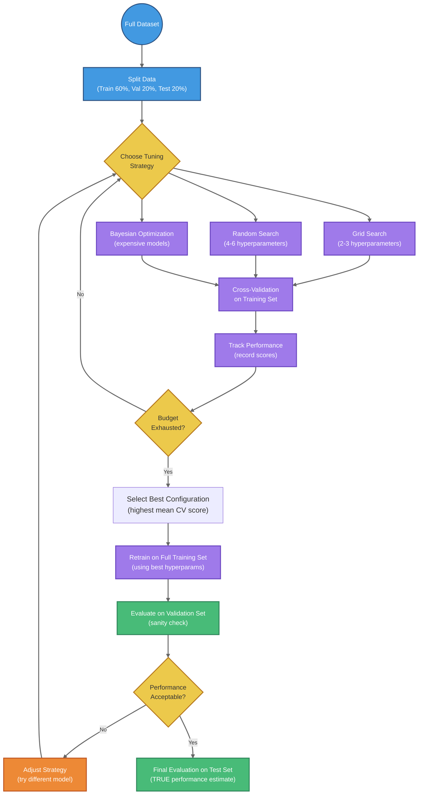

# Model Evaluation, Optimization, and Advanced Topics

## Summary

This comprehensive final chapter brings together essential techniques for evaluating, optimizing, and deploying machine learning models. Students will master evaluation metrics including confusion matrices, accuracy, precision, recall, F1 score, ROC curves, and AUC, learning when to apply each metric based on problem characteristics. The chapter covers cross-validation strategies, the bias-variance tradeoff, generalization, and methods for diagnosing overfitting and underfitting through training and validation error analysis. Students will explore advanced optimization algorithms (Adam, RMSprop, Nesterov momentum) and regularization techniques (dropout, early stopping, gradient clipping), and learn systematic approaches to hyperparameter tuning through grid search, random search, and Bayesian optimization. This chapter synthesizes knowledge from the entire course, preparing students to tackle real-world machine learning projects.

## Concepts Covered

This chapter covers the following 28 concepts from the learning graph:

1. Training Error
2. Test Error
3. Generalization
4. Stratified Sampling
5. Holdout Method
6. Confusion Matrix
7. True Positive
8. False Positive
9. True Negative
10. False Negative
11. Accuracy
12. Precision
13. Recall
14. F1 Score
15. ROC Curve
16. AUC
17. Sensitivity
18. Specificity
19. Adam Optimizer
20. RMSprop
21. Nesterov Momentum
22. Gradient Clipping
23. Model Evaluation
24. Model Selection
25. Hyperparameter Tuning
26. Grid Search
27. Random Search
28. Bayesian Optimization

## Prerequisites

This chapter builds on concepts from:

- [Chapter 1: Introduction to Machine Learning Fundamentals](../01-intro-to-ml-fundamentals/index.md)
- [Chapter 3: Decision Trees and Tree-Based Learning](../03-decision-trees/index.md)
- [Chapter 5: Regularization Techniques](../05-regularization/index.md)
- [Chapter 8: Data Preprocessing and Feature Engineering](../08-data-preprocessing/index.md)
- [Chapter 9: Neural Networks Fundamentals](../09-neural-networks/index.md)

---

## Introduction: Why Model Evaluation Matters

Imagine you've trained a machine learning model that predicts whether a medical patient has a rare disease. Your model achieves 99% accuracy—impressive, right? But what if only 1% of patients actually have the disease? A naive model that always predicts "no disease" would also achieve 99% accuracy while being completely useless for diagnosis. This example illustrates a fundamental truth: **choosing the right evaluation metric is as important as building a good model**.

Throughout this course, we've built classifiers, regressors, clustering algorithms, and neural networks. But how do we know if these models are actually good? How do we compare different approaches? How do we ensure our models will perform well on new, unseen data? These questions lie at the heart of machine learning practice.

This chapter synthesizes the evaluation, optimization, and tuning techniques that separate research prototypes from production-ready systems. We'll explore how to measure model performance accurately, diagnose common problems like overfitting and underfitting, select optimal hyperparameters, and deploy models that generalize well to real-world scenarios.

## Training Error vs. Test Error

The most fundamental concept in model evaluation is the distinction between **training error** and **test error**.

**Training error** measures how well your model fits the data it was trained on. It's computed by evaluating the model's predictions on the same dataset used for training. While low training error might seem desirable, it can be misleading—a model that memorizes the training data will have zero training error but fail completely on new examples.

**Test error** measures how well your model performs on data it has never seen before. This is the metric we truly care about, as it reflects real-world performance. The gap between training and test error reveals whether your model has learned genuine patterns or simply memorized noise.

Let's implement a simple example to illustrate this distinction:

```python
from sklearn.model_selection import train_test_split
from sklearn.neighbors import KNeighborsClassifier
from sklearn.metrics import accuracy_score
import pandas as pd

# Load iris dataset
iris_df = pd.read_csv('https://raw.githubusercontent.com/sziccardi/MLCamp2025_DataRepository/main/iris.csv')

# Prepare features and target
feature_names = ["sepal_length", "sepal_width", "petal_length", "petal_width"]
X = iris_df[feature_names].values
y = iris_df["species"].values

# Split data into training and testing sets
X_train, X_test, y_train, y_test = train_test_split(
    X, y, test_size=0.2, random_state=0
)

# Train a 3-nearest neighbors classifier
classifier = KNeighborsClassifier(n_neighbors=3)
classifier.fit(X_train, y_train)

# Compute training error
y_train_pred = classifier.predict(X_train)
train_accuracy = accuracy_score(y_train, y_train_pred)
print(f"Training Accuracy: {train_accuracy:.4f}")

# Compute test error
y_test_pred = classifier.predict(X_test)
test_accuracy = accuracy_score(y_test, y_test_pred)
print(f"Test Accuracy: {test_accuracy:.4f}")
```

Typical output:
```
Training Accuracy: 0.9667
Test Accuracy: 0.9667
```

In this example, training and test accuracy are similar, suggesting good **generalization**. However, with more complex models or smaller datasets, we often see training accuracy significantly higher than test accuracy—a clear sign of overfitting.

## Generalization and the Bias-Variance Tradeoff

**Generalization** refers to a model's ability to perform well on new, unseen data. A model that generalizes well has learned the underlying patterns in the data rather than memorizing specific training examples.

The **bias-variance tradeoff** is a fundamental framework for understanding generalization:

- **High bias** models are too simple and underfit the data. They make strong assumptions about the data's structure, leading to systematic errors on both training and test sets. Examples: linear regression on non-linear data, decision stumps (depth-1 trees).

- **High variance** models are too complex and overfit the data. They capture noise in the training set, performing well on training data but poorly on test data. Examples: very deep decision trees, k-NN with k=1, neural networks with too many parameters.

The relationship between model complexity, bias, and variance can be visualized:

| Model Complexity | Bias | Variance | Training Error | Test Error | Generalization |
|------------------|------|----------|----------------|------------|----------------|
| Too Simple | High | Low | High | High | Poor (underfitting) |
| Optimal | Moderate | Moderate | Moderate | Moderate | Good |
| Too Complex | Low | High | Low | High | Poor (overfitting) |

The goal of machine learning is to find the "sweet spot" where the sum of bias and variance is minimized, achieving the best generalization performance.

!!! tip "Detecting Underfitting vs. Overfitting"
    - **Underfitting**: Both training and test errors are high, and similar to each other
    - **Overfitting**: Training error is low, but test error is much higher
    - **Good fit**: Both training and test errors are low and similar to each other

## The Holdout Method and Data Splitting

The **holdout method** is the simplest approach to estimating test error: split your dataset into a training set and a test set, train on the former, and evaluate on the latter.

Common split ratios include:

- **80/20 split**: 80% training, 20% testing (common for medium to large datasets)
- **70/30 split**: 70% training, 30% testing (provides more test data for evaluation)
- **60/20/20 split**: 60% training, 20% validation (for hyperparameter tuning), 20% testing (for final evaluation)

The code from our earlier example demonstrates the holdout method:

```python
X_train, X_test, y_train, y_test = train_test_split(
    X, y, test_size=0.2, random_state=0
)
```

The `test_size=0.2` parameter allocates 20% of data for testing. The `random_state=0` ensures reproducibility—the same random seed produces the same split every time.

### Stratified Sampling

When working with imbalanced datasets (where some classes are much more frequent than others), standard random splitting can produce unrepresentative train/test sets. **Stratified sampling** solves this by ensuring each split has approximately the same proportion of each class as the original dataset.

```python
from sklearn.model_selection import train_test_split

# Standard split (may not preserve class proportions)
X_train, X_test, y_train, y_test = train_test_split(
    X, y, test_size=0.2, random_state=42
)

# Stratified split (preserves class proportions)
X_train, X_test, y_train, y_test = train_test_split(
    X, y, test_size=0.2, stratify=y, random_state=42
)
```

The `stratify=y` parameter instructs `train_test_split` to maintain the class distribution. If your dataset has 60% class A and 40% class B, stratified sampling ensures both training and test sets maintain this 60/40 ratio.

## Cross-Validation: A More Robust Approach

The holdout method has a significant limitation: the train/test split is random, so performance estimates can vary significantly depending on which examples end up in the test set. **Cross-validation** addresses this by averaging performance over multiple train/test splits.

### K-Fold Cross-Validation

The most common form is **k-fold cross-validation**:

1. Divide the dataset into k equal-sized folds
2. For each fold i (i = 1, ..., k):
   - Use fold i as the test set
   - Use the remaining k-1 folds as the training set
   - Train the model and compute test error
3. Average the k test errors to get the final performance estimate

Here's how to implement k-fold cross-validation:

```python
from sklearn.model_selection import cross_val_score, StratifiedKFold

# Perform 10-fold cross-validation
knn = KNeighborsClassifier(n_neighbors=3)
scores = cross_val_score(
    knn, X_train, y_train,
    cv=StratifiedKFold(n_splits=10, shuffle=True, random_state=42),
    scoring='accuracy'
)

print(f"Cross-validation scores: {scores}")
print(f"Mean accuracy: {scores.mean():.4f} (+/- {scores.std() * 2:.4f})")
```

The `StratifiedKFold` ensures each fold maintains the class distribution. Common choices for k are 5 or 10, balancing computational cost with reliable estimation.

**Advantages of cross-validation:**

- More reliable performance estimates than a single train/test split
- Uses all data for both training and testing (at different times)
- Provides confidence intervals via standard deviation of scores

**Disadvantages:**

- Computationally expensive (k times slower than holdout method)
- Not suitable for time-series data (where temporal order matters)

## The Confusion Matrix

For classification tasks, accuracy alone is often insufficient to understand model performance. The **confusion matrix** provides a complete picture by showing exactly which predictions were correct and which were incorrect.

For binary classification, the confusion matrix is a 2×2 table:

|                    | Predicted Negative | Predicted Positive |
|--------------------|--------------------|--------------------|
| **Actual Negative** | True Negative (TN) | False Positive (FP) |
| **Actual Positive** | False Negative (FN) | True Positive (TP) |

Let's compute a confusion matrix for our k-NN classifier:

```python
from sklearn.metrics import confusion_matrix

# Make predictions on test set
y_pred = classifier.predict(X_test)

# Compute confusion matrix
cm = confusion_matrix(y_test, y_pred)
print("Confusion Matrix:")
print(cm)
```

Output:
```
[[11  0  0]
 [ 0 12  1]
 [ 0  0  6]]
```

For the iris dataset (3 classes), we get a 3×3 matrix. The diagonal entries represent correct classifications, while off-diagonal entries show misclassifications. Here, we see only 1 misclassification: a versicolor flower (row 2) classified as virginica (column 3).

The four basic components of a binary confusion matrix have specific names:

- **True Positive (TP)**: Correctly predicted positive class
- **True Negative (TN)**: Correctly predicted negative class
- **False Positive (FP)**: Incorrectly predicted positive (Type I error)
- **False Negative (FN)**: Incorrectly predicted negative (Type II error)

Understanding these components is crucial for computing derived metrics like precision and recall.

Explore the relationship between confusion matrix values and classification metrics:

<iframe src="../../sims/confusion-matrix-explorer/confusion-matrix.html" width="100%" height="950" frameborder="0"></iframe>

## Classification Metrics: Beyond Accuracy

While accuracy measures the overall proportion of correct predictions, it can be misleading in many real-world scenarios. Consider our disease detection example: with 99% of patients healthy, a model that always predicts "healthy" achieves 99% accuracy despite never detecting the 1% with the disease.

### Precision and Recall

Two fundamental metrics address this limitation:

**Precision** answers: "Of all examples predicted as positive, how many were actually positive?"

#### Precision Formula

$\text{Precision} = \frac{TP}{TP + FP}$

where:

- $TP$ is the number of true positives
- $FP$ is the number of false positives

Precision is critical when false positives are costly. For example, in spam detection, marking legitimate emails as spam (false positives) frustrates users, so we want high precision.

**Recall** (also called **sensitivity** or **true positive rate**) answers: "Of all actual positive examples, how many did we correctly identify?"

#### Recall Formula

$\text{Recall} = \frac{TP}{TP + FN}$

where:

- $TP$ is the number of true positives
- $FN$ is the number of false negatives

Recall is critical when false negatives are costly. For disease detection, missing actual cases (false negatives) could be fatal, so we want high recall.

There's typically a tradeoff between precision and recall. Predicting positive more aggressively increases recall but decreases precision (more false positives). Being conservative increases precision but decreases recall (more false negatives).

### Specificity

**Specificity** (also called **true negative rate**) measures how well the model identifies negative examples:

#### Specificity Formula

$\text{Specificity} = \frac{TN}{TN + FP}$

where:

- $TN$ is the number of true negatives
- $FP$ is the number of false positives

Specificity is the negative-class analog of recall. It's particularly important in screening tests where you want to avoid alarming healthy patients with false positives.

### F1 Score

The **F1 score** provides a single metric that balances precision and recall through their harmonic mean:

#### F1 Score Formula

$F_1 = 2 \times \frac{\text{Precision} \times \text{Recall}}{\text{Precision} + \text{Recall}} = \frac{2 \times TP}{2 \times TP + FP + FN}$

The F1 score ranges from 0 (worst) to 1 (best). It's particularly useful when you need a single metric that accounts for both precision and recall, and when classes are imbalanced.

Let's compute these metrics in Python:

```python
from sklearn.metrics import precision_score, recall_score, f1_score, classification_report

# Compute metrics
precision = precision_score(y_test, y_pred, average='weighted')
recall = recall_score(y_test, y_pred, average='weighted')
f1 = f1_score(y_test, y_pred, average='weighted')

print(f"Precision: {precision:.4f}")
print(f"Recall: {recall:.4f}")
print(f"F1 Score: {f1:.4f}")

# Or get a comprehensive report
print("\nClassification Report:")
print(classification_report(y_test, y_pred))
```

The `average='weighted'` parameter computes metrics for each class separately, then averages them weighted by class frequency—appropriate for multi-class problems with imbalanced classes.

## ROC Curves and AUC

While precision, recall, and F1 score are valuable, they depend on choosing a classification threshold (typically 0.5 for probability-based classifiers). The **Receiver Operating Characteristic (ROC) curve** provides a threshold-independent evaluation by plotting the true positive rate (recall) against the false positive rate at various thresholds.

### Understanding ROC Curves

The **false positive rate** is defined as:

#### False Positive Rate Formula

$\text{FPR} = \frac{FP}{FP + TN} = 1 - \text{Specificity}$

An ROC curve plots:
- **Y-axis**: True Positive Rate (Recall/Sensitivity)
- **X-axis**: False Positive Rate (1 - Specificity)

Each point on the curve represents the (FPR, TPR) pair at a specific classification threshold. A perfect classifier would have a point at (0, 1)—no false positives, all true positives captured.

The **Area Under the Curve (AUC)** summarizes the ROC curve with a single number between 0 and 1:

- **AUC = 1.0**: Perfect classifier (ideal case)
- **AUC = 0.5**: Random classifier (diagonal line, no better than coin flipping)
- **AUC < 0.5**: Worse than random (predictions are anticorrelated with truth)

AUC can be interpreted as the probability that the model ranks a random positive example higher than a random negative example.

Here's how to compute and plot ROC curves:

```python
from sklearn.metrics import roc_curve, roc_auc_score
from sklearn.preprocessing import label_binarize
import matplotlib.pyplot as plt
import numpy as np

# For binary classification
# Get probability predictions instead of hard classifications
y_proba = classifier.predict_proba(X_test)

# Compute ROC curve and AUC for each class (one-vs-rest)
n_classes = len(np.unique(y))
y_test_bin = label_binarize(y_test, classes=np.unique(y))

# Plot ROC curve for each class
plt.figure(figsize=(10, 8))
for i in range(n_classes):
    fpr, tpr, thresholds = roc_curve(y_test_bin[:, i], y_proba[:, i])
    auc = roc_auc_score(y_test_bin[:, i], y_proba[:, i])
    plt.plot(fpr, tpr, label=f'Class {i} (AUC = {auc:.3f})')

# Plot diagonal (random classifier)
plt.plot([0, 1], [0, 1], 'k--', label='Random Classifier')
plt.xlabel('False Positive Rate')
plt.ylabel('True Positive Rate (Recall)')
plt.title('ROC Curves for Multi-Class Classification')
plt.legend()
plt.grid(True)
plt.show()
```

!!! note "When to Use ROC/AUC vs. Precision/Recall"
    - Use **ROC/AUC** when classes are balanced and you care equally about both classes
    - Use **Precision/Recall** when classes are imbalanced or when one type of error is more costly than the other
    - In highly imbalanced problems (e.g., fraud detection with 0.1% fraud rate), precision-recall curves are often more informative than ROC curves

Compare ROC curves for different classifier performance levels:

<iframe src="../../sims/roc-curve-comparison/roc-curve.html" width="100%" height="950" frameborder="0"></iframe>

## Advanced Optimization Algorithms

In Chapter 11, we introduced Stochastic Gradient Descent (SGD) with momentum. While SGD with momentum works well for many problems, modern deep learning relies on more sophisticated optimization algorithms that adapt learning rates during training.

### Adam Optimizer

**Adam** (Adaptive Moment Estimation) is currently the most popular optimizer for deep learning. It combines ideas from momentum and RMSprop, maintaining both:

1. **First moment** (mean) of gradients (like momentum)
2. **Second moment** (uncentered variance) of gradients (like RMSprop)

The Adam update rules are:

#### Adam Update Equations

$m_t = \beta_1 m_{t-1} + (1 - \beta_1) \nabla L(\theta_{t-1})$

$v_t = \beta_2 v_{t-1} + (1 - \beta_2) [\nabla L(\theta_{t-1})]^2$

$\hat{m}_t = \frac{m_t}{1 - \beta_1^t}$

$\hat{v}_t = \frac{v_t}{1 - \beta_2^t}$

$\theta_t = \theta_{t-1} - \eta \frac{\hat{m}_t}{\sqrt{\hat{v}_t} + \epsilon}$

where:

- $m_t$ is the first moment estimate (exponential moving average of gradients)
- $v_t$ is the second moment estimate (exponential moving average of squared gradients)
- $\beta_1$ is the decay rate for first moment (typically 0.9)
- $\beta_2$ is the decay rate for second moment (typically 0.999)
- $\hat{m}_t$ and $\hat{v}_t$ are bias-corrected moment estimates
- $\eta$ is the learning rate (typically 0.001)
- $\epsilon$ is a small constant for numerical stability (typically $10^{-8}$)

Adam's key advantages:

- **Adaptive learning rates**: Each parameter gets its own learning rate based on gradient history
- **Momentum**: Accelerates convergence like SGD with momentum
- **Robust to hyperparameters**: Works well with default settings across many problems
- **Efficient**: Low memory requirements, computationally efficient

In PyTorch, Adam is the default choice for most applications:

```python
import torch.optim as optim

# Create Adam optimizer
optimizer = optim.Adam(model.parameters(), lr=0.001, betas=(0.9, 0.999))

# Training loop
for inputs, labels in dataloader:
    optimizer.zero_grad()
    outputs = model(inputs)
    loss = criterion(outputs, labels)
    loss.backward()
    optimizer.step()
```

### RMSprop

**RMSprop** (Root Mean Square Propagation) adapts learning rates by dividing by a running average of recent gradient magnitudes:

#### RMSprop Update Equations

$v_t = \beta v_{t-1} + (1 - \beta) [\nabla L(\theta_{t-1})]^2$

$\theta_t = \theta_{t-1} - \frac{\eta}{\sqrt{v_t} + \epsilon} \nabla L(\theta_{t-1})$

where:

- $v_t$ is the moving average of squared gradients
- $\beta$ is the decay rate (typically 0.9)
- $\eta$ is the learning rate
- $\epsilon$ is a small constant for numerical stability

RMSprop addresses the problem of rapidly diminishing learning rates in Adagrad by using an exponentially decaying average of squared gradients instead of accumulating all past gradients. It works particularly well for recurrent neural networks.

```python
# Create RMSprop optimizer in PyTorch
optimizer = optim.RMSprop(model.parameters(), lr=0.01, alpha=0.9)
```

### Nesterov Momentum

**Nesterov Accelerated Gradient (NAG)** or **Nesterov momentum** is a variant of standard momentum that often converges faster. The key idea: instead of computing the gradient at the current position, compute it at an approximate future position.

Standard momentum update:
1. Compute gradient at current position: $\nabla L(\theta_t)$
2. Update velocity: $v_{t+1} = \beta v_t + \nabla L(\theta_t)$
3. Update parameters: $\theta_{t+1} = \theta_t - \eta v_{t+1}$

Nesterov momentum update:
1. Look ahead: $\theta_{\text{ahead}} = \theta_t - \eta \beta v_t$
2. Compute gradient at look-ahead position: $\nabla L(\theta_{\text{ahead}})$
3. Update velocity: $v_{t+1} = \beta v_t + \nabla L(\theta_{\text{ahead}})$
4. Update parameters: $\theta_{t+1} = \theta_t - \eta v_{t+1}$

This "look ahead" often provides better convergence because it corrects course earlier when overshooting:

```python
# SGD with Nesterov momentum in PyTorch
optimizer = optim.SGD(model.parameters(), lr=0.01, momentum=0.9, nesterov=True)
```

### Gradient Clipping

**Gradient clipping** is a technique to prevent exploding gradients, particularly common in recurrent neural networks. When gradients become very large, they can cause numerical instability and make training diverge.

Gradient clipping limits gradient magnitude before the optimization step:

```python
import torch.nn as nn

# During training loop, after loss.backward() but before optimizer.step()
loss.backward()

# Clip gradients to maximum norm of 1.0
nn.utils.clip_grad_norm_(model.parameters(), max_norm=1.0)

optimizer.step()
```

Two common clipping strategies:

1. **Clip by norm**: Scale gradients so their L2 norm doesn't exceed a threshold
2. **Clip by value**: Clamp individual gradient values to a range like [-1, 1]

Gradient clipping is essential for training LSTMs and other recurrent architectures, where gradients can explode exponentially during backpropagation through time.

## Hyperparameter Tuning

**Hyperparameters** are configuration settings that aren't learned from data—learning rate, number of layers, regularization strength, etc. Choosing optimal hyperparameters often makes the difference between mediocre and state-of-the-art performance.

### Grid Search

**Grid search** exhaustively tries all combinations of specified hyperparameter values:

```python
from sklearn.model_selection import GridSearchCV
from sklearn.svm import SVC

# Define hyperparameter grid
param_grid = {
    'C': [0.1, 1, 10, 100],
    'gamma': [0.001, 0.01, 0.1, 1],
    'kernel': ['rbf', 'poly', 'sigmoid']
}

# Create grid search with cross-validation
grid_search = GridSearchCV(
    SVC(),
    param_grid,
    cv=5,
    scoring='accuracy',
    n_jobs=-1,  # Use all CPU cores
    verbose=2
)

# Fit on training data
grid_search.fit(X_train, y_train)

# Best parameters and score
print(f"Best parameters: {grid_search.best_params_}")
print(f"Best cross-validation score: {grid_search.best_score_:.4f}")

# Use best model
best_model = grid_search.best_estimator_
```

In this example, grid search evaluates 4 × 4 × 3 = 48 hyperparameter combinations, using 5-fold cross-validation for each—a total of 240 model training runs! The `n_jobs=-1` parameter parallelizes these runs across all CPU cores.

**Advantages of grid search:**
- Guaranteed to find the best combination within the specified grid
- Simple and easy to understand
- Embarrassingly parallel (each combination can be evaluated independently)

**Disadvantages:**
- Computationally expensive (exponential in number of hyperparameters)
- Wastes computation on unlikely combinations
- Requires prior knowledge to define reasonable ranges

### Random Search

**Random search** samples hyperparameter combinations randomly from specified distributions:

```python
from sklearn.model_selection import RandomizedSearchCV
from scipy.stats import uniform, randint

# Define hyperparameter distributions
param_distributions = {
    'C': uniform(0.1, 100),  # Uniform distribution from 0.1 to 100.1
    'gamma': uniform(0.001, 1),  # Uniform distribution from 0.001 to 1.001
    'kernel': ['rbf', 'poly', 'sigmoid']
}

# Create random search
random_search = RandomizedSearchCV(
    SVC(),
    param_distributions,
    n_iter=50,  # Number of random combinations to try
    cv=5,
    scoring='accuracy',
    n_jobs=-1,
    random_state=42,
    verbose=2
)

# Fit on training data
random_search.fit(X_train, y_train)

print(f"Best parameters: {random_search.best_params_}")
print(f"Best score: {random_search.best_score_:.4f}")
```

Random search tries 50 random combinations instead of all 48 systematic combinations from grid search. Surprisingly, research shows random search often performs as well as or better than grid search with far fewer evaluations.

**Why does random search work?**

- Not all hyperparameters matter equally; random search explores important dimensions more densely
- Can explore a wider range without exponential cost
- Better at finding global optima when search space is large

**Advantages:**
- More efficient than grid search for high-dimensional spaces
- Can specify continuous distributions instead of discrete values
- Easy to parallelize

**Disadvantages:**
- No guarantee of finding the absolute best combination
- Results vary with random seed (though this also helps explore the space)

### Bayesian Optimization

**Bayesian optimization** is a more sophisticated approach that builds a probabilistic model of the objective function (e.g., validation accuracy as a function of hyperparameters) and uses it to select the most promising hyperparameters to evaluate next.

The algorithm works as follows:

1. Evaluate a few random hyperparameter configurations
2. Fit a probabilistic model (typically a Gaussian Process) to observed results
3. Use an **acquisition function** to select the next hyperparameter configuration that balances:
   - **Exploitation**: Try hyperparameters expected to perform well based on the model
   - **Exploration**: Try hyperparameters in unexplored regions with high uncertainty
4. Evaluate the selected configuration and update the model
5. Repeat steps 3-4 until budget exhausted

Popular libraries for Bayesian optimization include Optuna, Hyperopt, and Scikit-Optimize. Here's an example with Optuna:

```python
import optuna
from sklearn.svm import SVC
from sklearn.model_selection import cross_val_score

def objective(trial):
    # Suggest hyperparameters
    C = trial.suggest_float('C', 0.1, 100, log=True)
    gamma = trial.suggest_float('gamma', 0.001, 1, log=True)
    kernel = trial.suggest_categorical('kernel', ['rbf', 'poly', 'sigmoid'])

    # Create and evaluate model
    model = SVC(C=C, gamma=gamma, kernel=kernel)
    score = cross_val_score(model, X_train, y_train, cv=5, scoring='accuracy').mean()

    return score

# Create study and optimize
study = optuna.create_study(direction='maximize')
study.optimize(objective, n_trials=50)

print(f"Best parameters: {study.best_params}")
print(f"Best score: {study.best_value:.4f}")
```

**Advantages of Bayesian optimization:**
- More sample-efficient than random or grid search
- Principled approach to exploration-exploitation tradeoff
- Can handle expensive black-box functions (e.g., training deep neural networks)
- Often finds better hyperparameters with fewer evaluations

**Disadvantages:**
- More complex to implement and understand
- Computational overhead of fitting probabilistic models
- Less parallelizable than grid/random search (next evaluation depends on previous results)

## Model Selection: Choosing the Right Algorithm

**Model selection** involves choosing not just hyperparameters, but the entire class of model (linear regression vs. neural network vs. decision tree, etc.). This decision should be based on:

**Problem characteristics:**

- **Data size**: Deep learning requires large datasets; linear models work with smaller data
- **Feature relationships**: Non-linear models for complex relationships, linear for simple patterns
- **Interpretability requirements**: Decision trees and linear models are more interpretable than neural networks
- **Computational constraints**: Simple models train faster; complex models may need GPU acceleration

**Systematic model selection process:**

1. **Establish baseline**: Start with a simple model (e.g., logistic regression, decision tree)
2. **Iterate**: Try progressively more complex models (random forests, gradient boosting, neural networks)
3. **Compare rigorously**: Use same train/test splits and evaluation metrics across all models
4. **Consider ensembles**: Combine multiple models for better performance
5. **Validate on held-out test set**: Only evaluate final model on test set (avoid overfitting to validation set)

Let's compare multiple algorithms systematically:

```python
from sklearn.linear_model import LogisticRegression
from sklearn.tree import DecisionTreeClassifier
from sklearn.ensemble import RandomForestClassifier
from sklearn.svm import SVC
from sklearn.neighbors import KNeighborsClassifier
from sklearn.model_selection import cross_val_score

# Define models to compare
models = {
    'Logistic Regression': LogisticRegression(max_iter=1000),
    'Decision Tree': DecisionTreeClassifier(max_depth=5),
    'Random Forest': RandomForestClassifier(n_estimators=100),
    'SVM (RBF)': SVC(kernel='rbf', gamma='scale'),
    'K-Nearest Neighbors': KNeighborsClassifier(n_neighbors=5)
}

# Evaluate each model with cross-validation
results = {}
for name, model in models.items():
    scores = cross_val_score(model, X_train, y_train, cv=5, scoring='accuracy')
    results[name] = {
        'mean': scores.mean(),
        'std': scores.std()
    }
    print(f"{name}: {scores.mean():.4f} (+/- {scores.std() * 2:.4f})")

# Select best model
best_model_name = max(results, key=lambda x: results[x]['mean'])
print(f"\nBest model: {best_model_name}")
```

!!! warning "The Test Set is Sacred"
    Never tune hyperparameters or select models based on test set performance. This leads to overfitting to the test set, producing optimistically biased performance estimates. Always use a separate validation set (or cross-validation on the training set) for model selection, reserving the test set only for final evaluation of the chosen model.

#### Hyperparameter Tuning Workflow



**Key Points**: (1) Test set used ONLY once at the end, (2) Cross-validation performed on training set only, (3) Multiple tuning strategies available based on search space size

13. End: "Report Test Performance"
    Hover text: "Test accuracy is the unbiased estimate of real-world performance"

Color coding:
- Blue: Data preparation
- Green: Hyperparameter search
- Purple: Cross-validation
- Yellow: Decision points
- Red: Final evaluation (test set)
- Orange: Adjustments/iterations

Swimlanes:
- Data Management
- Hyperparameter Search
- Model Training
- Evaluation

Annotations:
- Warning icon on test set: "Use only once for final evaluation!"
- Best practice note: "Never tune hyperparameters based on test set"
- Typical timeline: "Grid search: hours-days. Random search: hours. Bayesian: hours (fewer iterations needed)"

Implementation: Mermaid.js or D3.js flowchart
Canvas size: Responsive, minimum 800×1000px
</details>

## Putting It All Together: A Complete Evaluation Pipeline

Let's synthesize everything we've learned into a complete machine learning evaluation pipeline:

```python
from sklearn.model_selection import train_test_split, GridSearchCV, cross_val_score
from sklearn.preprocessing import StandardScaler
from sklearn.svm import SVC
from sklearn.metrics import classification_report, confusion_matrix, roc_auc_score
import numpy as np

# Step 1: Split data into train/validation/test
# First split: 80% train+val, 20% test
X_temp, X_test, y_temp, y_test = train_test_split(
    X, y, test_size=0.2, stratify=y, random_state=42
)

# Second split: 75% train, 25% validation (of the 80%)
X_train, X_val, y_train, y_val = train_test_split(
    X_temp, y_temp, test_size=0.25, stratify=y_temp, random_state=42
)

print(f"Training set size: {len(X_train)}")
print(f"Validation set size: {len(X_val)}")
print(f"Test set size: {len(X_test)}")

# Step 2: Preprocessing (fit on training set only!)
scaler = StandardScaler()
X_train_scaled = scaler.fit_transform(X_train)
X_val_scaled = scaler.transform(X_val)
X_test_scaled = scaler.transform(X_test)

# Step 3: Hyperparameter tuning with grid search and cross-validation
param_grid = {
    'C': [0.1, 1, 10, 100],
    'gamma': ['scale', 'auto', 0.001, 0.01],
    'kernel': ['rbf', 'poly']
}

grid_search = GridSearchCV(
    SVC(probability=True),  # Enable probability estimates for ROC curve
    param_grid,
    cv=5,
    scoring='accuracy',
    n_jobs=-1,
    verbose=1
)

grid_search.fit(X_train_scaled, y_train)

print(f"\nBest hyperparameters: {grid_search.best_params_}")
print(f"Best cross-validation accuracy: {grid_search.best_score_:.4f}")

# Step 4: Evaluate on validation set
best_model = grid_search.best_estimator_
y_val_pred = best_model.predict(X_val_scaled)
val_accuracy = accuracy_score(y_val, y_val_pred)

print(f"\nValidation set accuracy: {val_accuracy:.4f}")
print("\nValidation Set Classification Report:")
print(classification_report(y_val, y_val_pred))

# Step 5: Final evaluation on test set (use only once!)
y_test_pred = best_model.predict(X_test_scaled)
test_accuracy = accuracy_score(y_test, y_test_pred)

print(f"\n{'='*60}")
print(f"FINAL TEST SET PERFORMANCE")
print(f"{'='*60}")
print(f"Test Accuracy: {test_accuracy:.4f}")
print("\nConfusion Matrix:")
print(confusion_matrix(y_test, y_test_pred))
print("\nClassification Report:")
print(classification_report(y_test, y_test_pred))

# Compute ROC AUC if binary classification
if len(np.unique(y)) == 2:
    y_test_proba = best_model.predict_proba(X_test_scaled)[:, 1]
    test_auc = roc_auc_score(y_test, y_test_proba)
    print(f"\nTest AUC-ROC: {test_auc:.4f}")
```

This pipeline demonstrates best practices:

1. ✓ Proper train/validation/test split with stratification
2. ✓ Preprocessing fitted on training data only
3. ✓ Hyperparameter tuning via cross-validation on training set
4. ✓ Validation set used to catch overfitting before final evaluation
5. ✓ Test set used only once for final, unbiased performance estimate
6. ✓ Comprehensive metrics: accuracy, precision, recall, F1, confusion matrix, AUC

## Common Pitfalls and How to Avoid Them

Even experienced practitioners make evaluation mistakes. Here are the most common pitfalls:

**Pitfall 1: Data leakage**

Data leakage occurs when information from outside the training set influences the model, leading to overly optimistic performance estimates.

Common sources:
- Fitting preprocessors (scalers, imputers) on the entire dataset before splitting
- Including future information in time-series prediction
- Using the test set for feature selection or hyperparameter tuning

**Prevention**: Always split data first, then fit all preprocessing only on training data.

**Pitfall 2: Imbalanced class evaluation**

Using accuracy on imbalanced datasets (e.g., 95% class A, 5% class B) is misleading. A model that always predicts class A achieves 95% accuracy despite being useless.

**Prevention**: Use precision, recall, F1-score, or AUC instead of accuracy for imbalanced problems. Consider resampling techniques (oversampling minority class or undersampling majority class).

**Pitfall 3: Not using stratified splits**

Random train/test splits on imbalanced or small datasets can produce unrepresentative splits.

**Prevention**: Always use `stratify=y` in `train_test_split` for classification tasks.

**Pitfall 4: Repeated use of test set**

Evaluating multiple models on the test set and selecting the best one essentially turns the test set into a validation set, causing overfitting.

**Prevention**: Use cross-validation or a separate validation set for model selection. Touch the test set only once for final evaluation.

**Pitfall 5: Ignoring confidence intervals**

Reporting a single accuracy number (e.g., "95% accurate") without confidence intervals can be misleading. Different random splits may yield significantly different results.

**Prevention**: Report standard deviation from cross-validation: "95% ± 2% accuracy".

**Pitfall 6: Wrong metrics for the problem**

Using precision when you need recall (or vice versa) leads to optimizing the wrong objective.

**Prevention**: Understand your problem's cost function. For medical diagnosis, high recall (detect all diseases) is critical. For spam detection, high precision (don't mark legitimate emails as spam) is critical.

## Summary and Key Takeaways

This chapter has covered the essential techniques for evaluating, optimizing, and deploying machine learning models. Let's summarize the key insights:

**Evaluation fundamentals:**

- **Training vs. test error** reveals whether your model generalizes or overfits
- **Cross-validation** provides more reliable performance estimates than single train/test splits
- **Stratified sampling** ensures representative splits for imbalanced datasets

**Classification metrics:**

- **Accuracy** is simple but misleading for imbalanced classes
- **Precision** measures correctness of positive predictions (important when false positives are costly)
- **Recall/Sensitivity** measures coverage of actual positives (important when false negatives are costly)
- **F1 score** balances precision and recall with a single metric
- **ROC curves and AUC** provide threshold-independent evaluation

**Optimization algorithms:**

- **Adam** combines momentum and adaptive learning rates; the default choice for most deep learning
- **RMSprop** adapts learning rates based on gradient history; works well for RNNs
- **Nesterov momentum** improves standard momentum with look-ahead gradients
- **Gradient clipping** prevents exploding gradients in recurrent networks

**Hyperparameter tuning:**

- **Grid search** exhaustively tries all combinations; guaranteed to find best within grid
- **Random search** samples randomly; more efficient for high-dimensional spaces
- **Bayesian optimization** intelligently explores promising regions; best for expensive models

**Best practices:**

- Split data into train/validation/test sets; never tune on test set
- Use cross-validation for reliable performance estimates
- Choose metrics appropriate for your problem (precision/recall for imbalance, AUC for ranking)
- Report confidence intervals, not just point estimates
- Fit all preprocessing on training data only (avoid data leakage)
- Use stratified sampling for classification tasks

## Further Reading

For deeper exploration of model evaluation and optimization:

- Hastie, Tibshirani, and Friedman - "The Elements of Statistical Learning" - Comprehensive coverage of bias-variance tradeoff and model selection
- Goodfellow, Bengio, and Courville - "Deep Learning" (Chapter 8) - Optimization algorithms for deep learning
- Bergstra and Bengio (2012) - "Random Search for Hyper-Parameter Optimization" - Why random search outperforms grid search
- Snoek, Larochelle, and Adams (2012) - "Practical Bayesian Optimization of Machine Learning Algorithms" - Introduction to Bayesian hyperparameter tuning
- Powers (2011) - "Evaluation: From Precision, Recall and F-Measure to ROC, Informedness, Markedness and Correlation" - Comprehensive guide to classification metrics
- [Scikit-learn Model Evaluation Guide](https://scikit-learn.org/stable/modules/model_evaluation.html) - Practical implementation details for all metrics

## Exercises

**Exercise 1: Metrics for Imbalanced Classification**

You're building a fraud detection system where only 0.5% of transactions are fraudulent. You train three models:

- Model A: 99.5% accuracy, 10% precision, 80% recall
- Model B: 99.0% accuracy, 30% precision, 60% recall
- Model C: 98.0% accuracy, 50% precision, 40% recall

Which model would you choose and why? Consider the costs of false positives (flagging legitimate transactions) vs. false negatives (missing fraud).

**Exercise 2: Cross-Validation Implementation**

Implement 5-fold cross-validation from scratch (without using scikit-learn's `cross_val_score`). Split the iris dataset manually into 5 folds, train a k-NN classifier on 4 folds, test on the remaining fold, and repeat for all 5 combinations. Compute the mean and standard deviation of accuracy scores.

**Exercise 3: ROC Curve Analysis**

Train a logistic regression classifier on an imbalanced dataset. Plot the ROC curve and compute AUC. Then plot the precision-recall curve for the same classifier. Which visualization is more informative for this imbalanced problem? Explain why.

**Exercise 4: Hyperparameter Tuning Comparison**

Choose a dataset and model (e.g., SVM on the iris dataset). Implement:
1. Grid search over 3-4 hyperparameters
2. Random search with the same number of total evaluations
3. Compare: Which found better hyperparameters? How long did each take?

**Exercise 5: Detecting Overfitting**

Train decision trees with varying max_depth (1, 2, 5, 10, 20, None) on the iris dataset. For each depth:
- Compute training accuracy
- Compute test accuracy (using holdout)
- Compute cross-validation accuracy

Plot all three curves vs. max_depth. At what depth does overfitting begin? How can you tell?

**Exercise 6: Building a Complete Pipeline**

Implement the complete evaluation pipeline from the "Putting It All Together" section on a dataset of your choice. Include:
- Proper train/validation/test split
- Preprocessing (scaling, encoding)
- Hyperparameter tuning with cross-validation
- Validation set evaluation
- Final test set evaluation with comprehensive metrics
- Discussion of results and potential improvements
